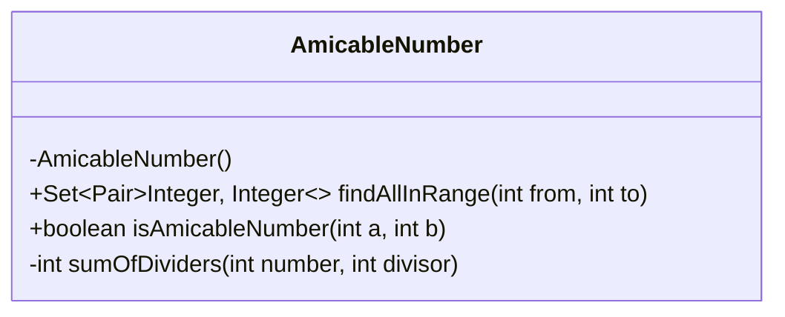
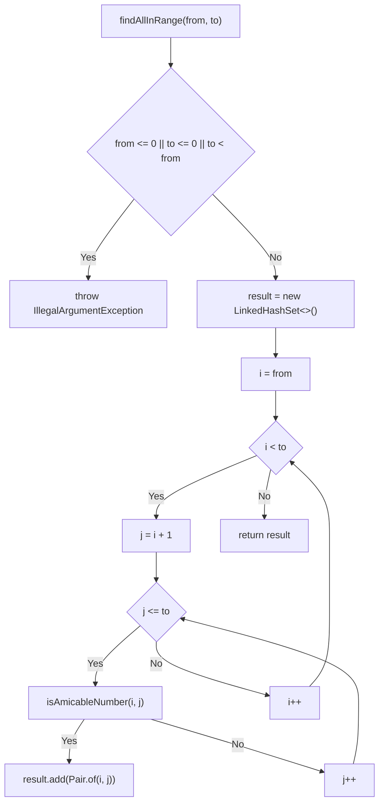
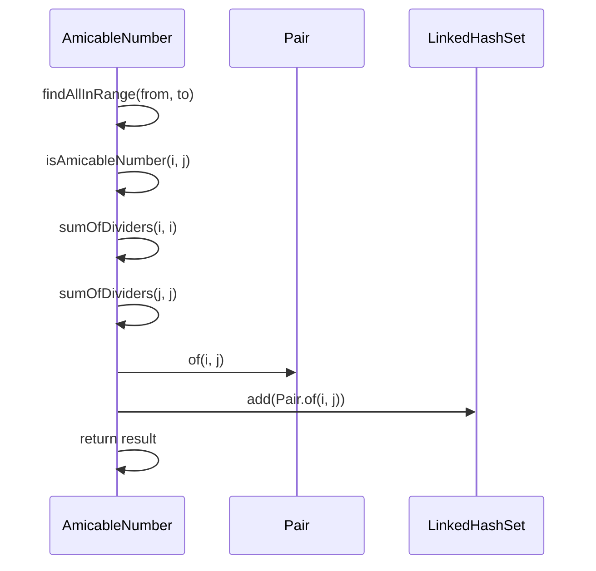
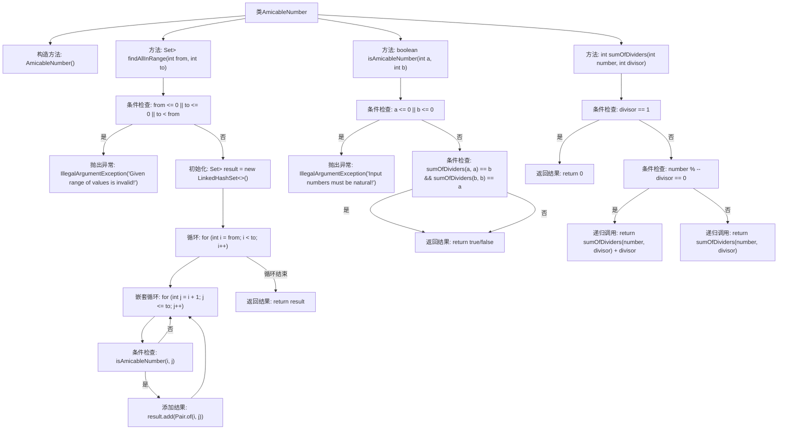

# 基础信息

|      |      |
|------|------|
| 名称 | AmicableNumber |
| 编码语言 | .java |
| 代码路径 | Java/src/main/java/com/thealgorithms/maths/AmicableNumber.java |
| 包名 | com.thealgorithms.maths |
| 依赖项 | ['java.util.LinkedHashSet', 'java.util.Set', 'org.apache.commons.lang3.tuple.Pair'] |
| 概述说明 | AmicableNumber类用于查找和验证给定范围内的亲和数对。 |

# 说明

AmicableNumber类的主要功能是查找指定范围内的亲和数对，并验证两个数是否构成亲和数。亲和数对是指两个数互为对方的真约数之和。该类通过计算和比较数的真约数和，实现亲和数的识别与验证。

# 类列表 Class Summary

| 名称   | 类型  | 说明 |
|-------|------|-------------|
| AmicableNumber | class | AmicableNumber类用于查找给定范围内的亲和数对，并验证两数是否为亲和数。 |

## 类 AmicableNumber

|      |      |
|------|------|
| 访问范围 | public final |
| 类型 | class |
| 名称 | AmicableNumber |
| 说明 | AmicableNumber类用于查找给定范围内的亲和数对，并验证两数是否为亲和数。 |

### UML类图

### 描述
`AmicableNumber` 类用于查找指定范围内的亲和数对。它包含三个主要方法：`findAllInRange` 用于在给定范围内查找所有亲和数对，`isAmicableNumber` 用于判断两个数是否为亲和数，`sumOfDividers` 用于递归计算一个数的所有真约数之和。类图展示了类的私有构造器和公有方法，流程图和时序图分别描述了方法的执行流程和调用顺序。

### 内部方法调用关系图

这段代码定义了一个`AmicableNumber`类，用于查找给定范围内的亲和数对。代码首先检查输入范围的有效性，然后通过嵌套循环遍历范围内的所有数对，使用`isAmicableNumber`方法判断是否为亲和数对。`isAmicableNumber`方法通过递归计算每个数的真因子和来判断亲和数关系。整个流程包括输入验证、循环遍历、条件判断和递归计算，最终返回找到的亲和数对集合。

### 字段列表 Field List

| 名称  | 类型  | 说明 |
|-------|-------|------|

### 方法列表 Method List

| 名称  | 类型  | 说明 |
|-------|-------|------|
| findAllInRange | Set<Pair<Integer, Integer>> | 查找范围内所有友好数对，返回集合。 |
| sumOfDividers | int | 递归计算数的因子和，排除1。 |
| isAmicableNumber | boolean | 判断两个自然数是否为亲和数，需满足各自真因数之和等于对方。 |

