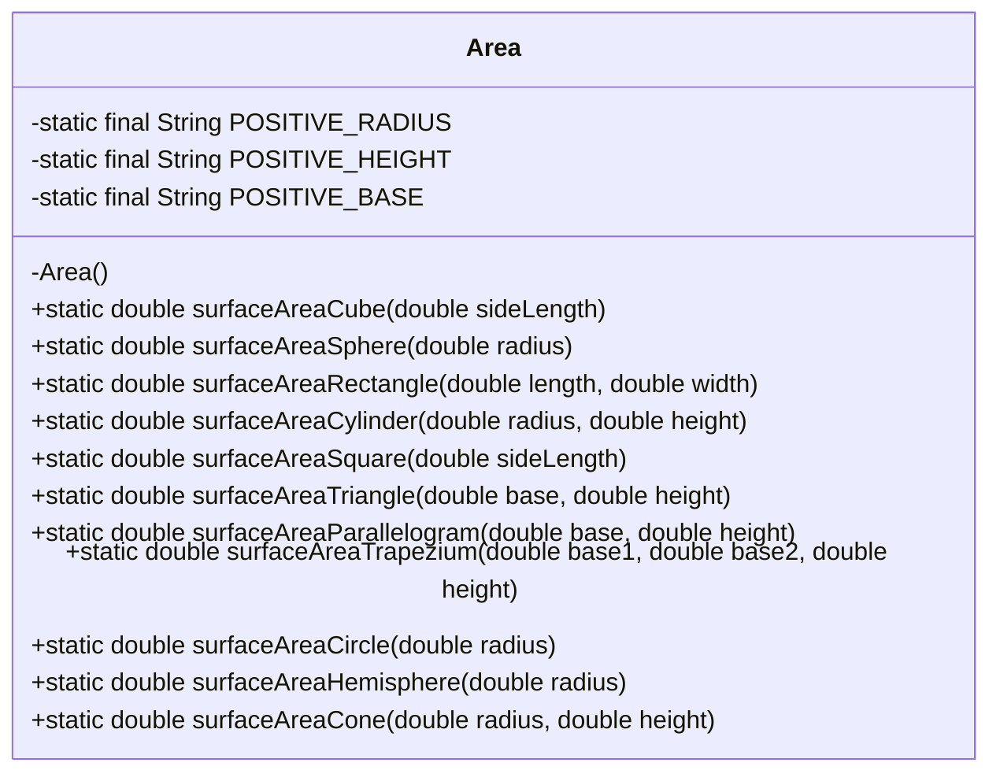

# 基础信息

|      |      |
|------|------|
| 名称 | Area |
| 编码语言 | .java |
| 代码路径 | Java/src/main/java/com/thealgorithms/maths/Area.java |
| 包名 | com.thealgorithms.maths |
| 依赖项 | [] |
| 概述说明 | Area类支持多种几何图形面积计算，参数必须为正数，否则异常。 |

# 说明

Area类提供多种几何图形的面积计算方法，要求所有输入参数必须为正数，若参数为负数或零，则抛出异常以确保计算结果的准确性和有效性。

# 类列表 Class Summary

| 名称   | 类型  | 说明 |
|-------|------|-------------|
| Area | class | Area类提供多种几何图形的面积计算方法，参数需为正数，否则抛出异常。 |

## 类 Area

|      |      |
|------|------|
| 访问范围 | public final |
| 类型 | class |
| 名称 | Area |
| 说明 | Area类提供多种几何图形的面积计算方法，参数需为正数，否则抛出异常。 |

### UML类图

**描述：**
`Area` 类是一个工具类，提供了计算各种几何图形表面积和面积的静态方法。每个方法都包含输入参数的校验，确保输入的几何参数为正数，否则抛出 `IllegalArgumentException`。该类设计为不可实例化，所有方法均为静态，适用于直接调用。

### 内部方法调用关系图

```mermaid
graph TD
    A["类Area"]
    B["私有构造方法: Area()"]
    C["私有静态常量: POSITIVE_RADIUS"]
    D["私有静态常量: POSITIVE_HEIGHT"]
    E["私有静态常量: POSITIVE_BASE"]
    F["公有静态方法: surfaceAreaCube(double sideLength)"]
    G["公有静态方法: surfaceAreaSphere(double radius)"]
    H["公有静态方法: surfaceAreaRectangle(double length, double width)"]
    I["公有静态方法: surfaceAreaCylinder(double radius, double height)"]
    J["公有静态方法: surfaceAreaSquare(double sideLength)"]
    K["公有静态方法: surfaceAreaTriangle(double base, double height)"]
    L["公有静态方法: surfaceAreaParallelogram(double base, double height)"]
    M["公有静态方法: surfaceAreaTrapezium(double base1, double base2, double height)"]
    N["公有静态方法: surfaceAreaCircle(double radius)"]
    O["公有静态方法: surfaceAreaHemisphere(double radius)"]
    P["公有静态方法: surfaceAreaCone(double radius, double height)"]

    A --> B
    A --> C
    A --> D
    A --> E
    A --> F
    A --> G
    A --> H
    A --> I
    A --> J
    A --> K
    A --> L
    A --> M
    A --> N
    A --> O
    A --> P
```

这段代码定义了一个名为 `Area` 的类，其中包含多个静态方法用于计算不同几何形状的表面积。每个方法首先检查输入参数是否为正数，若为负数或零则抛出 `IllegalArgumentException` 异常。方法中使用了数学公式来计算几何形状的表面积，如立方体、球体、矩形、圆柱体、正方形、三角形、平行四边形、梯形、圆形、半球体和圆锥体。代码通过私有构造方法确保类不能被实例化，并通过私有静态常量定义了异常提示信息。

### 字段列表 Field List

| 名称  | 类型  | 说明 |
|-------|-------|------|
| POSITIVE_RADIUS = "Must be a positive radius" | String | 要求半径为正值。 |
| POSITIVE_HEIGHT = "Must be a positive height" | String | 高度必须为正数。 |
| POSITIVE_BASE = "Must be a positive base" | String | 私有静态常量POSITIVE_BASE表示“必须为正数基数”。 |

### 方法列表 Method List

| 名称  | 类型  | 说明 |
|-------|-------|------|
| surfaceAreaTriangle | double | 计算三角形面积的静态方法，要求底和高为正数。 |
| surfaceAreaSphere | double | 计算球体表面积，若半径非正则抛出异常。 |
| surfaceAreaCylinder | double | 计算圆柱表面积，验证半径和高度为正数，返回结果。 |
| surfaceAreaCube | double | 计算立方体表面积，边长为正，公式为6*边长平方。 |
| surfaceAreaTrapezium | double | 计算梯形面积，检查底边和高是否为正数，返回面积值。 |
| surfaceAreaHemisphere | double | 计算半球表面积，半径须为正数，公式为3πr²。 |
| surfaceAreaSquare | double | 计算正方形面积的静态方法，要求边长大于零。 |
| surfaceAreaCircle | double | 计算圆形面积的静态方法，若半径非正则抛出异常。 |
| surfaceAreaParallelogram | double | 计算平行四边形面积，需输入正数底和高，否则抛出异常。 |
| surfaceAreaCone | double | 计算圆锥表面积，确保半径和高度为正数。 |
| surfaceAreaRectangle | double | 计算矩形面积，参数需为正数。 |

