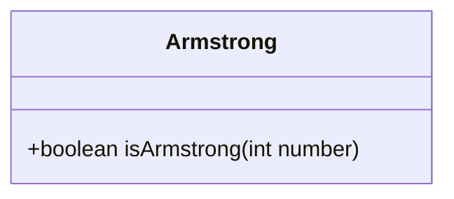
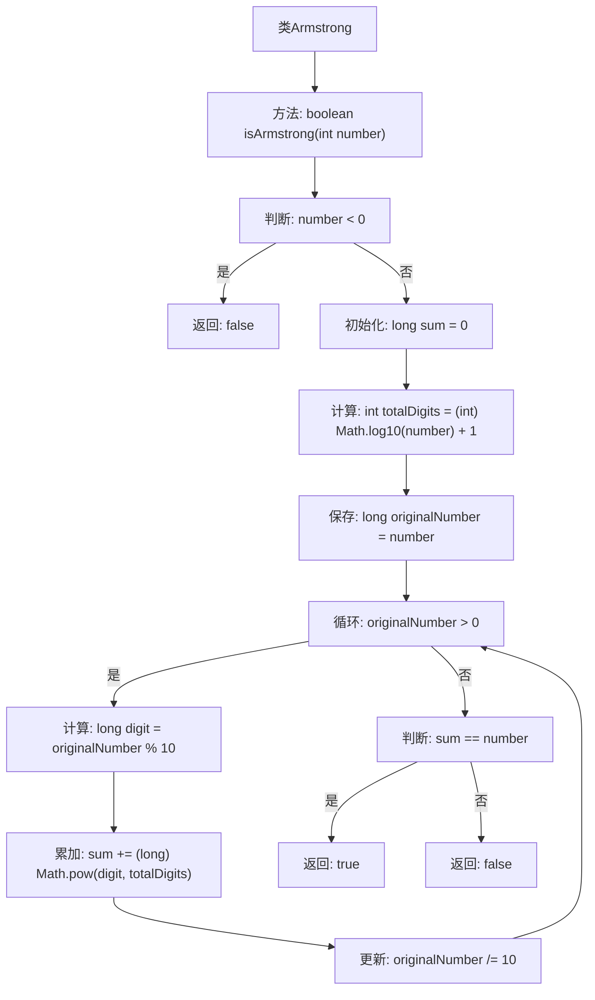

# 基础信息

|      |      |
|------|------|
| 名称 | Armstrong |
| 编码语言 | .java |
| 代码路径 | Java/src/main/java/com/thealgorithms/maths/Armstrong.java |
| 包名 | com.thealgorithms.maths |
| 依赖项 | [] |
| 概述说明 | 判断数字是否为阿姆斯壮数，返回布尔值。 |

# 说明

该内容描述了一个功能，用于检查给定的数字是否为阿姆斯壮数，并返回一个布尔值。阿姆斯壮数是指一个n位数字，其每个位上的数字的n次幂之和等于它本身。例如，153是一个阿姆斯壮数，因为1^3 + 5^3 + 3^3 = 153。该功能通过验证数字是否满足阿姆斯壮数的定义，最终返回真或假。

# 类列表 Class Summary

| 名称   | 类型  | 说明 |
|-------|------|-------------|
| Armstrong | class | 检查给定数字是否为阿姆斯壮数，返回布尔值。 |

## 类 Armstrong

|      |      |
|------|------|
| 访问范围 | public |
| 类型 | class |
| 名称 | Armstrong |
| 说明 | 检查给定数字是否为阿姆斯壮数，返回布尔值。 |

### UML类图

**描述：**  
`Armstrong` 类包含一个公有方法 `isArmstrong`，用于判断给定的整数是否为阿姆斯特朗数。阿姆斯特朗数是指一个n位数，其每个位上的数字的n次幂之和等于它本身。该方法首先排除负数，然后计算数字的位数，接着通过循环计算每个数字的幂次和，最后判断该和是否等于原始数字。如果相等，则返回 `true`，否则返回 `false`。

### 内部方法调用关系图

这段代码定义了一个类`Armstrong`，其中包含一个方法`isArmstrong`，用于判断给定的整数是否为阿姆斯特朗数。阿姆斯特朗数是指一个n位数，其每个位上的数字的n次幂之和等于它本身。代码首先检查数字是否为负数，如果是则直接返回`false`。然后计算数字的位数，并通过循环计算每位数字的幂次和，最后比较和与原始数字是否相等。

### 字段列表 Field List

| 名称  | 类型  | 说明 |
|-------|-------|------|

### 方法列表 Method List

| 名称  | 类型  | 说明 |
|-------|-------|------|
| isArmstrong | boolean | 判断一个数是否为阿姆斯壮数，即各位数字的幂次和等于原数。 |

