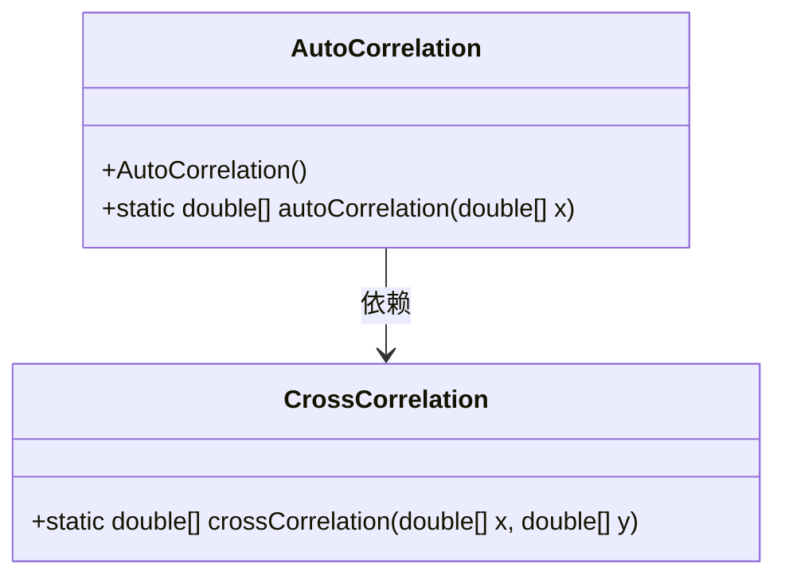
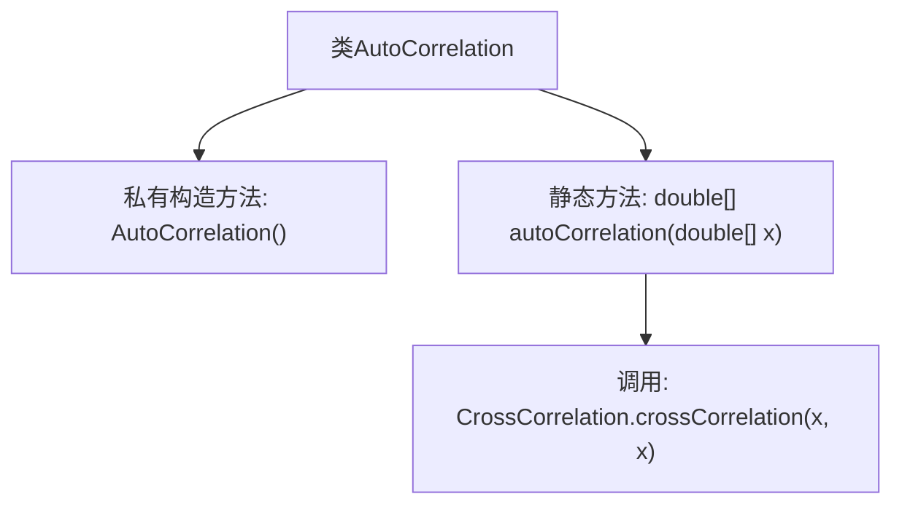

# 基础信息

|      |      |
|------|------|
| 名称 | AutoCorrelation |
| 编码语言 | .java |
| 代码路径 | Java/src/main/java/com/thealgorithms/maths/AutoCorrelation.java |
| 包名 | com.thealgorithms.maths |
| 依赖项 | [] |
| 概述说明 | AutoCorrelation类计算离散信号自相关并返回结果。 |

# 说明

AutoCorrelation类用于计算离散信号的自相关函数，通过分析信号与其自身在不同时间延迟下的相似性，返回自相关结果。该类的主要功能是帮助用户理解信号的内在结构，识别周期性或重复模式，为信号处理和分析提供重要依据。

# 类列表 Class Summary

| 名称   | 类型  | 说明 |
|-------|------|-------------|
| AutoCorrelation | class | AutoCorrelation类实现离散信号自相关函数，返回信号自相关结果。 |

## 类 AutoCorrelation

|      |      |
|------|------|
| 访问范围 | public final |
| 类型 | class |
| 名称 | AutoCorrelation |
| 说明 | AutoCorrelation类实现离散信号自相关函数，返回信号自相关结果。 |

### UML类图

这段代码定义了一个名为 `AutoCorrelation` 的类，该类包含一个私有的构造函数和一个公有的静态方法 `autoCorrelation`。`autoCorrelation` 方法用于计算离散信号的线性自相关函数，通过调用 `CrossCorrelation` 类的 `crossCorrelation` 方法来实现。`CrossCorrelation` 类包含一个公有的静态方法 `crossCorrelation`，用于计算两个信号的互相关。`AutoCorrelation` 类依赖于 `CrossCorrelation` 类来完成自相关计算。

### 内部方法调用关系图

这段代码定义了一个名为 `AutoCorrelation` 的类，该类包含一个私有的构造方法和一个静态方法 `autoCorrelation`。`autoCorrelation` 方法用于计算离散信号的线性自相关函数，通过调用 `CrossCorrelation` 类的 `crossCorrelation` 方法来实现。流程图展示了类及其方法之间的调用关系，清晰描述了代码的结构和功能。

### 字段列表 Field List

| 名称  | 类型  | 说明 |
|-------|-------|------|

### 方法列表 Method List

| 名称  | 类型  | 说明 |
|-------|-------|------|
| autoCorrelation | double[] | 计算离散信号自相关函数，通过信号与其自身的互相关实现。 |

