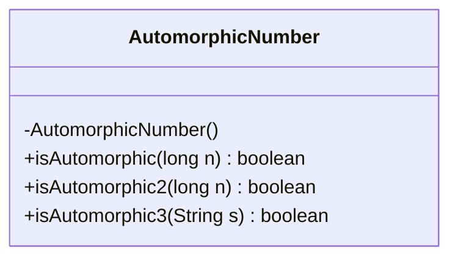
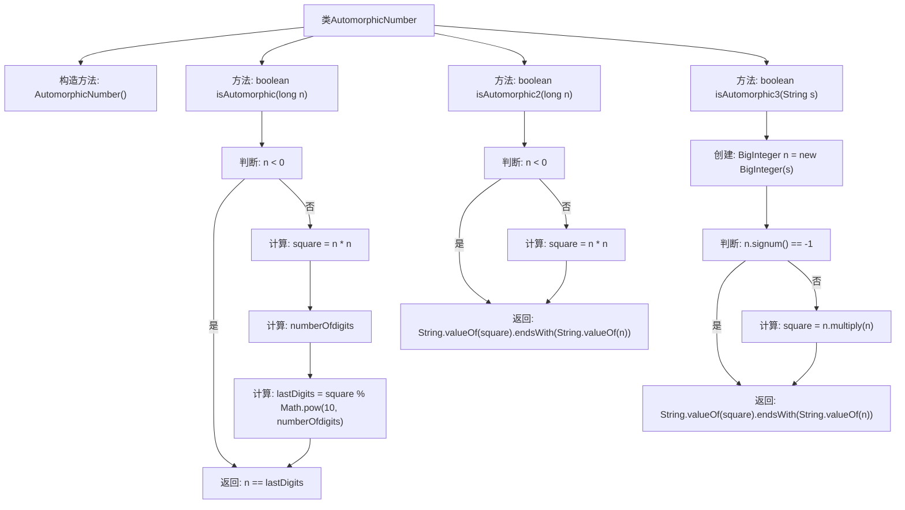

# 基础信息

|      |      |
|------|------|
| 名称 | AutomorphicNumber |
| 编码语言 | .java |
| 代码路径 | Java/src/main/java/com/thealgorithms/maths/AutomorphicNumber.java |
| 包名 | com.thealgorithms.maths |
| 依赖项 | ['java.math.BigInteger'] |
| 概述说明 | 类AutomorphicNumber提供判断数字是否为自守数的方法。 |

# 说明

类AutomorphicNumber包含三个方法，专门用于判断一个数字是否为自守数。自守数是指一个数的平方的末尾几位数字与该数本身相同的数。这些方法通过不同的逻辑和计算步骤，能够准确地检测出给定数字是否满足自守数的条件。通过调用这些方法，用户可以方便地验证任意数字是否为自守数，从而在需要时进行进一步的处理或分析。

# 类列表 Class Summary

| 名称   | 类型  | 说明 |
|-------|------|-------------|
| AutomorphicNumber | class | 类AutomorphicNumber包含三个方法，用于判断数字是否为自守数。 |

## 类 AutomorphicNumber

|      |      |
|------|------|
| 访问范围 | public final |
| 类型 | class |
| 名称 | AutomorphicNumber |
| 说明 | 类AutomorphicNumber包含三个方法，用于判断数字是否为自守数。 |

### UML类图

这段代码定义了一个名为 `AutomorphicNumber` 的类，该类包含三个静态方法，用于检查一个数字是否为自守数（Automorphic Number）。自守数是指一个数的平方的末尾数字与该数本身相同的数。`isAutomorphic` 方法通过计算数字的平方并提取末尾数字来进行判断；`isAutomorphic2` 方法使用字符串操作来简化判断过程；`isAutomorphic3` 方法则处理大整数的情况，使用 `BigInteger` 类进行计算。这些方法都考虑了负数的情况，并在输入为负数时直接返回 `false`。

### 内部方法调用关系图

这段代码定义了一个名为 `AutomorphicNumber` 的类，该类包含三个静态方法 `isAutomorphic`、`isAutomorphic2` 和 `isAutomorphic3`，用于判断一个数字是否是自守数。自守数是指其平方的末尾数字等于该数本身的数字。每个方法通过不同的方式实现这一判断，包括直接计算、字符串操作和使用 `BigInteger` 类。流程图展示了每个方法的执行步骤和判断逻辑。

### 字段列表 Field List

| 名称  | 类型  | 说明 |
|-------|-------|------|

### 方法列表 Method List

| 名称  | 类型  | 说明 |
|-------|-------|------|
| isAutomorphic3 | boolean | 判断数字平方的末尾是否与原数字相同。 |
| isAutomorphic | boolean | 判断一个数是否自守数，通过计算其平方并比较最后几位数字。 |
| isAutomorphic2 | boolean | 判断一个数是否为自守数，即其平方的末尾是否等于该数本身。 |

