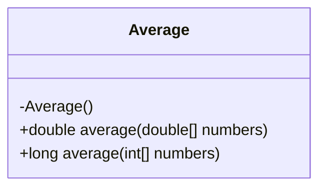
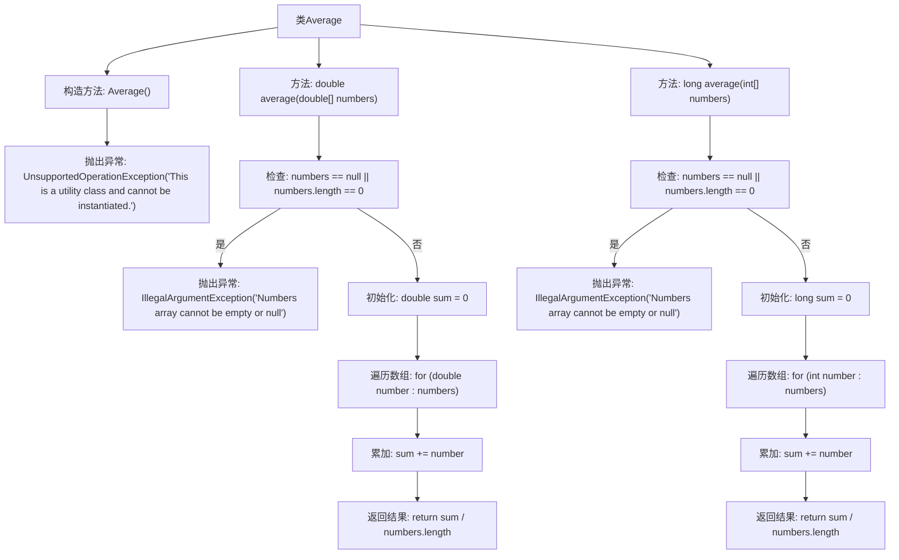

# 基础信息

|      |      |
|------|------|
| 名称 | Average |
| 编码语言 | .java |
| 代码路径 | Java/src/main/java/com/thealgorithms/maths/Average.java |
| 包名 | com.thealgorithms.maths |
| 依赖项 | [] |
| 概述说明 | Average类用于计算双精度和整数数组的平均值，且不可实例化。 |

# 说明

Average类是一个专门用于计算双精度和整数数组平均值的工具类。该类提供了相应的方法来执行这些计算任务。值得注意的是，Average类被设计为禁止实例化，这意味着它不能被创建为对象实例，而是通过静态方法直接调用其功能。这种设计通常用于工具类，以确保其方法可以在不创建对象的情况下使用，从而提高代码的简洁性和效率。

# 类列表 Class Summary

| 名称   | 类型  | 说明 |
|-------|------|-------------|
| Average | class | Average类提供计算双精度和整数数组平均值的方法，禁止实例化。 |

## 类 Average

|      |      |
|------|------|
| 访问范围 | public final |
| 类型 | class |
| 名称 | Average |
| 说明 | Average类提供计算双精度和整数数组平均值的方法，禁止实例化。 |

### UML类图

这段代码定义了一个名为 `Average` 的工具类，该类包含两个静态方法 `average`，分别用于计算 `double` 数组和 `int` 数组的平均值。为了避免实例化，构造函数被私有化，并在调用时抛出 `UnsupportedOperationException` 异常。每个方法在输入数组为空或为 `null` 时都会抛出 `IllegalArgumentException` 异常，以确保输入的有效性。类图展示了 `Average` 类的结构，包括私有构造函数和两个公有方法。

### 内部方法调用关系图

这段代码定义了一个名为`Average`的工具类，包含两个静态方法`average`，分别用于计算`double`数组和`int`数组的平均值。每个方法首先检查输入数组是否为空或`null`，如果是则抛出`IllegalArgumentException`异常。然后，方法通过遍历数组累加所有元素，最后返回累加和除以数组长度的结果。类`Average`的构造方法被私有化，并抛出`UnsupportedOperationException`，以防止实例化该类。

### 字段列表 Field List

| 名称  | 类型  | 说明 |
|-------|-------|------|

### 方法列表 Method List

| 名称  | 类型  | 说明 |
|-------|-------|------|
| average | double | 计算数组平均值，空数组或null抛出异常。 |
| average | long | 计算整数数组平均值，空数组或null抛出异常。 |

