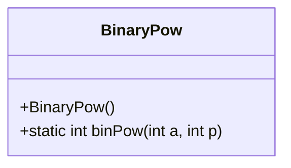
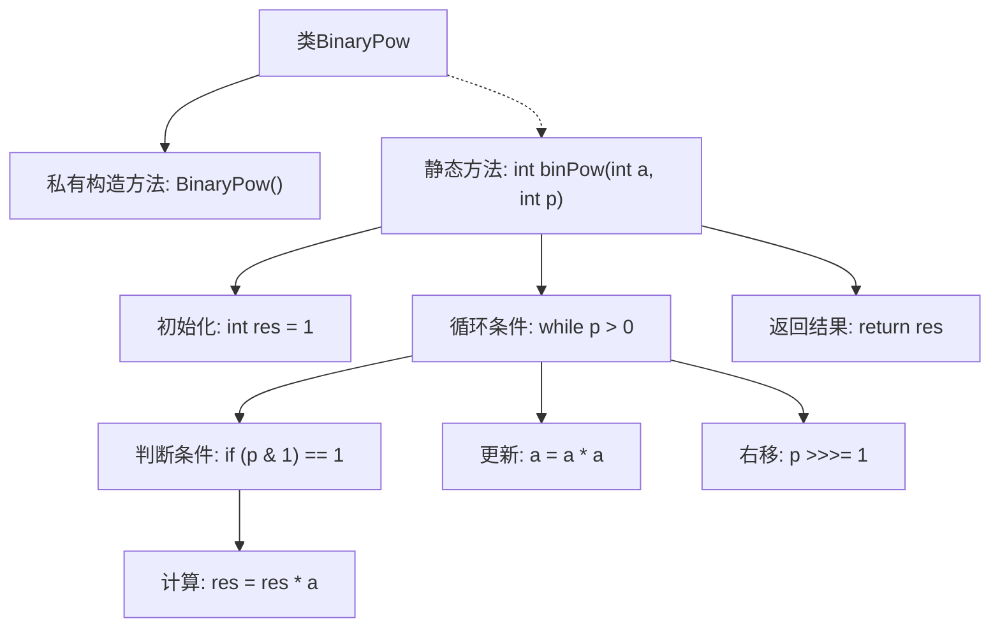

# 基础信息

|      |      |
|------|------|
| 名称 | BinaryPow |
| 编码语言 | .java |
| 代码路径 | Java/src/main/java/com/thealgorithms/maths/BinaryPow.java |
| 包名 | com.thealgorithms.maths |
| 依赖项 | [] |
| 概述说明 | BinaryPow类用于计算a的p次方，实现二进制幂运算。 |

# 说明

BinaryPow类专门用于实现二进制幂运算，旨在高效计算给定基数a的p次方。该算法通过将幂次p分解为二进制形式，利用移位和乘法操作来加速计算过程。这种方法显著减少了乘法次数，特别适用于大幂次的计算场景，提升了运算效率。BinaryPow类的设计简洁且功能明确，专注于优化幂运算性能，适用于需要频繁进行高次幂计算的应用程序。

# 类列表 Class Summary

| 名称   | 类型  | 说明 |
|-------|------|-------------|
| BinaryPow | class | BinaryPow类实现二进制幂运算，计算a的p次方。 |

## 类 BinaryPow

|      |      |
|------|------|
| 访问范围 | public final |
| 类型 | class |
| 名称 | BinaryPow |
| 说明 | BinaryPow类实现二进制幂运算，计算a的p次方。 |

### UML类图

**描述：**  
`BinaryPow` 类是一个工具类，提供了一个静态方法 `binPow`，用于通过二进制幂算法计算 `a^p`。该方法通过不断平方和乘法操作来高效计算幂运算，适用于指数较大的情况。类本身是 `final` 的，且构造函数为私有，防止实例化，确保其作为工具类的纯粹性。

### 内部方法调用关系图

这段代码定义了一个名为 `BinaryPow` 的类，其中包含一个私有构造方法和一个静态方法 `binPow`。`binPow` 方法使用二进制幂算法计算 `a` 的 `p` 次方。通过循环和位操作，方法逐步计算并返回结果。流程图展示了从初始化到返回结果的完整流程，包括循环、条件判断和变量更新。

### 字段列表 Field List

| 名称  | 类型  | 说明 |
|-------|-------|------|

### 方法列表 Method List

| 名称  | 类型  | 说明 |
|-------|-------|------|
| binPow | int | 实现快速幂运算的静态方法，计算a的p次方。 |

