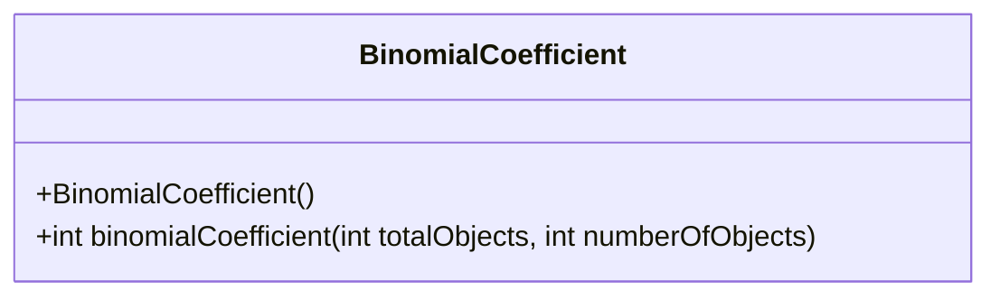
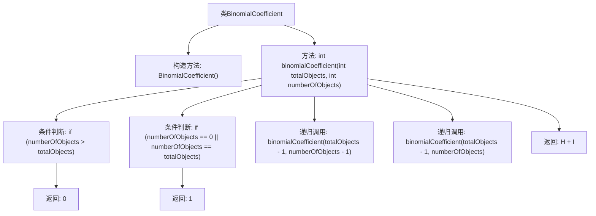

# 基础信息

|      |      |
|------|------|
| 名称 | BinomialCoefficient |
| 编码语言 | .java |
| 代码路径 | Java/src/main/java/com/thealgorithms/maths/BinomialCoefficient.java |
| 包名 | com.thealgorithms.maths |
| 依赖项 | [] |
| 概述说明 | 计算从n个对象中选取k个对象的组合数。 |

# 说明

计算从n个对象中选取k个对象的组合数是一种数学方法，用于确定在不考虑顺序的情况下，从n个不同对象中选择k个对象的所有可能方式。组合数的计算通常使用组合公式，该公式考虑了n和k的值，并通过阶乘运算来得出结果。这种方法在概率论、统计学和组合数学等领域有广泛应用，能够帮助解决涉及选择和排列的实际问题。

# 类列表 Class Summary

| 名称   | 类型  | 说明 |
|-------|------|-------------|
| BinomialCoefficient | class | 计算从n个对象中选取k个对象的组合数。 |

## 类 BinomialCoefficient

|      |      |
|------|------|
| 访问范围 | public final |
| 类型 | class |
| 名称 | BinomialCoefficient |
| 说明 | 计算从n个对象中选取k个对象的组合数。 |

### UML类图

这段代码定义了一个名为 `BinomialCoefficient` 的类，该类包含一个私有的构造函数和一个公有的静态方法 `binomialCoefficient`。`binomialCoefficient` 方法用于计算从 `totalObjects` 个对象中选择 `numberOfObjects` 个对象的组合数。该方法通过递归的方式实现，首先处理了两种基本情况：当 `numberOfObjects` 大于 `totalObjects` 时返回 0，当 `numberOfObjects` 等于 0 或 `totalObjects` 时返回 1。对于其他情况，方法通过递归调用自身来计算组合数。类图展示了 `BinomialCoefficient` 类的结构，包括其构造函数和公有方法。

### 内部方法调用关系图

这段代码定义了一个名为`BinomialCoefficient`的类，其中包含一个静态方法`binomialCoefficient`，用于计算从`totalObjects`个对象中选择`numberOfObjects`个对象的组合数。方法通过递归实现，首先检查基本条件，如果`numberOfObjects`大于`totalObjects`则返回0，如果`numberOfObjects`为0或等于`totalObjects`则返回1。否则，递归调用自身并返回两个递归调用的结果之和。流程图清晰地展示了方法的逻辑流程和递归调用关系。

### 字段列表 Field List

| 名称  | 类型  | 说明 |
|-------|-------|------|

### 方法列表 Method List

| 名称  | 类型  | 说明 |
|-------|-------|------|
| binomialCoefficient | int | 计算组合数的递归函数，包含基例和递归调用。 |

