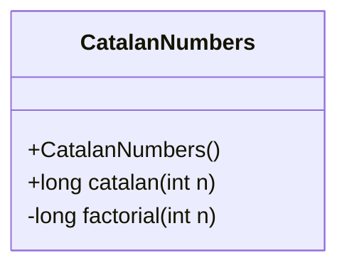
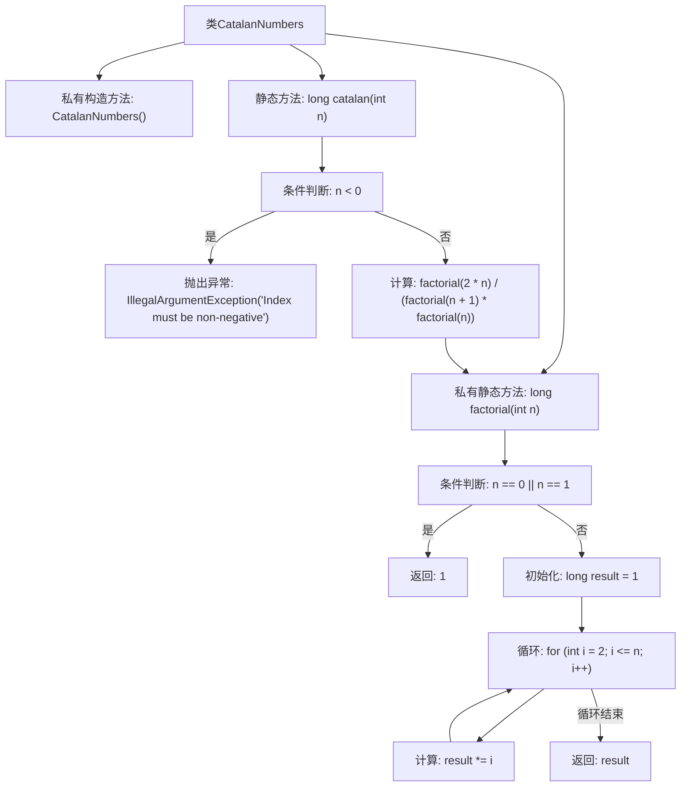

# 基础信息

|      |      |
|------|------|
| 名称 | CatalanNumbers |
| 编码语言 | .java |
| 代码路径 | Java/src/main/java/com/thealgorithms/maths/CatalanNumbers.java |
| 包名 | com.thealgorithms.maths |
| 依赖项 | [] |
| 概述说明 | 递归方法计算第n个卡塔兰数。 |

# 说明

计算第n个卡塔兰数的递归方法是一种基于数学定义的算法。卡塔兰数是一系列在组合数学中具有重要意义的数，常用于解决括号匹配、二叉树结构等问题。递归方法通过将问题分解为更小的子问题来实现计算。具体而言，第n个卡塔兰数可以通过前n-1个卡塔兰数的组合来计算，即C(n) = C(0)*C(n-1) + C(1)*C(n-2) + ... + C(n-1)*C(0)，其中C(0) = 1。这种方法虽然直观，但由于存在大量重复计算，效率较低。

# 类列表 Class Summary

| 名称   | 类型  | 说明 |
|-------|------|-------------|
| CatalanNumbers | class | 计算第n个卡塔兰数的递归方法。 |

## 类 CatalanNumbers

|      |      |
|------|------|
| 访问范围 | public final |
| 类型 | class |
| 名称 | CatalanNumbers |
| 说明 | 计算第n个卡塔兰数的递归方法。 |

### UML类图

这段代码定义了一个名为 `CatalanNumbers` 的类，该类包含两个静态方法：`catalan` 和 `factorial`。`catalan` 方法用于计算第 n 个卡塔兰数，它依赖于 `factorial` 方法来计算阶乘。`factorial` 方法是一个私有方法，用于计算给定整数的阶乘。`CatalanNumbers` 类的构造函数是私有的，这意味着该类不能被实例化，所有方法都是静态的，可以直接通过类名调用。

### 内部方法调用关系图

这段代码定义了一个`CatalanNumbers`类，其中包含两个静态方法：`catalan`和`factorial`。`catalan`方法用于计算第n个卡塔兰数，通过调用`factorial`方法计算阶乘来实现。`factorial`方法用于计算给定整数的阶乘，使用循环逐步累乘结果。`catalan`方法在输入参数为负数时会抛出异常，确保输入的合法性。整个流程展示了如何通过递归公式计算卡塔兰数，并详细描述了阶乘计算的步骤。

### 字段列表 Field List

| 名称  | 类型  | 说明 |
|-------|-------|------|

### 方法列表 Method List

| 名称  | 类型  | 说明 |
|-------|-------|------|
| factorial | long | 计算整数n的阶乘，返回结果。 |
| catalan | long | 计算卡特兰数的Java方法，要求输入非负整数。 |

