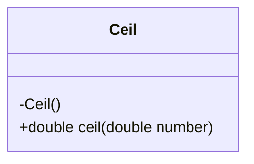
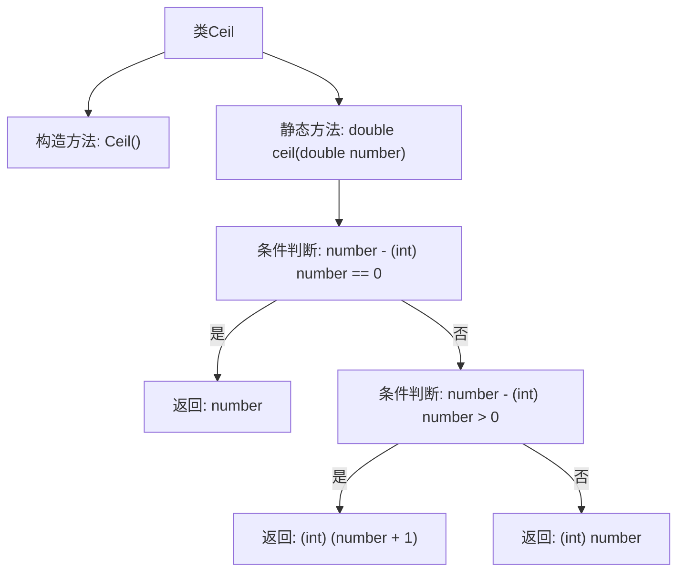

# 基础信息

|      |      |
|------|------|
| 名称 | Ceil |
| 编码语言 | .java |
| 代码路径 | Java/src/main/java/com/thealgorithms/maths/Ceil.java |
| 包名 | com.thealgorithms.maths |
| 依赖项 | [] |
| 概述说明 | Ceil类方法返回最接近负无穷的整数。 |

# 说明

Ceil类包含一个名为ceil的方法，该方法用于返回一个最接近负无穷的整数。这意味着无论输入值是正数还是负数，ceil方法都会将其向上取整到最近的整数。例如，对于正数3.2，ceil方法将返回4；对于负数-2.7，ceil方法将返回-2。这个方法在处理需要向上取整的数学运算时非常有用。

# 类列表 Class Summary

| 名称   | 类型  | 说明 |
|-------|------|-------------|
| Ceil | class | Ceil类提供ceil方法，返回最接近负无穷的整数。 |

## 类 Ceil

|      |      |
|------|------|
| 访问范围 | public final |
| 类型 | class |
| 名称 | Ceil |
| 说明 | Ceil类提供ceil方法，返回最接近负无穷的整数。 |

### UML类图

这段代码定义了一个名为 `Ceil` 的不可继承类，包含一个私有的构造函数和一个公有的静态方法 `ceil`。`ceil` 方法接收一个 `double` 类型的参数 `number`，并返回一个 `double` 类型的值。该方法通过判断 `number` 与它的整数部分之间的差值，来决定返回的值是 `number` 本身、`number + 1` 的整数部分，还是 `number` 的整数部分。这个类的主要功能是实现对给定数字向上取整的操作。

### 内部方法调用关系图

**描述：**  
该流程图展示了`Ceil`类的结构及其`ceil`方法的执行流程。`Ceil`类包含一个私有的构造方法和一个静态的`ceil`方法。`ceil`方法接收一个`double`类型的参数，并根据该参数与整数部分的差值进行条件判断。如果差值为0，则返回原数；如果差值大于0，则返回整数部分加1；否则返回整数部分。流程图清晰地描述了这些判断和返回的逻辑路径。

### 字段列表 Field List

| 名称  | 类型  | 说明 |
|-------|-------|------|

### 方法列表 Method List

| 名称  | 类型  | 说明 |
|-------|-------|------|
| ceil | double | 该方法返回大于或等于输入数字的最小整数。 |

