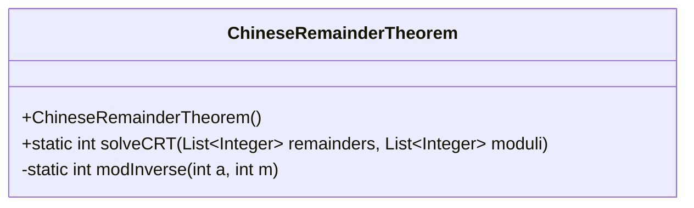
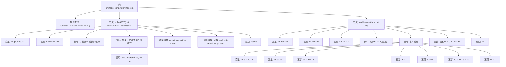

# 基础信息

|      |      |
|------|------|
| 名称 | ChineseRemainderTheorem |
| 编码语言 | .java |
| 代码路径 | Java/src/main/java/com/thealgorithms/maths/ChineseRemainderTheorem.java |
| 包名 | com.thealgorithms.maths |
| 依赖项 | ['java.util.List'] |
| 概述说明 | 中国剩余定理类，含求解方法与模逆计算。 |

# 说明

中国剩余定理求解类是一个用于解决同余方程组的工具，主要包含两个核心功能：求解方法和模逆计算。求解方法通过将多个同余方程合并，找到满足所有条件的最小正整数解。模逆计算则用于在模运算中找到一个数的乘法逆元，确保方程组的解能够正确计算。该类的设计旨在高效处理复杂的同余问题，广泛应用于密码学、数论和算法设计等领域。

# 类列表 Class Summary

| 名称   | 类型  | 说明 |
|-------|------|-------------|
| ChineseRemainderTheorem | class | 中国剩余定理求解类，包含求解方法和模逆计算。 |

## 类 ChineseRemainderTheorem

|      |      |
|------|------|
| 访问范围 | public final |
| 类型 | class |
| 名称 | ChineseRemainderTheorem |
| 说明 | 中国剩余定理求解类，包含求解方法和模逆计算。 |

### UML类图

**描述：**  
`ChineseRemainderTheorem` 类是一个工具类，用于解决中国剩余定理问题。它包含两个方法：`solveCRT` 和 `modInverse`。`solveCRT` 方法接受两个整数列表（余数和模数），并返回满足所有同余条件的最小正整数解。`modInverse` 方法是一个私有方法，用于计算模数的模逆，使用扩展欧几里得算法实现。该类通过静态方法提供功能，无需实例化即可使用。

### 内部方法调用关系图

这段代码实现了一个解决中国剩余定理问题的类`ChineseRemainderTheorem`。它包含两个主要方法：`solveCRT`和`modInverse`。`solveCRT`方法通过计算所有模数的乘积，并应用公式计算每个同余式的解，最终返回满足所有同余式的最小正整数解。`modInverse`方法使用扩展欧几里得算法计算模逆，确保在模数不为1时返回正确的模逆值。整个流程通过循环和条件判断确保计算的准确性和效率。

### 字段列表 Field List

| 名称  | 类型  | 说明 |
|-------|-------|------|

### 方法列表 Method List

| 名称  | 类型  | 说明 |
|-------|-------|------|
| solveCRT | int | 实现中国剩余定理，计算最小正整数解。 |
| modInverse | int | 计算整数a对模m的模逆元，使用扩展欧几里得算法实现。 |

