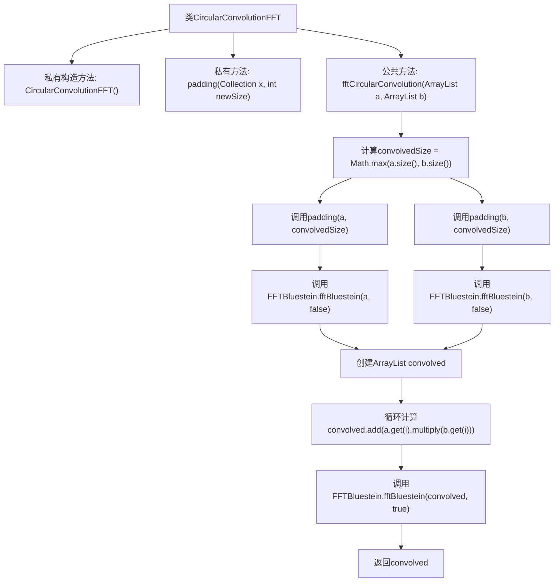

# 基础信息

|      |      |
|------|------|
| 名称 | CircularConvolutionFFT |
| 编码语言 | .java |
| 代码路径 | Java/src/main/java/com/thealgorithms/maths/CircularConvolutionFFT.java |
| 包名 | com.thealgorithms.maths |
| 依赖项 | ['java.util.ArrayList', 'java.util.Collection'] |
| 概述说明 | CircularConvolutionFFT类利用FFT和Bluestein算法实现快速循环卷积。 |

# 说明

CircularConvolutionFFT类实现了基于快速傅里叶变换（FFT）的循环卷积计算，采用Bluestein算法来加速计算过程。该类通过FFT技术将时域信号转换到频域，利用频域乘法进行卷积运算，最后再通过逆FFT将结果转换回时域，从而实现高效的循环卷积计算。Bluestein算法在此过程中用于优化FFT的计算效率，特别适用于非2的幂次长度的信号处理。

# 类列表 Class Summary

| 名称   | 类型  | 说明 |
|-------|------|-------------|
| CircularConvolutionFFT | class | CircularConvolutionFFT类实现基于FFT的循环卷积，使用Bluestein算法进行快速计算。 |


## 类 CircularConvolutionFFT

|      |      |
|------|------|
| 访问范围 | public final |
| 类型 | class |
| 名称 | CircularConvolutionFFT |
| 说明 | CircularConvolutionFFT类实现基于FFT的循环卷积，使用Bluestein算法进行快速计算。 |


### UML类图

```mermaid
classDiagram
    class CircularConvolutionFFT {
        +CircularConvolutionFFT()
        -static void padding(Collection~FFT.Complex~ x, int newSize)
        +static ArrayList~FFT.Complex~ fftCircularConvolution(ArrayList~FFT.Complex~ a, ArrayList~FFT.Complex~ b)
    }

    class FFT {
        class Complex {
            +Complex()
            +Complex multiply(Complex other)
        }
    }

    class FFTBluestein {
        +static void fftBluestein(ArrayList~FFT.Complex~ x, boolean inverse)
    }

    CircularConvolutionFFT --> FFT : 使用
    CircularConvolutionFFT --> FFTBluestein : 依赖
```

这段代码实现了一个用于计算离散循环卷积的类 `CircularConvolutionFFT`。该类包含两个主要方法：`padding` 用于对信号进行零填充，`fftCircularConvolution` 使用快速傅里叶变换（FFT）和卷积定理来计算两个信号的卷积。代码依赖于 `FFT.Complex` 类来表示复数，并使用 `FFTBluestein` 类中的 `fftBluestein` 方法进行FFT和逆FFT计算。通过这种方式，代码能够高效地处理信号卷积问题。


### 内部方法调用关系图



这段代码实现了一个基于FFT的循环卷积算法。首先，通过`padding`方法对输入信号进行零填充，使其长度一致。然后，使用Bluestein算法计算两个信号的FFT，将结果相乘后，再进行逆FFT变换，最终返回卷积结果。整个过程确保了信号长度的一致性，并利用FFT加速了卷积计算。

### 字段列表 Field List

| 名称  | 类型  | 说明 |
|-------|-------|------|

### 方法列表 Method List

| 名称  | 类型  | 说明 |
|-------|-------|------|
| padding | void | 填充集合至指定大小，不足部分添加默认复数对象。 |
| fftCircularConvolution | ArrayList<FFT.Complex> | 实现FFT循环卷积，对信号进行零填充并使用Bluestein算法计算FFT，结果相乘后通过IFFT返回卷积结果。 |


