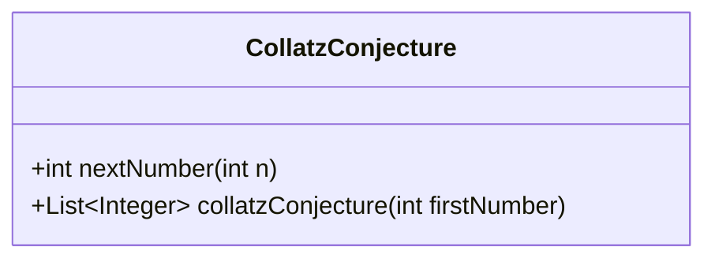
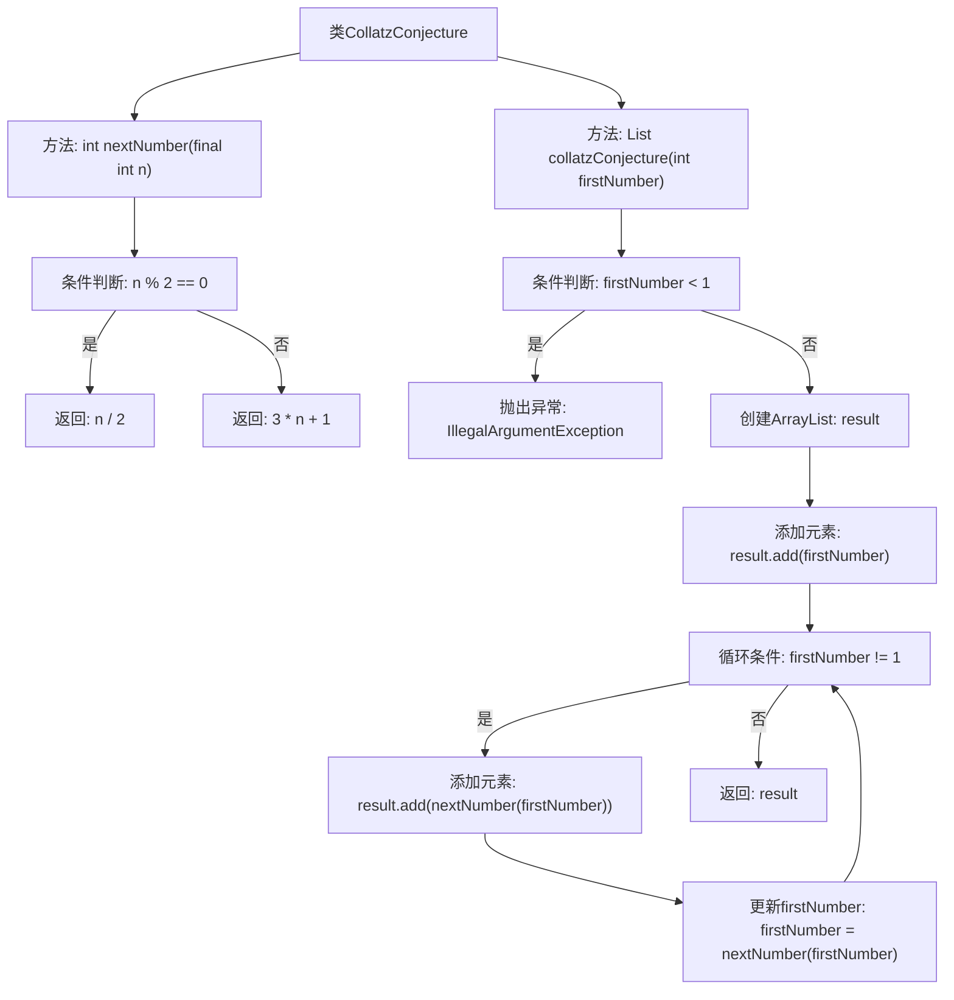

# 基础信息

|      |      |
|------|------|
| 名称 | CollatzConjecture |
| 编码语言 | .java |
| 代码路径 | Java/src/main/java/com/thealgorithms/maths/CollatzConjecture.java |
| 包名 | com.thealgorithms.maths |
| 依赖项 | ['java.util.ArrayList', 'java.util.List'] |
| 概述说明 | CollatzConjecture类实现Collatz序列计算，包含nextNumber和collatzConjecture方法。 |

# 说明

CollatzConjecture类实现了计算Collatz序列的功能，包含两个主要方法：nextNumber和collatzConjecture。nextNumber方法用于计算给定数字的下一个Collatz序列值，根据数字的奇偶性进行相应操作。collatzConjecture方法则用于生成并返回从给定数字开始的完整Collatz序列，直到序列结束。这两个方法共同实现了Collatz猜想的计算过程，展示了从任意正整数出发，最终都会收敛到1的数学现象。

# 类列表 Class Summary

| 名称   | 类型  | 说明 |
|-------|------|-------------|
| CollatzConjecture | class | CollatzConjecture类实现计算Collatz序列，包含nextNumber和collatzConjecture方法。 |

## 类 CollatzConjecture

|      |      |
|------|------|
| 访问范围 | public |
| 类型 | class |
| 名称 | CollatzConjecture |
| 说明 | CollatzConjecture类实现计算Collatz序列，包含nextNumber和collatzConjecture方法。 |

### UML类图

**描述**：`CollatzConjecture` 类实现了著名的Collatz猜想，通过`nextNumber`方法计算序列中的下一个数字，`collatzConjecture`方法生成从任意自然数开始的Collatz序列。该类确保输入为自然数，并返回一个整数列表表示序列。

### 内部方法调用关系图

这段代码实现了一个计算Collatz序列的类。`nextNumber`方法根据当前数字计算序列中的下一个数字，`collatzConjecture`方法则生成从起始数字到1的完整序列。流程图展示了方法的调用顺序和条件判断，包括异常处理和循环逻辑。

### 字段列表 Field List

| 名称  | 类型  | 说明 |
|-------|-------|------|

### 方法列表 Method List

| 名称  | 类型  | 说明 |
|-------|-------|------|
| nextNumber | int | 函数根据输入整数n的奇偶性返回n/2或3n+1。 |
| collatzConjecture | List<Integer> | 该方法生成科拉茨猜想序列，从给定自然数开始，直到结果为1。 |

