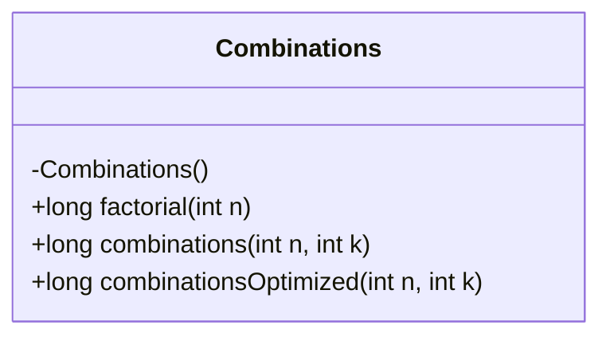
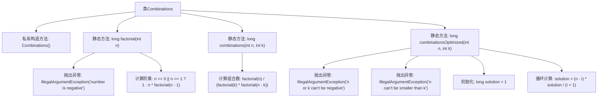

# 基础信息

|      |      |
|------|------|
| 名称 | Combinations |
| 编码语言 | .java |
| 代码路径 | Java/src/main/java/com/thealgorithms/maths/Combinations.java |
| 包名 | com.thealgorithms.maths |
| 依赖项 | [] |
| 概述说明 | Combinations类提供阶乘、组合计算及优化，防止长整型溢出。 |

# 说明

Combinations类提供计算阶乘和组合的方法，并优化组合计算以避免长整型溢出问题。该类专注于数学运算的精确性和效率，确保在处理大数时仍能稳定运行。通过优化算法，有效解决了长整型溢出的常见问题，提升了计算的可靠性和性能。

# 类列表 Class Summary

| 名称   | 类型  | 说明 |
|-------|------|-------------|
| Combinations | class | Combinations类提供计算阶乘、组合及优化组合的方法，避免长整型溢出问题。 |

## 类 Combinations

|      |      |
|------|------|
| 访问范围 | public final |
| 类型 | class |
| 名称 | Combinations |
| 说明 | Combinations类提供计算阶乘、组合及优化组合的方法，避免长整型溢出问题。 |

### UML类图

### 描述
`Combinations` 类提供了三个静态方法来计算组合数。`factorial` 方法计算给定整数的阶乘，`combinations` 方法使用阶乘计算组合数，但可能因阶乘结果过大而溢出。`combinationsOptimized` 方法通过迭代优化了组合数的计算，避免了溢出问题。所有方法都包含输入参数的验证，确保计算的合法性。

### 内部方法调用关系图

这段代码定义了一个名为`Combinations`的类，包含三个静态方法：`factorial`、`combinations`和`combinationsOptimized`。`factorial`方法计算给定整数的阶乘，并在输入为负数时抛出异常。`combinations`方法通过调用`factorial`方法计算组合数，但在大数情况下可能会溢出。`combinationsOptimized`方法通过迭代计算组合数，避免了阶乘计算的溢出问题，并在输入无效时抛出异常。

### 字段列表 Field List

| 名称  | 类型  | 说明 |
|-------|-------|------|

### 方法列表 Method List

| 名称  | 类型  | 说明 |
|-------|-------|------|
| combinationsOptimized | long | 优化组合数计算，处理非法输入，循环计算并返回结果。 |
| combinations | long | 计算组合数C(n,k)，使用阶乘函数实现。 |
| factorial | long | 计算整数的阶乘，处理负数异常，递归实现。 |

