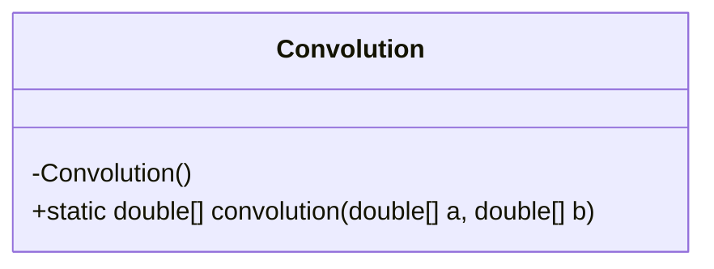
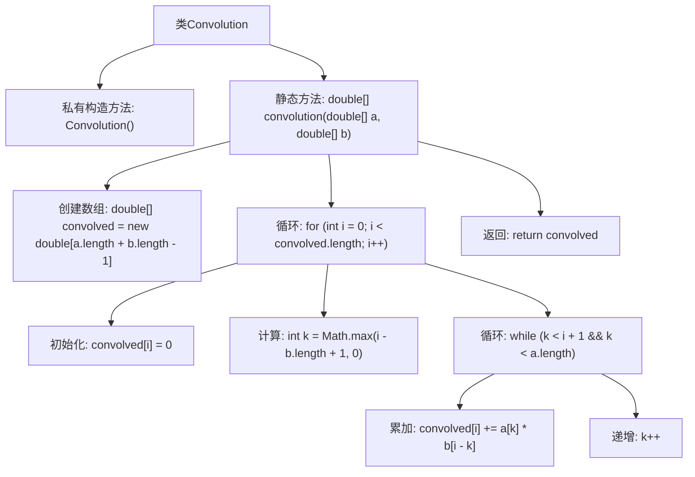

# 基础信息

|      |      |
|------|------|
| 名称 | Convolution |
| 编码语言 | .java |
| 代码路径 | Java/src/main/java/com/thealgorithms/maths/Convolution.java |
| 包名 | com.thealgorithms.maths |
| 依赖项 | [] |
| 概述说明 | 卷积类实现离散线性卷积，输入信号从0开始并返回结果。 |

# 说明

卷积类实现了离散线性卷积功能，其输入信号从0开始，并返回卷积结果。该过程涉及将输入信号与卷积核进行线性组合，生成最终的卷积输出。实现细节包括信号处理、卷积核应用以及结果计算，确保输出准确反映输入信号的卷积特性。

# 类列表 Class Summary

| 名称   | 类型  | 说明 |
|-------|------|-------------|
| Convolution | class | 卷积类实现离散线性卷积，输入信号从0开始，返回卷积结果。 |

## 类 Convolution

|      |      |
|------|------|
| 访问范围 | public final |
| 类型 | class |
| 名称 | Convolution |
| 说明 | 卷积类实现离散线性卷积，输入信号从0开始，返回卷积结果。 |

### UML类图

这段代码定义了一个名为 `Convolution` 的最终类，该类包含一个私有的构造函数和一个公有的静态方法 `convolution`。`convolution` 方法实现了离散线性卷积运算，它接收两个双精度浮点数数组 `a` 和 `b` 作为输入，并返回它们的卷积结果。卷积运算的结果数组长度为 `a.length + b.length - 1`。该方法通过遍历输出数组的每个元素，计算相应的卷积值，最终返回卷积后的数组。

### 内部方法调用关系图

这段代码实现了一个离散线性卷积函数，用于计算两个离散信号的卷积。卷积函数首先创建一个新的数组来存储卷积结果，然后通过嵌套循环计算每个卷积点的值。外层循环遍历卷积结果的每个位置，内层循环计算该位置的卷积值。最终，函数返回计算得到的卷积结果。

### 字段列表 Field List

| 名称  | 类型  | 说明 |
|-------|-------|------|

### 方法列表 Method List

| 名称  | 类型  | 说明 |
|-------|-------|------|
| convolution | double[] | 实现两数组离散卷积，返回卷积结果数组。 |

