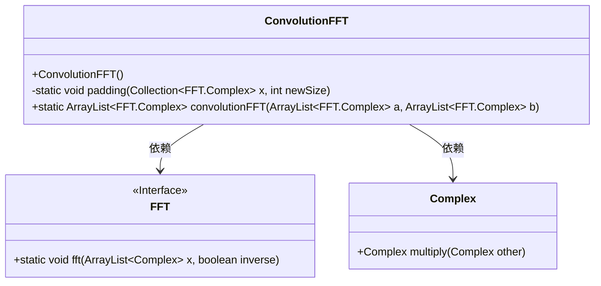
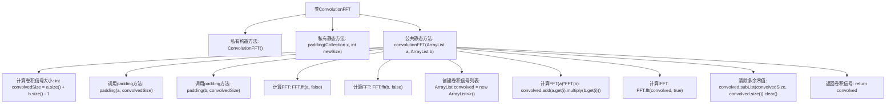

# 基础信息

|      |      |
|------|------|
| 名称 | ConvolutionFFT |
| 编码语言 | .java |
| 代码路径 | Java/src/main/java/com/thealgorithms/maths/ConvolutionFFT.java |
| 包名 | com.thealgorithms.maths |
| 依赖项 | ['java.util.ArrayList', 'java.util.Collection'] |
| 概述说明 | 卷积FFT类利用零填充和FFT算法加速线性卷积计算。 |

# 说明

卷积FFT类通过零填充和FFT算法实现线性卷积，旨在加速计算过程。该方法首先对输入信号进行零填充，以扩展其长度，然后利用FFT算法将时域信号转换为频域信号。在频域中进行乘法操作后，再通过逆FFT将结果转换回时域，从而得到线性卷积的结果。这种方法显著提高了卷积运算的效率，尤其适用于大规模数据处理。

# 类列表 Class Summary

| 名称   | 类型  | 说明 |
|-------|------|-------------|
| ConvolutionFFT | class | 卷积FFT类实现线性卷积，通过零填充和FFT算法加速计算。 |

## 类 ConvolutionFFT

|      |      |
|------|------|
| 访问范围 | public final |
| 类型 | class |
| 名称 | ConvolutionFFT |
| 说明 | 卷积FFT类实现线性卷积，通过零填充和FFT算法加速计算。 |

### UML类图

**描述：**  
`ConvolutionFFT` 类提供了基于快速傅里叶变换（FFT）的离散线性卷积功能。它通过 `padding` 方法对信号进行零填充，以确保信号长度满足卷积要求。`convolutionFFT` 方法实现了卷积定理，通过 FFT 和逆 FFT 计算两个信号的卷积。`FFT` 接口提供了 FFT 算法的实现，`Complex` 类用于处理复数运算。该类图展示了 `ConvolutionFFT` 类如何依赖 `FFT` 和 `Complex` 类来完成卷积计算。

### 内部方法调用关系图

这段代码实现了一个基于快速傅里叶变换（FFT）的卷积计算。首先，通过`padding`方法对输入信号进行零填充，使其达到卷积所需的大小。然后，分别计算两个信号的FFT，并将结果相乘得到卷积的频域表示。接着，通过逆FFT（IFFT）将结果转换回时域，并清除多余的零值，最终返回卷积信号。整个过程利用FFT加速了卷积计算，适用于处理大尺寸信号。

### 字段列表 Field List

| 名称  | 类型  | 说明 |
|-------|-------|------|

### 方法列表 Method List

| 名称  | 类型  | 说明 |
|-------|-------|------|
| padding | void | 填充集合至指定大小，不足部分添加空Complex对象。 |
| convolutionFFT | ArrayList<FFT.Complex> | 使用FFT实现两个复数信号卷积，包括零填充、FFT计算、乘法、逆FFT及清除多余零值。 |

