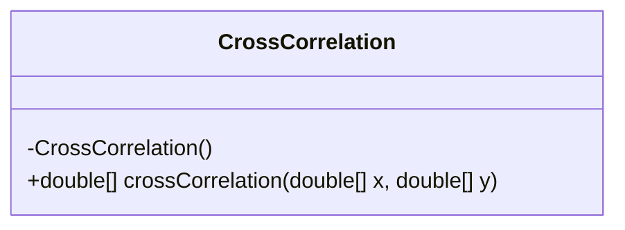
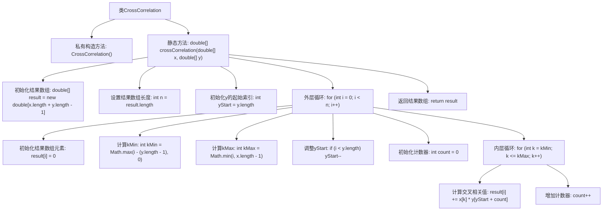

# 基础信息

|      |      |
|------|------|
| 名称 | CrossCorrelation |
| 编码语言 | .java |
| 代码路径 | Java/src/main/java/com/thealgorithms/maths/CrossCorrelation.java |
| 包名 | com.thealgorithms.maths |
| 依赖项 | [] |
| 概述说明 | CrossCorrelation类计算信号x和y的离散线性互相关，输出结果。 |

# 说明

CrossCorrelation类用于实现离散线性互相关函数，其功能是计算两个输入信号x和y之间的互相关信号。通过该类，用户可以输入两个信号，系统将输出它们之间的互相关结果，帮助分析信号之间的相似性和延迟关系。该类的核心在于精确计算信号的相关性，适用于信号处理、数据分析等领域。

# 类列表 Class Summary

| 名称   | 类型  | 说明 |
|-------|------|-------------|
| CrossCorrelation | class | CrossCorrelation类实现离散线性互相关函数，输入信号x和y，输出结果为两者的互相关信号。 |

## 类 CrossCorrelation

|      |      |
|------|------|
| 访问范围 | public final |
| 类型 | class |
| 名称 | CrossCorrelation |
| 说明 | CrossCorrelation类实现离散线性互相关函数，输入信号x和y，输出结果为两者的互相关信号。 |

### UML类图

**描述：**  
`CrossCorrelation` 类是一个工具类，用于计算两个离散信号的线性互相关函数。该类包含一个私有构造函数，防止实例化，并且提供了一个静态方法 `crossCorrelation`，该方法接受两个双精度浮点数数组 `x` 和 `y` 作为输入，返回它们的互相关结果。该方法通过遍历信号的不同偏移位置，计算每个位置的乘积和，最终生成互相关信号。

### 内部方法调用关系图

这段代码实现了一个离散线性交叉相关函数，用于计算两个离散信号`x`和`y`的交叉相关结果。代码首先初始化结果数组，然后通过双重循环计算每个位置的交叉相关值。外层循环遍历结果数组的每个位置，内层循环计算当前位置的交叉相关值。最终，代码返回计算得到的交叉相关结果数组。流程图展示了代码的主要逻辑和函数调用关系。

### 字段列表 Field List

| 名称  | 类型  | 说明 |
|-------|-------|------|

### 方法列表 Method List

| 名称  | 类型  | 说明 |
|-------|-------|------|
| crossCorrelation | double[] | 计算两个离散信号x和y的互相关，结果长度为x和y长度之和减一。 |

