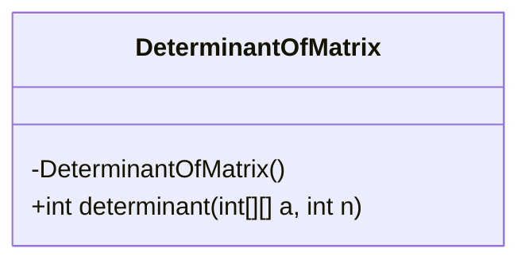
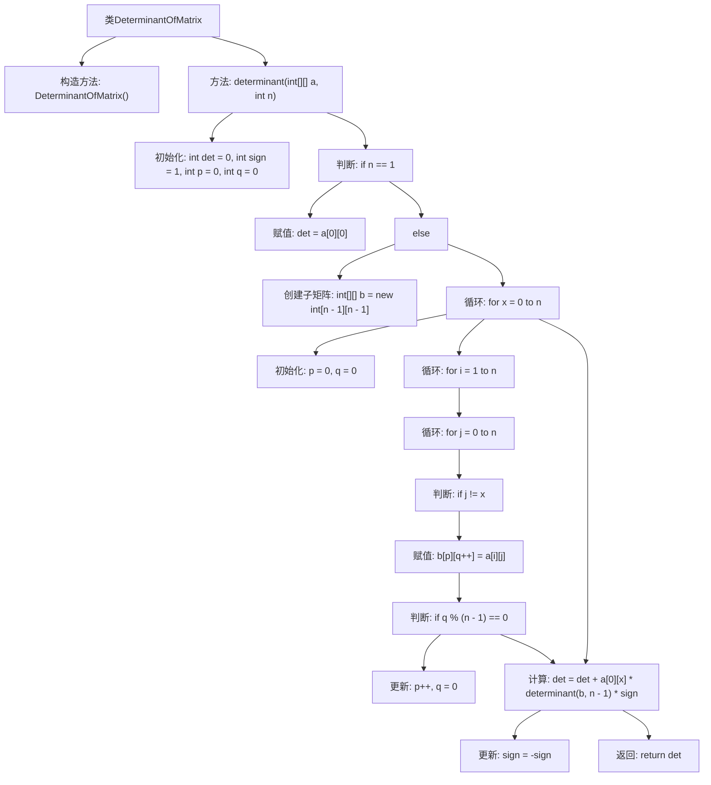

# 基础信息

|      |      |
|------|------|
| 名称 | DeterminantOfMatrix |
| 编码语言 | .java |
| 代码路径 | Java/src/main/java/com/thealgorithms/maths/DeterminantOfMatrix.java |
| 包名 | com.thealgorithms.maths |
| 依赖项 | [] |
| 概述说明 | Java类实现矩阵行列式计算，采用递归方法。 |

# 说明

这是一个用于计算矩阵行列式的Java类，采用递归方法实现。该类的核心功能是处理任意大小的方阵，通过递归算法精确计算其行列式值。递归方法通过逐步分解矩阵，将其简化为更小的子矩阵，最终得出结果。该类适用于需要行列式计算的数学和工程应用，具备高效性和准确性。

# 类列表 Class Summary

| 名称   | 类型  | 说明 |
|-------|------|-------------|
| DeterminantOfMatrix | class | 计算矩阵行列式的Java类，支持递归方法。 |

## 类 DeterminantOfMatrix

|      |      |
|------|------|
| 访问范围 | public final |
| 类型 | class |
| 名称 | DeterminantOfMatrix |
| 说明 | 计算矩阵行列式的Java类，支持递归方法。 |

### UML类图

**描述：**
`DeterminantOfMatrix` 是一个不可继承的类，包含一个私有构造函数，防止实例化。该类提供了一个静态方法 `determinant`，用于计算给定矩阵的行列式。该方法通过递归方式处理矩阵的子矩阵，最终返回行列式的值。类图展示了类的结构及其唯一的方法。

### 内部方法调用关系图

这段代码定义了一个名为 `DeterminantOfMatrix` 的类，其中包含一个静态方法 `determinant`，用于计算给定矩阵的行列式。方法通过递归和子矩阵的方式计算行列式，最终返回计算结果。流程图展示了方法的执行流程，包括初始化、条件判断、循环、子矩阵创建以及行列式的递归计算。

### 字段列表 Field List

| 名称  | 类型  | 说明 |
|-------|-------|------|

### 方法列表 Method List

| 名称  | 类型  | 说明 |
|-------|-------|------|
| determinant | int | 计算矩阵行列式的递归函数，支持任意阶矩阵。 |

