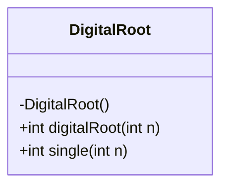
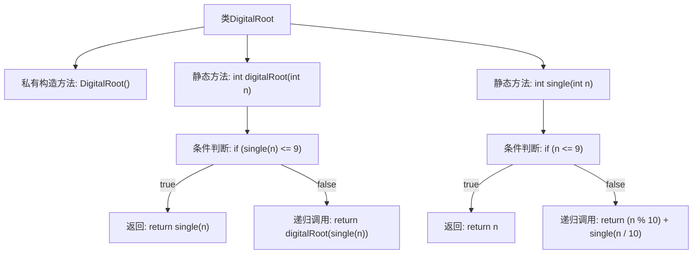

# 基础信息

|      |      |
|------|------|
| 名称 | DigitalRoot |
| 编码语言 | .java |
| 代码路径 | Java/src/main/java/com/thealgorithms/maths/DigitalRoot.java |
| 包名 | com.thealgorithms.maths |
| 依赖项 | [] |
| 概述说明 | DigitalRoot类计算数字的数位和，直到结果为单数，时间复杂度O(位数^2)，空间复杂度O(位数)。 |

# 说明

DigitalRoot类用于计算一个数字的数位和，直到结果变为单数。该算法的时间复杂度为O(位数^2)，意味着随着数字位数的增加，计算时间呈平方级增长。空间复杂度为O(位数)，表示所需存储空间与数字的位数成正比。该算法通过反复计算数位和，直到结果缩减为单个数字，适用于需要快速确定数字根的场景。

# 类列表 Class Summary

| 名称   | 类型  | 说明 |
|-------|------|-------------|
| DigitalRoot | class | DigitalRoot类计算数字的数位和，直到结果为单数。时间复杂度O(位数^2)，空间复杂度O(位数)。 |

## 类 DigitalRoot

|      |      |
|------|------|
| 访问范围 | final |
| 类型 | class |
| 名称 | DigitalRoot |
| 说明 | DigitalRoot类计算数字的数位和，直到结果为单数。时间复杂度O(位数^2)，空间复杂度O(位数)。 |

### UML类图

**描述：**  
`DigitalRoot` 是一个工具类，用于计算数字的数字根。它包含两个静态方法：`digitalRoot` 和 `single`。`single` 方法用于计算一个数字的各位数字之和，而 `digitalRoot` 方法则通过递归调用 `single` 方法，直到得到一个单一的数字根。该类设计为不可实例化，所有方法均为静态方法，适合作为工具类使用。

### 内部方法调用关系图

这段代码定义了一个`DigitalRoot`类，用于计算一个数字的数位根。`digitalRoot`方法通过递归调用`single`方法，将数字的各位相加，直到结果为一个单一的数字。`single`方法也是递归的，用于计算数字的各位之和。代码通过递归和条件判断，逐步减少数字的位数，最终得到数位根。

### 字段列表 Field List

| 名称  | 类型  | 说明 |
|-------|-------|------|

### 方法列表 Method List

| 名称  | 类型  | 说明 |
|-------|-------|------|
| digitalRoot | int | 递归计算数字根，直到结果为单数。 |
| single | int | 递归函数计算整数各位数字之和，直至结果为个位数。 |

