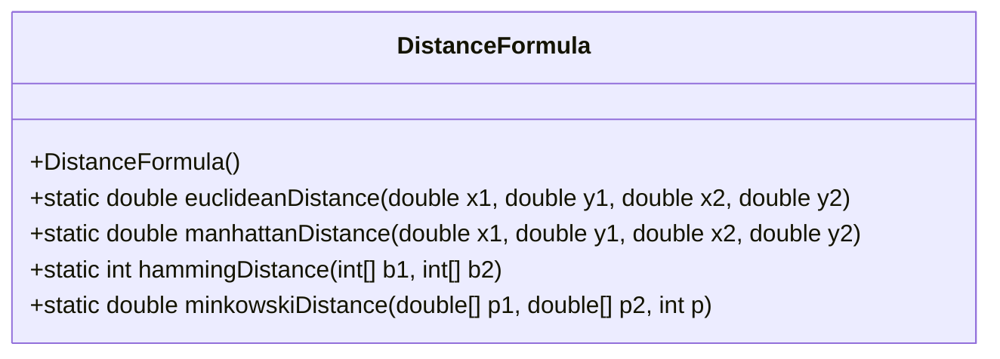
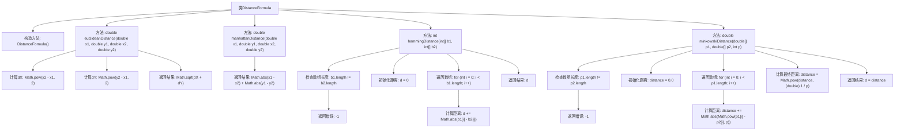

# 基础信息

|      |      |
|------|------|
| 名称 | DistanceFormula |
| 编码语言 | .java |
| 代码路径 | Java/src/main/java/com/thealgorithms/maths/DistanceFormula.java |
| 包名 | com.thealgorithms.maths |
| 依赖项 | [] |
| 概述说明 | DistanceFormula类支持欧几里得、曼哈顿、汉明和闵可夫斯基距离计算。 |

# 说明

DistanceFormula类提供了四种距离计算方法，包括欧几里得距离、曼哈顿距离、汉明距离和闵可夫斯基距离。这些方法适用于不同的计算场景，能够满足多种距离度量的需求。

# 类列表 Class Summary

| 名称   | 类型  | 说明 |
|-------|------|-------------|
| DistanceFormula | class | DistanceFormula类提供欧几里得、曼哈顿、汉明和闵可夫斯基距离计算方法。 |

## 类 DistanceFormula

|      |      |
|------|------|
| 访问范围 | public final |
| 类型 | class |
| 名称 | DistanceFormula |
| 说明 | DistanceFormula类提供欧几里得、曼哈顿、汉明和闵可夫斯基距离计算方法。 |

### UML类图

这段代码定义了一个名为 `DistanceFormula` 的类，该类提供了四种不同的距离计算方法：欧几里得距离、曼哈顿距离、汉明距离和闵可夫斯基距离。类中的方法都是静态的，因此可以直接通过类名调用，而无需实例化对象。每个方法都处理不同类型的输入参数，并返回相应的距离值。代码中还对数组长度不一致的情况进行了错误处理，返回 `-1` 表示错误。这个类适用于需要计算不同距离的场景，如数据分析和机器学习中的距离度量。

### 内部方法调用关系图

这段代码定义了一个`DistanceFormula`类，包含四个静态方法用于计算不同类型的距离：欧几里得距离、曼哈顿距离、汉明距离和闵可夫斯基距离。每个方法都处理特定的输入并返回相应的距离值，同时检查输入的有效性，如数组长度是否一致。流程图展示了类结构和方法的调用关系，以及每个方法内部的逻辑步骤。

### 字段列表 Field List

| 名称  | 类型  | 说明 |
|-------|-------|------|

### 方法列表 Method List

| 名称  | 类型  | 说明 |
|-------|-------|------|
| euclideanDistance | double | 计算两点间欧氏距离的静态方法。 |
| hammingDistance | int | 计算两个等长数组的汉明距离，若长度不等返回-1。 |
| minkowskiDistance | double | 计算两个数组的闵可夫斯基距离，数组长度需相同，返回距离值或错误标志。 |
| manhattanDistance | double | 计算两点曼哈顿距离：|x1-x2|+|y1-y2|。 |

