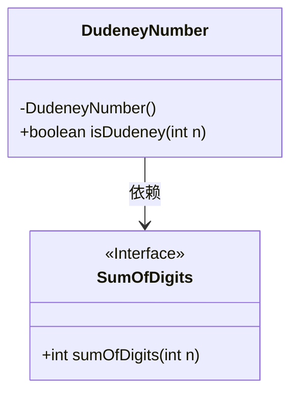
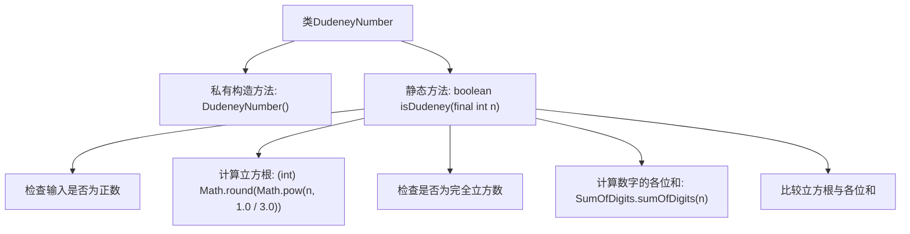

# 基础信息

|      |      |
|------|------|
| 名称 | DudeneyNumber |
| 编码语言 | .java |
| 代码路径 | Java/src/main/java/com/thealgorithms/maths/DudeneyNumber.java |
| 包名 | com.thealgorithms.maths |
| 依赖项 | [] |
| 概述说明 | DudeneyNumber类用于验证数字是否为立方等于其数字和的Dudeney数。 |

# 说明

DudeneyNumber类用于检查一个数字是否为Dudeney数。Dudeney数的定义是，该数字的立方等于其各位数字之和。例如，数字512的立方是134217728，其数字和为1+3+4+2+1+7+7+2+8=35，因此512不是Dudeney数。而数字153的立方是3587407，其数字和为3+5+8+7+4+0+7=34，因此153也不是Dudeney数。只有满足立方等于数字和的数字才是Dudeney数。

# 类列表 Class Summary

| 名称   | 类型  | 说明 |
|-------|------|-------------|
| DudeneyNumber | class | DudeneyNumber类检查数字是否为Dudeney数，即立方等于其数字和的数。 |

## 类 DudeneyNumber

|      |      |
|------|------|
| 访问范围 | public final |
| 类型 | class |
| 名称 | DudeneyNumber |
| 说明 | DudeneyNumber类检查数字是否为Dudeney数，即立方等于其数字和的数。 |

### UML类图

这段代码定义了一个名为 `DudeneyNumber` 的类，其中包含一个静态方法 `isDudeney`，用于判断一个整数是否为杜德尼数（Dudeney Number）。杜德尼数是指一个数等于其各位数字之和的立方。代码首先检查输入是否为正数，然后计算该数的立方根，并验证是否为完全立方数。最后，通过调用 `SumOfDigits` 接口的 `sumOfDigits` 方法，计算数字的各位数字之和，并与立方根进行比较。如果相等，则返回 `true`，否则返回 `false`。

### 内部方法调用关系图

这段代码定义了一个名为 `DudeneyNumber` 的类，其中包含一个静态方法 `isDudeney`，用于判断一个整数是否为 Dudeney 数。Dudeney 数是指一个数的立方根等于其各位数字之和的数。代码首先检查输入是否为正数，然后计算该数的立方根并检查是否为完全立方数，最后比较立方根与各位数字之和，返回判断结果。

### 字段列表 Field List

| 名称  | 类型  | 说明 |
|-------|-------|------|

### 方法列表 Method List

| 名称  | 类型  | 说明 |
|-------|-------|------|
| isDudeney | boolean | 判断数字是否为杜德尼数，需为正数且立方根等于其数字和。 |

