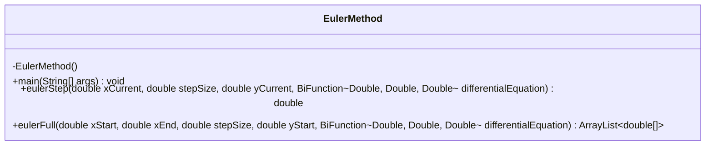
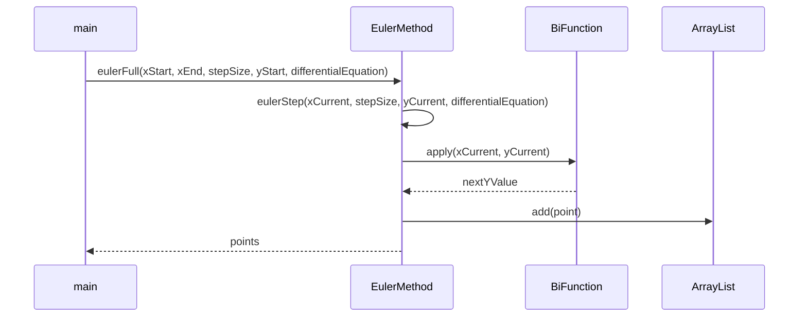

# 基础信息

|      |      |
|------|------|
| 名称 | EulerMethod |
| 编码语言 | .java |
| 代码路径 | Java/src/main/java/com/thealgorithms/maths/EulerMethod.java |
| 包名 | com.thealgorithms.maths |
| 依赖项 | ['java.util.ArrayList', 'java.util.function.BiFunction'] |
| 概述说明 | EulerMethod类演示欧拉法解微分方程，含三例及结果输出。 |

# 说明

EulerMethod类展示了使用欧拉法求解微分方程的过程，该方法通过逐步逼近的方式，利用初始条件和微分方程来计算后续点的值。类中包含了三个示例，分别展示了不同微分方程的求解过程，并输出了每个示例的计算结果。这些示例详细说明了欧拉法的应用步骤，帮助理解该方法在实际问题中的有效性。通过输出结果，用户可以直观地看到欧拉法在不同情况下的求解精度和适用性。

# 类列表 Class Summary

| 名称   | 类型  | 说明 |
|-------|------|-------------|
| EulerMethod | class | EulerMethod类展示欧拉法求解微分方程，包含三个示例并输出结果。 |

## 类 EulerMethod

|      |      |
|------|------|
| 访问范围 | public final |
| 类型 | class |
| 名称 | EulerMethod |
| 说明 | EulerMethod类展示欧拉法求解微分方程，包含三个示例并输出结果。 |

### UML类图

**描述：**  
`EulerMethod` 类实现了欧拉方法，用于求解常微分方程的数值解。它包含两个主要方法：`eulerStep` 用于计算下一个 y 值，`eulerFull` 用于在给定区间内逐步计算并返回所有点的 y 值。`main` 方法展示了三个示例，分别使用不同的微分方程进行求解，并将结果打印到控制台。代码通过 `BiFunction` 接口接收微分方程，并使用 `ArrayList` 存储计算结果。

### 内部方法调用关系图

```mermaid
graph TD
    A["类EulerMethod"]
    B["构造方法: EulerMethod()"]
    C["main方法: main(String[] args)"]
    D["输出: System.out.println('example 1:')"]
    E["定义: BiFunction<Double, Double, Double> exampleEquation1 = (x, y) -> x"]
    F["调用: ArrayList<double[]> points1 = eulerFull(0, 4, 0.1, 0, exampleEquation1)"]
    G["断言: assert points1.get(points1.size() - 1)[1] == 7.800000000000003"]
    H["输出: points1.forEach(point -> System.out.printf('x: %1$f; y: %2$f%n', point[0], point[1]))"]
    I["输出: System.out.println('\\n\\nexample 2:')"]
    J["定义: BiFunction<Double, Double, Double> exampleEquation2 = (x, y) -> y"]
    K["调用: ArrayList<double[]> points2 = eulerFull(0, 4, 0.1, 1, exampleEquation2)"]
    L["断言: assert points2.get(points2.size() - 1)[1] == 45.25925556817596"]
    M["输出: points2.forEach(point -> System.out.printf('x: %1$f; y: %2$f%n', point[0], point[1]))"]
    N["输出: System.out.println('\\n\\nexample 3:')"]
    O["定义: BiFunction<Double, Double, Double> exampleEquation3 = (x, y) -> x + y + x * y"]
    P["调用: ArrayList<double[]> points3 = eulerFull(0, 0.1, 0.025, 1, exampleEquation3)"]
    Q["断言: assert points3.get(points3.size() - 1)[1] == 1.1116729841674804"]
    R["输出: points3.forEach(point -> System.out.printf('x: %1$f; y: %2$f%n', point[0], point[1]))"]
    S["方法: double eulerStep(double xCurrent, double stepSize, double yCurrent, BiFunction<Double, Double, Double> differentialEquation)"]
    T["方法: ArrayList<double[]> eulerFull(double xStart, double xEnd, double stepSize, double yStart, BiFunction<Double, Double, Double> differentialEquation)"]
    U["初始化: ArrayList<double[]> points = new ArrayList<double[]>()"]
    V["添加第一个点: double[] firstPoint = {xStart, yStart}; points.add(firstPoint)"]
    W["循环: while (xCurrent < xEnd)"]
    X["调用: yCurrent = eulerStep(xCurrent, stepSize, yCurrent, differentialEquation)"]
    Y["更新: xCurrent += stepSize"]
    Z["添加点: double[] point = {xCurrent, yCurrent}; points.add(point)"]

    A --> B
    A -.-> C
    C --> D
    C --> E
    C --> F
    C --> G
    C --> H
    C --> I
    C --> J
    C --> K
    C --> L
    C --> M
    C --> N
    C --> O
    C --> P
    C --> Q
    C --> R
    A --> S
    A --> T
    T --> U
    T --> V
    T --> W
    W --> X
    W --> Y
    W --> Z
```

这段代码实现了一个欧拉方法（Euler Method）的数值解算器，用于求解常微分方程。`main`方法展示了三个不同的例子，分别使用不同的微分方程进行求解，并输出结果。`eulerStep`方法计算下一个y值，`eulerFull`方法则循环调用`eulerStep`，直到达到x的终点，并返回所有计算得到的点。流程图清晰地展示了类中的方法调用关系和执行流程。

### 字段列表 Field List

| 名称  | 类型  | 说明 |
|-------|-------|------|

### 方法列表 Method List

| 名称  | 类型  | 说明 |
|-------|-------|------|
| main | void | Java代码使用欧拉法求解三个微分方程，并验证结果。 |
| eulerFull | ArrayList<double[]> | 欧拉法计算微分方程解，返回点集。 |
| eulerStep | double | 欧拉步进法计算下一步的y值，步长需大于零。 |

