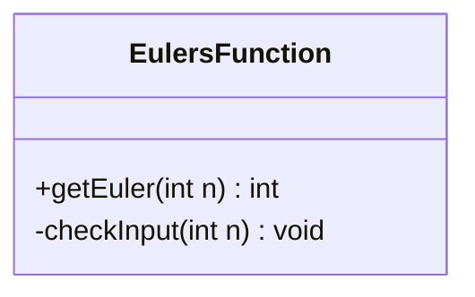
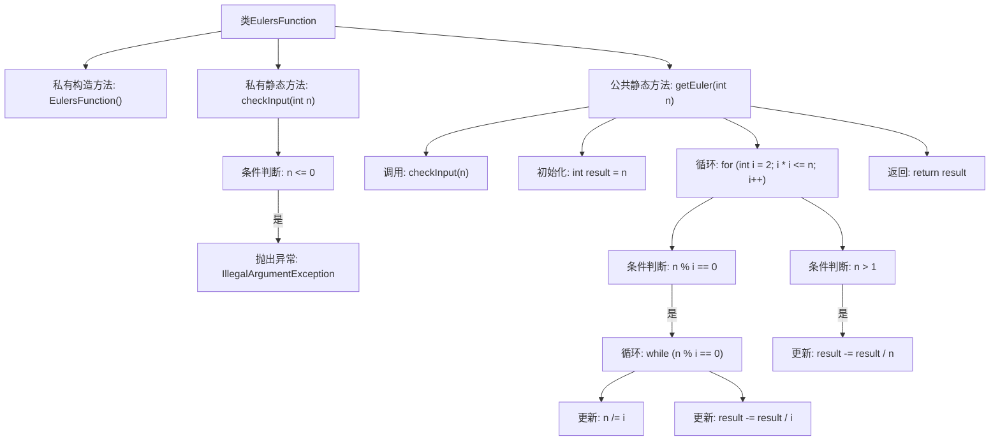

# 基础信息

|      |      |
|------|------|
| 名称 | EulersFunction |
| 编码语言 | .java |
| 代码路径 | Java/src/main/java/com/thealgorithms/maths/EulersFunction.java |
| 包名 | com.thealgorithms.maths |
| 依赖项 | [] |
| 概述说明 | 欧拉函数类，验证输入为正整数，时间复杂度为O(sqrt(n))。 |

# 说明

欧拉函数计算类主要用于计算给定正整数的欧拉函数值。该类首先验证输入是否为正整数，确保输入的合法性。计算过程中，采用时间复杂度为O(sqrt(n))的算法，通过遍历从1到sqrt(n)的所有整数，判断是否为输入数的因数，并利用这些因数来计算欧拉函数值。该方法在保证计算效率的同时，能够处理较大范围内的正整数输入。

# 类列表 Class Summary

| 名称   | 类型  | 说明 |
|-------|------|-------------|
| EulersFunction | class | 欧拉函数计算类，验证输入为正整数，时间复杂度O(sqrt(n))。 |

## 类 EulersFunction

|      |      |
|------|------|
| 访问范围 | public final |
| 类型 | class |
| 名称 | EulersFunction |
| 说明 | 欧拉函数计算类，验证输入为正整数，时间复杂度O(sqrt(n))。 |

### UML类图

这段代码定义了一个名为 `EulersFunction` 的类，该类包含两个静态方法：`getEuler` 和 `checkInput`。`getEuler` 方法用于计算给定整数的欧拉函数值，而 `checkInput` 方法用于验证输入是否为正整数。如果输入不符合要求，`checkInput` 方法会抛出 `IllegalArgumentException` 异常。`getEuler` 方法在计算欧拉函数时，首先调用 `checkInput` 方法进行输入验证，然后通过循环计算欧拉函数的值。该类的设计体现了输入验证和核心逻辑的分离，确保了代码的健壮性和可维护性。

### 内部方法调用关系图

这段代码实现了一个计算欧拉函数值的类 `EulersFunction`。首先，通过 `checkInput` 方法验证输入是否为正整数，若不符合则抛出异常。然后，`getEuler` 方法通过循环和条件判断计算欧拉函数值，最终返回结果。流程图展示了代码的执行顺序和各个方法之间的调用关系，帮助理解代码的逻辑结构。

### 字段列表 Field List

| 名称  | 类型  | 说明 |
|-------|-------|------|

### 方法列表 Method List

| 名称  | 类型  | 说明 |
|-------|-------|------|
| checkInput | void | 检查输入n是否为正数，否则抛出异常。 |
| getEuler | int | 计算欧拉函数，返回小于n且与n互质的整数个数。 |

