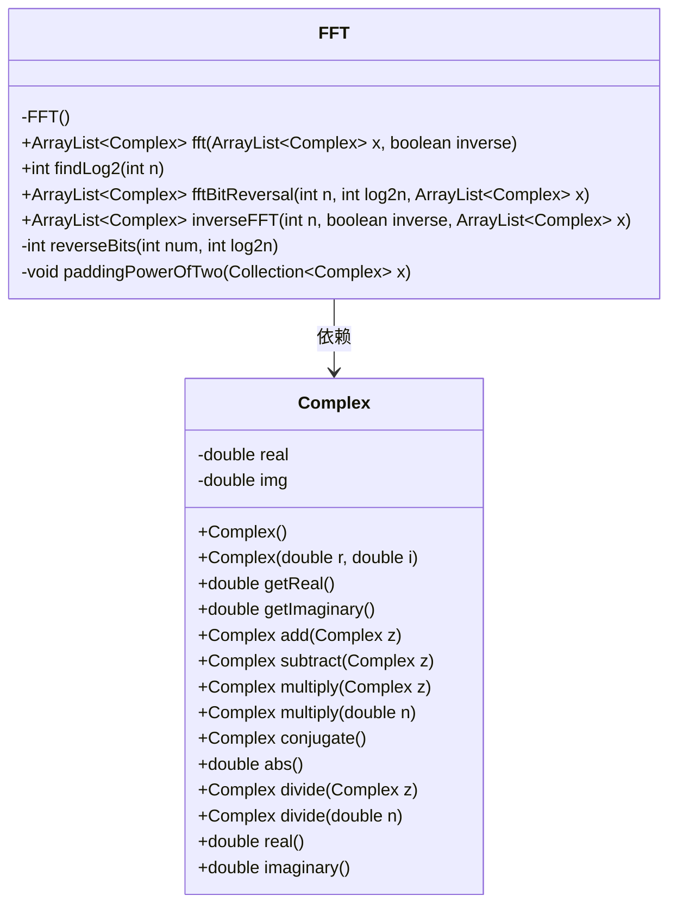

# 基础信息

|      |      |
|------|------|
| 名称 | FFT |
| 编码语言 | .java |
| 代码路径 | Java/src/main/java/com/thealgorithms/maths/FFT.java |
| 包名 | com.thealgorithms.maths |
| 依赖项 | ['java.util.ArrayList', 'java.util.Collection', 'java.util.Collections'] |
| 概述说明 | 实现复数运算及快速傅里叶变换，支持正逆变换。 |

# 说明

该FFT类实现了复数运算，并采用了Cooley-Tukey快速傅里叶变换算法，支持正变换和逆变换。复数运算功能用于处理复数的基本操作，而Cooley-Tukey算法则通过分治法高效计算傅里叶变换，适用于信号处理等领域。正变换将时域信号转换为频域，逆变换则将频域信号还原为时域，提供了完整的傅里叶变换功能。

# 类列表 Class Summary

| 名称   | 类型  | 说明 |
|-------|------|-------------|
| FFT | class | FFT类实现复数运算及Cooley-Tukey快速傅里叶变换算法，支持正逆变换。 |

## 类 FFT

|      |      |
|------|------|
| 访问范围 | public final |
| 类型 | class |
| 名称 | FFT |
| 说明 | FFT类实现复数运算及Cooley-Tukey快速傅里叶变换算法，支持正逆变换。 |

### UML类图

### 描述
这段代码实现了一个快速傅里叶变换（FFT）算法，包含一个`FFT`类和一个`Complex`类。`Complex`类用于表示复数，并提供了复数运算的基本方法，如加法、减法、乘法、除法等。`FFT`类则实现了Cooley-Tukey算法的FFT和逆FFT，通过位反转和迭代计算来完成傅里叶变换。`FFT`类依赖于`Complex`类来处理复数运算，确保傅里叶变换的正确执行。

### 内部方法调用关系图

```mermaid
graph TD
    A["类FFT"]
    B["内部类Complex"]
    C["属性: double real"]
    D["属性: double img"]
    E["构造方法: Complex()"]
    F["构造方法: Complex(double r, double i)"]
    G["方法: double getReal()"]
    H["方法: double getImaginary()"]
    I["方法: Complex add(Complex z)"]
    J["方法: Complex subtract(Complex z)"]
    K["方法: Complex multiply(Complex z)"]
    L["方法: Complex multiply(double n)"]
    M["方法: Complex conjugate()"]
    N["方法: double abs()"]
    O["方法: Complex divide(Complex z)"]
    P["方法: Complex divide(double n)"]
    Q["方法: double real()"]
    R["方法: double imaginary()"]
    S["方法: ArrayList<Complex> fft(ArrayList<Complex> x, boolean inverse)"]
    T["方法: int findLog2(int n)"]
    U["方法: ArrayList<Complex> fftBitReversal(int n, int log2n, ArrayList<Complex> x)"]
    V["方法: ArrayList<Complex> inverseFFT(int n, boolean inverse, ArrayList<Complex> x)"]
    W["方法: int reverseBits(int num, int log2n)"]
    X["方法: void paddingPowerOfTwo(Collection<Complex> x)"]

    A --> B
    B --> C
    B --> D
    B --> E
    B --> F
    B --> G
    B --> H
    B --> I
    B --> J
    B --> K
    B --> L
    B --> M
    B --> N
    B --> O
    B --> P
    B --> Q
    B --> R
    A --> S
    A --> T
    A --> U
    A --> V
    A --> W
    A --> X
```

这段代码实现了一个快速傅里叶变换（FFT）算法，主要用于信号处理。代码中包含一个内部类 `Complex`，用于表示和操作复数。`FFT` 类提供了多个方法，包括 `fft` 方法用于计算傅里叶变换，`findLog2` 用于计算对数，`fftBitReversal` 用于位反转，`inverseFFT` 用于计算逆傅里叶变换，`reverseBits` 用于反转比特，`paddingPowerOfTwo` 用于将信号长度填充为2的幂。这些方法共同协作，实现了高效的傅里叶变换计算。

### 字段列表 Field List

| 名称  | 类型  | 说明 |
|-------|-------|------|

### 方法列表 Method List

| 名称  | 类型  | 说明 |
|-------|-------|------|
| inverseFFT | ArrayList<Complex> | 逆FFT函数，若逆变换则对复数数组除以n后返回。 |
| fftBitReversal | ArrayList<Complex> | 实现FFT位反转，交换数组元素位置。 |
| reverseBits | int | 该方法反转整数的二进制位，返回反转后的结果。 |
| paddingPowerOfTwo | void | 将集合大小扩展至最接近的2的幂次方，并填充默认Complex对象。 |
| fft | ArrayList<Complex> | 实现FFT算法，支持正逆变换，包含零填充、位反转和主循环计算步骤。 |
| findLog2 | int | 计算整数n的以2为底的对数，返回最小满足2^log2n >= n的整数log2n。 |

