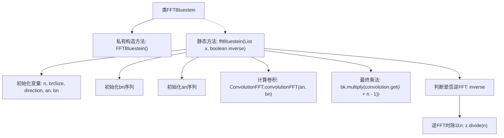

# 基础信息

|      |      |
|------|------|
| 名称 | FFTBluestein |
| 编码语言 | .java |
| 代码路径 | Java/src/main/java/com/thealgorithms/maths/FFTBluestein.java |
| 包名 | com.thealgorithms.maths |
| 依赖项 | ['java.util.ArrayList', 'java.util.List'] |
| 概述说明 | FFTBluestein类实现Bluestein的FFT算法，支持正反变换。 |

# 说明

FFTBluestein类实现了Bluestein的快速傅里叶变换（FFT）算法，该算法能够处理任意长度的序列，并且支持正向和反向变换。Bluestein的FFT算法通过将问题转化为卷积形式，利用FFT进行高效计算，从而解决了传统FFT算法对序列长度的限制。该类提供了完整的正反变换功能，适用于需要高精度和灵活性的信号处理场景。

# 类列表 Class Summary

| 名称   | 类型  | 说明 |
|-------|------|-------------|
| FFTBluestein | class | FFTBluestein类实现Bluestein的FFT算法，支持正反变换。 |


## 类 FFTBluestein

|      |      |
|------|------|
| 访问范围 | public final |
| 类型 | class |
| 名称 | FFTBluestein |
| 说明 | FFTBluestein类实现Bluestein的FFT算法，支持正反变换。 |


### UML类图

```mermaid
classDiagram
    class FFTBluestein {
        +fftBluestein(List~FFT.Complex~ x, boolean inverse) void
    }

    class FFT {
        class Complex {
            +Complex()
            +Complex(double real, double imaginary)
            +Complex multiply(Complex other) Complex
            +Complex divide(double scalar) Complex
        }
    }

    class ConvolutionFFT {
        +convolutionFFT(List~FFT.Complex~ an, List~FFT.Complex~ bn) List~FFT.Complex~
    }

    FFTBluestein --> FFT : 使用
    FFTBluestein --> ConvolutionFFT : 依赖
    FFT <|-- FFT.Complex
```

### 描述
该代码实现了Bluestein的FFT算法，用于计算离散信号的快速傅里叶变换（FFT）或逆FFT。`FFTBluestein`类包含一个静态方法`fftBluestein`，该方法接受一个复数列表和一个布尔值，表示是否进行逆FFT。该方法通过初始化序列`a(n)`和`b(n)`，使用`ConvolutionFFT`类进行卷积运算，最后根据是否逆FFT进行结果调整。`FFT.Complex`类用于表示复数，并提供乘法和除法操作。


### 内部方法调用关系图



**描述：**  
该代码实现了Bluestein的FFT算法，用于计算离散信号的快速傅里叶变换（FFT）或逆FFT。首先初始化变量和序列，然后通过卷积计算得到中间结果，最后根据是否为逆FFT进行相应的乘法或除法操作。整个流程清晰，涵盖了从初始化到最终结果处理的所有步骤。

### 字段列表 Field List

| 名称  | 类型  | 说明 |
|-------|-------|------|

### 方法列表 Method List

| 名称  | 类型  | 说明 |
|-------|-------|------|
| fftBluestein | void | 实现Bluestein FFT算法，支持正反变换，包括序列初始化、卷积计算及最终结果调整。 |


