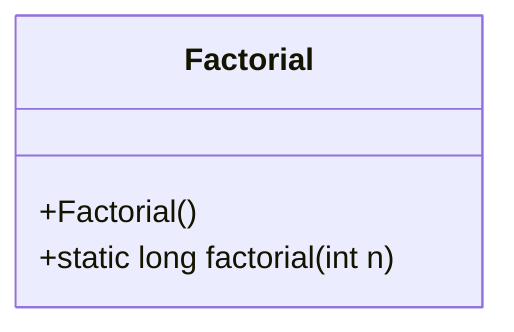
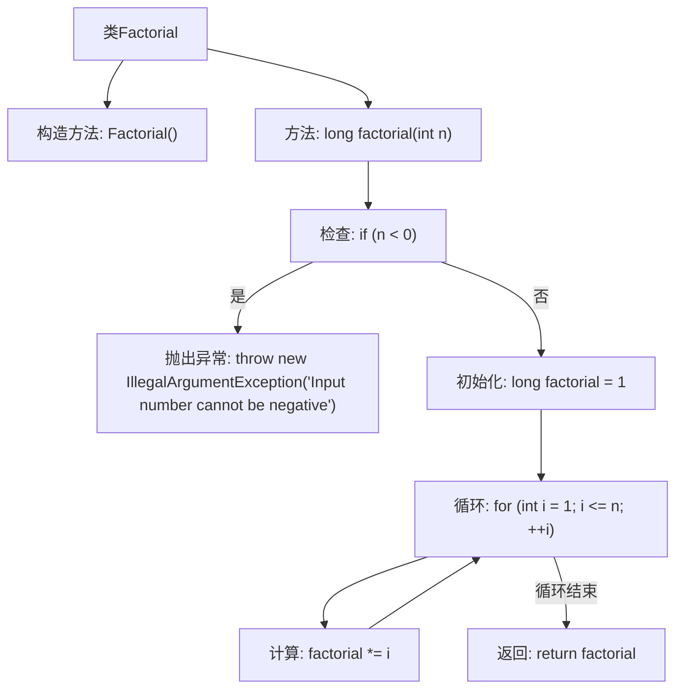

# 基础信息

|      |      |
|------|------|
| 名称 | Factorial |
| 编码语言 | .java |
| 代码路径 | Java/src/main/java/com/thealgorithms/maths/Factorial.java |
| 包名 | com.thealgorithms.maths |
| 依赖项 | [] |
| 概述说明 | Java类通过迭代方法计算阶乘。 |

# 说明

该Java类实现了阶乘的计算功能，采用迭代方法而非递归。通过循环结构逐步累乘，从1到给定整数n，最终返回n的阶乘结果。这种方法避免了递归的栈溢出风险，适合处理较大数值的阶乘计算。类设计简洁，逻辑清晰，易于理解和维护。

# 类列表 Class Summary

| 名称   | 类型  | 说明 |
|-------|------|-------------|
| Factorial | class | 计算阶乘的Java类，使用迭代方法实现。 |

## 类 Factorial

|      |      |
|------|------|
| 访问范围 | public final |
| 类型 | class |
| 名称 | Factorial |
| 说明 | 计算阶乘的Java类，使用迭代方法实现。 |

### UML类图

这段代码定义了一个名为 `Factorial` 的不可继承的类，其中包含一个私有的构造函数和一个公有的静态方法 `factorial`。`factorial` 方法用于计算给定整数 `n` 的阶乘，通过迭代的方式实现。如果输入的 `n` 为负数，方法会抛出 `IllegalArgumentException` 异常。该类的主要功能是提供阶乘计算服务，且由于构造函数为私有，无法实例化该类，确保了其工具类的特性。

### 内部方法调用关系图

这段代码定义了一个名为 `Factorial` 的类，其中包含一个私有的构造方法和一个静态的 `factorial` 方法。`factorial` 方法用于计算给定整数 `n` 的阶乘。首先，方法会检查输入的数是否为负数，如果是负数则抛出 `IllegalArgumentException` 异常。如果输入的数非负，则通过循环计算阶乘并返回结果。流程图清晰地展示了方法的执行流程，包括异常处理、循环计算和返回结果等步骤。

### 字段列表 Field List

| 名称  | 类型  | 说明 |
|-------|-------|------|

### 方法列表 Method List

| 名称  | 类型  | 说明 |
|-------|-------|------|
| factorial | long | 计算整数n的阶乘，若n为负数则抛出异常。 |

