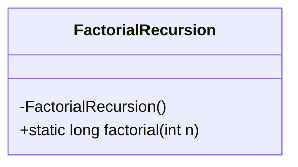
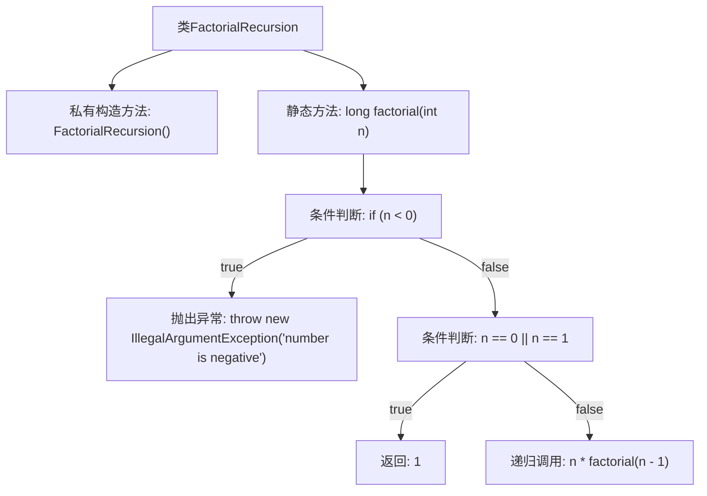

# 基础信息

|      |      |
|------|------|
| 名称 | FactorialRecursion |
| 编码语言 | .java |
| 代码路径 | Java/src/main/java/com/thealgorithms/maths/FactorialRecursion.java |
| 包名 | com.thealgorithms.maths |
| 依赖项 | [] |
| 概述说明 | 递归计算阶乘，处理负数异常。 |

# 说明

该内容描述了一个递归计算阶乘的程序，并特别强调了处理负数异常的情况。递归计算阶乘是指通过函数调用自身来计算一个正整数的阶乘，例如计算n的阶乘时，函数会调用自身计算n-1的阶乘，直到达到基准条件。处理负数异常意味着程序需要检测输入是否为负数，并在负数输入时抛出异常或返回错误信息，以确保程序的健壮性和正确性。

# 类列表 Class Summary

| 名称   | 类型  | 说明 |
|-------|------|-------------|
| FactorialRecursion | class | 递归计算阶乘，处理负数异常。 |

## 类 FactorialRecursion

|      |      |
|------|------|
| 访问范围 | public final |
| 类型 | class |
| 名称 | FactorialRecursion |
| 说明 | 递归计算阶乘，处理负数异常。 |

### UML类图

这段代码定义了一个名为 `FactorialRecursion` 的最终类，该类包含一个私有的构造函数和一个公有的静态方法 `factorial`。`factorial` 方法通过递归的方式计算给定整数的阶乘。如果输入的整数为负数，方法会抛出 `IllegalArgumentException` 异常。该方法在输入为 0 或 1 时返回 1，否则递归调用自身计算阶乘。

### 内部方法调用关系图

这段代码定义了一个名为 `FactorialRecursion` 的类，其中包含一个递归计算阶乘的静态方法 `factorial`。方法首先检查输入参数 `n` 是否为负数，如果是则抛出 `IllegalArgumentException` 异常。如果 `n` 为 0 或 1，则返回 1；否则，递归调用 `factorial(n - 1)` 并返回结果。流程图展示了方法内部的逻辑流程，包括条件判断、异常抛出和递归调用。

### 字段列表 Field List

| 名称  | 类型  | 说明 |
|-------|-------|------|

### 方法列表 Method List

| 名称  | 类型  | 说明 |
|-------|-------|------|
| factorial | long | 计算整数阶乘，负数抛出异常，递归实现。 |

