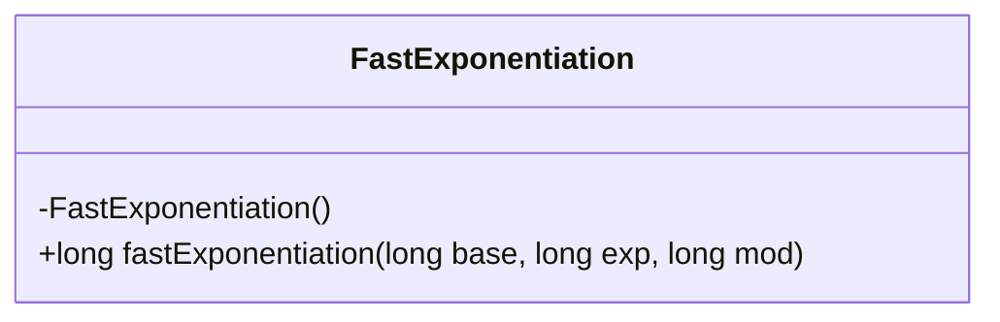
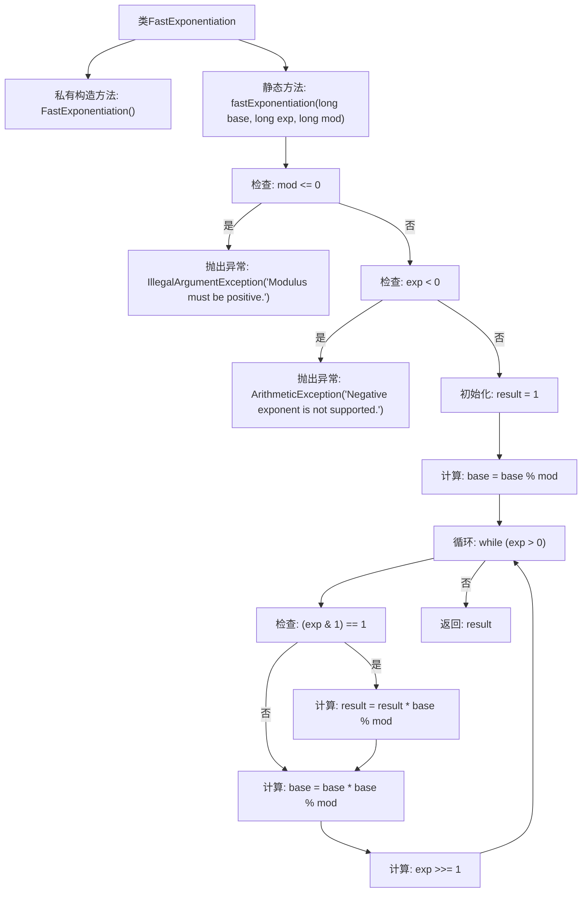

# 基础信息

|      |      |
|------|------|
| 名称 | FastExponentiation |
| 编码语言 | .java |
| 代码路径 | Java/src/main/java/com/thealgorithms/maths/FastExponentiation.java |
| 包名 | com.thealgorithms.maths |
| 依赖项 | [] |
| 概述说明 | 快速幂算法实现大数幂模运算，具备完善异常处理。 |

# 说明

快速幂算法用于高效计算大数的幂模运算，即计算(base^exp) % mod。该算法通过将指数分解为二进制形式，减少乘法次数，从而提升计算效率。支持大数运算，确保在处理极大数值时仍能保持性能。异常处理机制完善，能够有效应对输入错误、溢出等问题，确保算法的稳定性和可靠性。

# 类列表 Class Summary

| 名称   | 类型  | 说明 |
|-------|------|-------------|
| FastExponentiation | class | 快速幂算法实现，计算(base^exp) % mod，支持大数运算，异常处理完善。 |

## 类 FastExponentiation

|      |      |
|------|------|
| 访问范围 | public final |
| 类型 | class |
| 名称 | FastExponentiation |
| 说明 | 快速幂算法实现，计算(base^exp) % mod，支持大数运算，异常处理完善。 |

### UML类图

**描述：**  
`FastExponentiation` 类是一个工具类，用于高效计算模幂运算 `(base^exp) % mod`。它通过平方取模法（Exponentiation by Squaring）实现快速幂运算，避免了大数计算的溢出问题。类的构造函数被私有化，防止外部实例化。`fastExponentiation` 方法接收三个参数：`base`（基数）、`exp`（指数）和 `mod`（模数），并返回计算结果。该方法会检查模数是否为正数以及指数是否为非负数，若不符合条件则抛出异常。

### 内部方法调用关系图

**描述：**  
该流程图展示了`FastExponentiation`类中的`fastExponentiation`方法的执行流程。首先，方法检查模数`mod`是否小于等于0，若是则抛出`IllegalArgumentException`异常。接着，检查指数`exp`是否为负数，若是则抛出`ArithmeticException`异常。然后，初始化结果`result`为1，并对`base`取模。进入循环后，若`exp`为奇数，则将`base`乘到`result`中并取模。随后，`base`自乘并取模，`exp`右移一位。循环继续直到`exp`为0，最终返回`result`。

### 字段列表 Field List

| 名称  | 类型  | 说明 |
|-------|-------|------|

### 方法列表 Method List

| 名称  | 类型  | 说明 |
|-------|-------|------|
| fastExponentiation | long | 快速幂算法计算大数模幂，支持正底数和指数，处理大基数。 |

