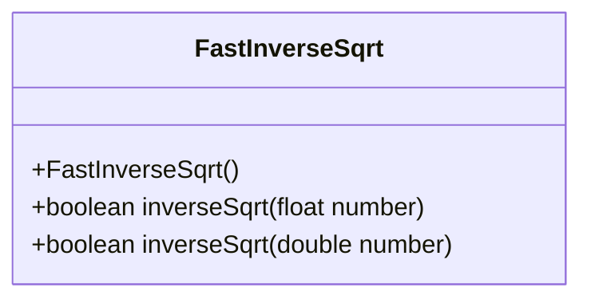
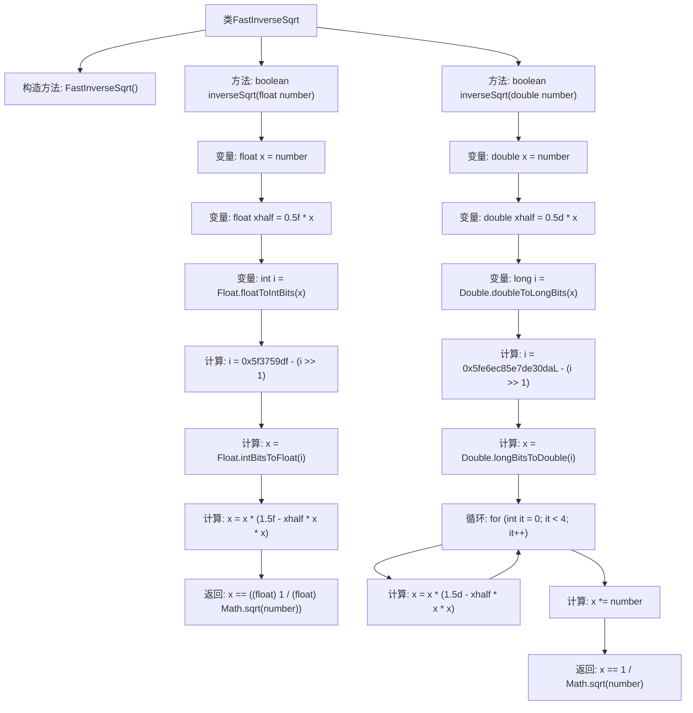

# 基础信息

|      |      |
|------|------|
| 名称 | FastInverseSqrt |
| 编码语言 | .java |
| 代码路径 | Java/src/main/java/com/thealgorithms/maths/FastInverseSqrt.java |
| 包名 | com.thealgorithms.maths |
| 依赖项 | [] |
| 概述说明 | FastInverseSqrt类提供两种方法计算逆平方根，精度6-8位和14-16位，时间复杂度O(1)。 |

# 说明

FastInverseSqrt类提供了两种计算数的逆平方根的方法，分别具有6-8位和14-16位的精度。这两种方法的时间复杂度均为O(1)，意味着它们的计算时间不随输入数据的大小而变化，保证了高效的计算性能。

# 类列表 Class Summary

| 名称   | 类型  | 说明 |
|-------|------|-------------|
| FastInverseSqrt | class | FastInverseSqrt类提供两种方法计算数的逆平方根，精度分别为6-8和14-16位，时间复杂度O(1)。 |

## 类 FastInverseSqrt

|      |      |
|------|------|
| 访问范围 | public final |
| 类型 | class |
| 名称 | FastInverseSqrt |
| 说明 | FastInverseSqrt类提供两种方法计算数的逆平方根，精度分别为6-8和14-16位，时间复杂度O(1)。 |

### UML类图

这段代码定义了一个名为 `FastInverseSqrt` 的类，该类包含两个静态方法 `inverseSqrt`，分别用于计算浮点数和双精度数的逆平方根。`inverseSqrt` 方法通过特定的数学公式和位操作来快速计算逆平方根，并返回计算结果是否与标准计算结果一致。该类被声明为 `final`，意味着它不能被继承，并且构造函数被私有化，防止外部实例化。

### 内部方法调用关系图

这段代码定义了一个名为`FastInverseSqrt`的类，包含两个静态方法`inverseSqrt`，分别用于计算浮点数和双精度数的逆平方根。通过特定的位操作和牛顿迭代法，方法能够快速计算出逆平方根，并与标准计算结果进行比较，返回布尔值。代码展示了高效的数值计算方法，适用于需要高精度计算的场景。

### 字段列表 Field List

| 名称  | 类型  | 说明 |
|-------|-------|------|

### 方法列表 Method List

| 名称  | 类型  | 说明 |
|-------|-------|------|
| inverseSqrt | boolean | 计算浮点数平方根倒数，通过位操作和牛顿迭代法优化。 |
| inverseSqrt | boolean | 该方法通过位操作和牛顿迭代法快速计算给定数的平方根倒数，并验证结果准确性。 |

