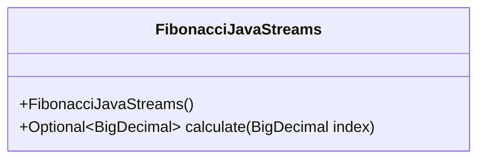
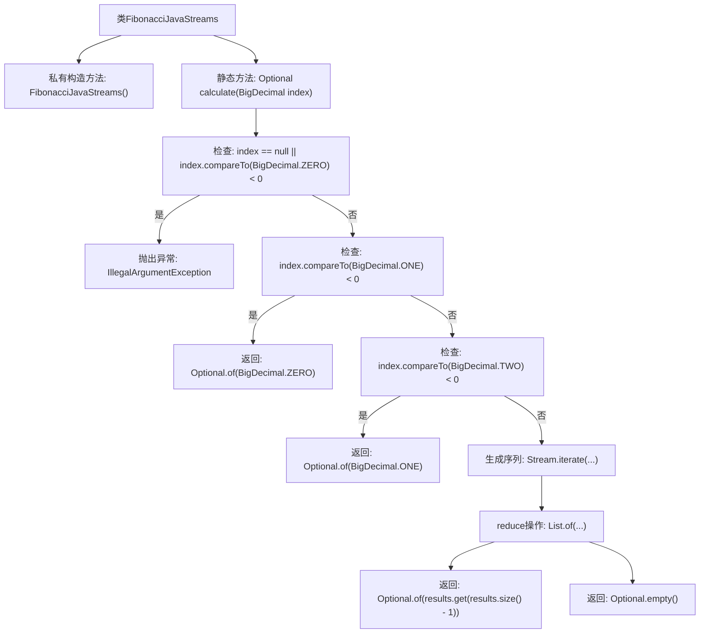

# 基础信息

|      |      |
|------|------|
| 名称 | FibonacciJavaStreams |
| 编码语言 | .java |
| 代码路径 | Java/src/main/java/com/thealgorithms/maths/FibonacciJavaStreams.java |
| 包名 | com.thealgorithms.maths |
| 依赖项 | ['java.math.BigDecimal', 'java.util.List', 'java.util.Optional', 'java.util.stream.Stream'] |
| 概述说明 | Java流式计算斐波那契数列，支持大数，返回Optional结果。 |

# 说明

Java流式计算斐波那契数列的实现，能够处理大数输入，并返回Optional类型的结果。该解决方案利用流式处理的高效性和灵活性，确保在大数计算时仍能保持性能。通过Optional返回结果，增强了代码的健壮性，避免了空指针异常，同时提供了更安全的结果处理方式。

# 类列表 Class Summary

| 名称   | 类型  | 说明 |
|-------|------|-------------|
| FibonacciJavaStreams | class | Java流式计算斐波那契数列，支持大数输入，返回Optional结果。 |

## 类 FibonacciJavaStreams

|      |      |
|------|------|
| 访问范围 | public final |
| 类型 | class |
| 名称 | FibonacciJavaStreams |
| 说明 | Java流式计算斐波那契数列，支持大数输入，返回Optional结果。 |

### UML类图

这段代码定义了一个名为 `FibonacciJavaStreams` 的类，该类包含一个私有构造函数和一个公共静态方法 `calculate`。`calculate` 方法接受一个 `BigDecimal` 类型的参数 `index`，并返回一个 `Optional<BigDecimal>` 类型的结果。该方法首先检查输入参数是否合法，然后根据 `index` 的值计算斐波那契数列的相应项，并返回结果。代码使用了 Java 的 `Stream` API 来处理斐波那契数列的计算，确保在输入为负数或 `null` 时抛出异常。

### 内部方法调用关系图

这段代码实现了一个使用Java Stream API计算斐波那契数列的方法。首先，代码检查输入是否为null或负数，如果是则抛出异常。接着，如果输入小于1，返回0；如果输入小于2，返回1。对于其他情况，代码使用Stream.iterate生成一个序列，并通过reduce操作计算斐波那契数列。最后，返回计算结果的最后一个值，如果结果为空则返回Optional.empty()。

### 字段列表 Field List

| 名称  | 类型  | 说明 |
|-------|-------|------|

### 方法列表 Method List

| 名称  | 类型  | 说明 |
|-------|-------|------|
| calculate | Optional<BigDecimal> | 计算函数，输入非负BigDecimal，返回特定条件下的结果或异常。 |

