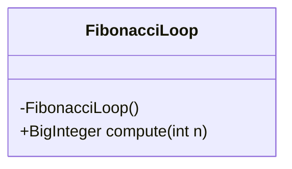
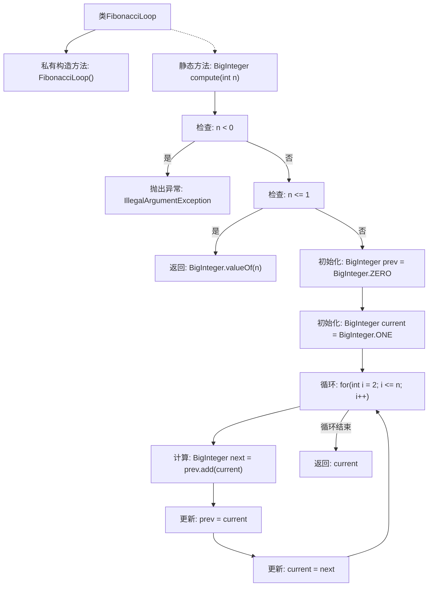

# 基础信息

|      |      |
|------|------|
| 名称 | FibonacciLoop |
| 编码语言 | .java |
| 代码路径 | Java/src/main/java/com/thealgorithms/maths/FibonacciLoop.java |
| 包名 | com.thealgorithms.maths |
| 依赖项 | ['java.math.BigInteger'] |
| 概述说明 | 计算第n个斐波那契数，采用循环方法，支持大整数计算。 |

# 说明

该描述涉及计算第n个斐波那契数的算法实现，采用循环方法以提高效率，特别支持大整数计算。循环实现避免了递归带来的性能问题，适用于处理较大的n值，确保计算结果的准确性和高效性。

# 类列表 Class Summary

| 名称   | 类型  | 说明 |
|-------|------|-------------|
| FibonacciLoop | class | 计算第n个斐波那契数，使用循环实现，支持大整数。 |

## 类 FibonacciLoop

|      |      |
|------|------|
| 访问范围 | public final |
| 类型 | class |
| 名称 | FibonacciLoop |
| 说明 | 计算第n个斐波那契数，使用循环实现，支持大整数。 |

### UML类图

类图描述：
`FibonacciLoop` 是一个工具类，用于计算第 n 个斐波那契数。该类包含一个私有构造函数，防止外部实例化。主要方法 `compute` 接受一个整数参数 `n`，并返回一个 `BigInteger` 类型的结果。如果 `n` 为负数，方法会抛出 `IllegalArgumentException`。该方法通过循环计算斐波那契数列，避免递归带来的性能问题。

### 内部方法调用关系图

这段代码实现了一个计算第n个斐波那契数的工具类FibonacciLoop。类中包含一个私有构造方法以防止实例化，以及一个静态方法compute用于计算斐波那契数。该方法首先检查输入是否为非负整数，若为负则抛出异常。若n小于等于1，则直接返回n。否则，通过循环计算斐波那契数，最终返回结果。

### 字段列表 Field List

| 名称  | 类型  | 说明 |
|-------|-------|------|

### 方法列表 Method List

| 名称  | 类型  | 说明 |
|-------|-------|------|
| compute | BigInteger | 计算第n个斐波那契数，输入为非负整数。 |

