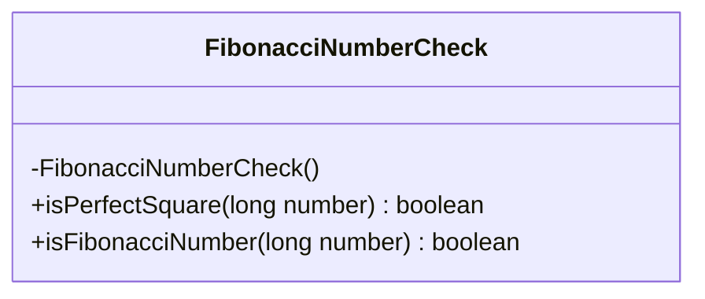
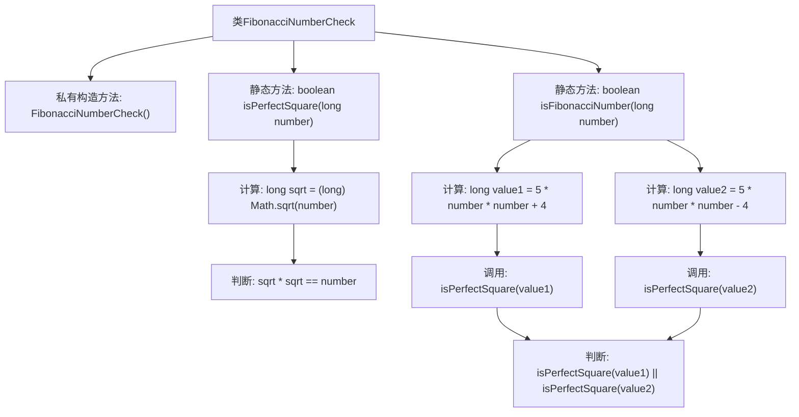

# 基础信息

|      |      |
|------|------|
| 名称 | FibonacciNumberCheck |
| 编码语言 | .java |
| 代码路径 | Java/src/main/java/com/thealgorithms/maths/FibonacciNumberCheck.java |
| 包名 | com.thealgorithms.maths |
| 依赖项 | [] |
| 概述说明 | 该类提供两个静态方法：判断完全平方数和斐波那契数。 |

# 说明

该类提供了两个静态方法，用于检查数字的特定属性。第一个方法isPerfectSquare用于判断一个数字是否为完全平方数，即该数字是否等于某个整数的平方。第二个方法isFibonacciNumber用于判断一个数字是否为斐波那契数，即该数字是否出现在斐波那契数列中。这两个方法可以帮助用户快速验证数字的数学特性。

# 类列表 Class Summary

| 名称   | 类型  | 说明 |
|-------|------|-------------|
| FibonacciNumberCheck | class | 该类包含两个静态方法：isPerfectSquare检查数字是否为完全平方数，isFibonacciNumber检查数字是否为斐波那契数。 |

## 类 FibonacciNumberCheck

|      |      |
|------|------|
| 访问范围 | public final |
| 类型 | class |
| 名称 | FibonacciNumberCheck |
| 说明 | 该类包含两个静态方法：isPerfectSquare检查数字是否为完全平方数，isFibonacciNumber检查数字是否为斐波那契数。 |

### UML类图

这段代码定义了一个名为 `FibonacciNumberCheck` 的类，该类包含两个静态方法：`isPerfectSquare` 和 `isFibonacciNumber`。`isPerfectSquare` 方法用于判断一个数是否为完全平方数，而 `isFibonacciNumber` 方法则用于判断一个数是否为斐波那契数。斐波那契数的判断基于数学性质，即一个数是斐波那契数当且仅当 `5x^2 + 4` 或 `5x^2 - 4` 之一是完全平方数。该类是一个工具类，因此构造函数被私有化以防止实例化。

### 内部方法调用关系图

这段代码定义了一个名为`FibonacciNumberCheck`的类，其中包含两个静态方法：`isPerfectSquare`和`isFibonacciNumber`。`isPerfectSquare`方法用于判断一个数是否为完全平方数，通过计算其平方根并验证平方根的平方是否等于原数。`isFibonacciNumber`方法用于判断一个数是否为斐波那契数，通过计算两个表达式`5 * number * number + 4`和`5 * number * number - 4`，并检查其中至少有一个是完全平方数。流程图展示了类的方法调用关系和逻辑判断流程。

### 字段列表 Field List

| 名称  | 类型  | 说明 |
|-------|-------|------|

### 方法列表 Method List

| 名称  | 类型  | 说明 |
|-------|-------|------|
| isPerfectSquare | boolean | 该方法判断一个长整型数是否为完全平方数。 |
| isFibonacciNumber | boolean | 判断数字是否为斐波那契数列中的数。 |

