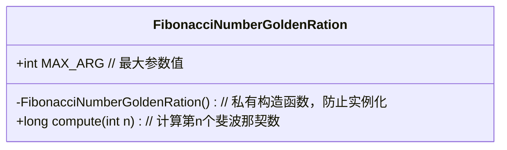
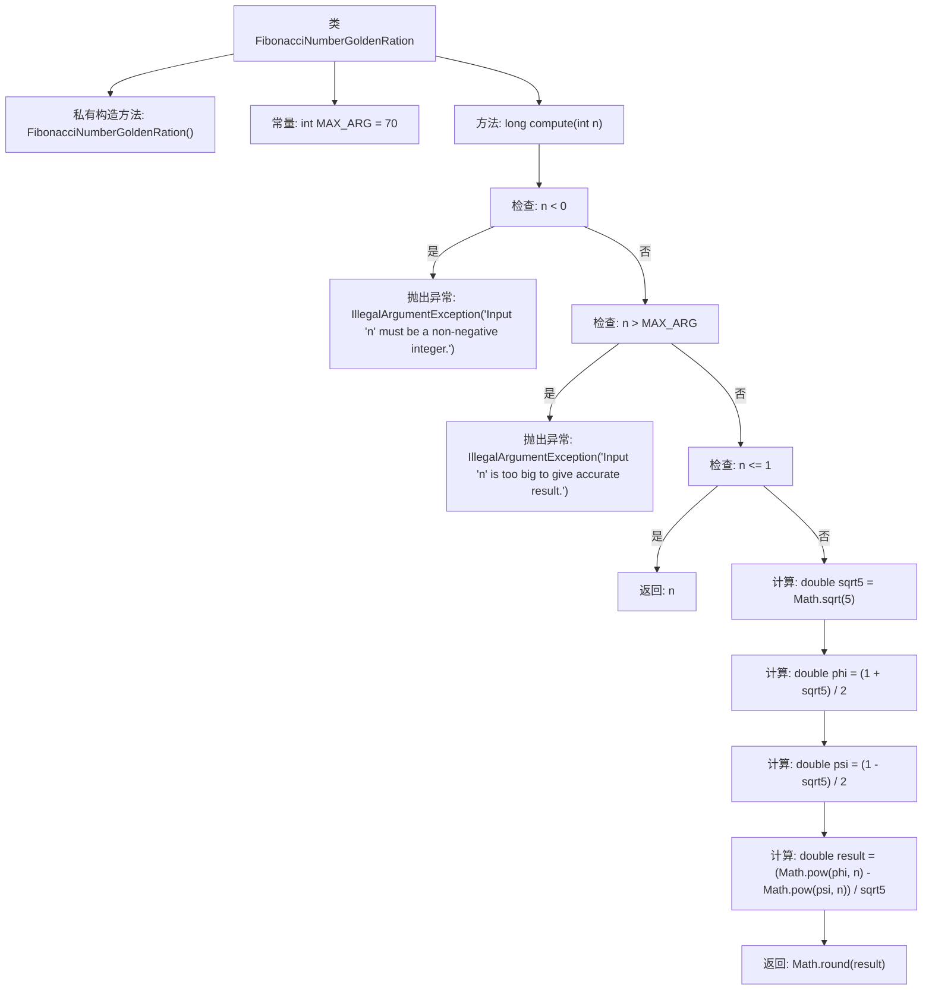

# 基础信息

|      |      |
|------|------|
| 名称 | FibonacciNumberGoldenRation |
| 编码语言 | .java |
| 代码路径 | Java/src/main/java/com/thealgorithms/maths/FibonacciNumberGoldenRation.java |
| 包名 | com.thealgorithms.maths |
| 依赖项 | [] |
| 概述说明 | Fibonacci类用黄金比例公式计算第n个数，输入上限为70以保证精度。 |

# 说明

Fibonacci类采用黄金比例公式来计算第n个斐波那契数，该方法通过数学公式直接得出结果，避免了递归或迭代的计算方式。为了确保计算结果的精度，类中对输入的最大值进行了限制，最大输入值设置为70。这一限制保证了在计算过程中不会出现精度丢失或数值溢出的问题，从而确保结果的准确性和可靠性。

# 类列表 Class Summary

| 名称   | 类型  | 说明 |
|-------|------|-------------|
| FibonacciNumberGoldenRation | class | Fibonacci类使用黄金比例公式计算第n个斐波那契数，最大输入限制为70以确保精度。 |

## 类 FibonacciNumberGoldenRation

|      |      |
|------|------|
| 访问范围 | public final |
| 类型 | class |
| 名称 | FibonacciNumberGoldenRation |
| 说明 | Fibonacci类使用黄金比例公式计算第n个斐波那契数，最大输入限制为70以确保精度。 |

### UML类图

**描述：**  
`FibonacciNumberGoldenRation` 是一个工具类，用于计算斐波那契数列的第n个数。该类通过使用黄金比例公式（Binet's formula）进行计算，并限制了输入参数n的最大值为70，以避免浮点运算误差导致的错误结果。类中包含一个私有构造函数，防止外部实例化，并提供了一个静态方法`compute`来执行计算，同时处理非法输入。

### 内部方法调用关系图

**描述：**  
该流程图展示了一个名为`FibonacciNumberGoldenRation`的类的内部逻辑。该类包含一个私有构造方法和一个公共静态方法`compute`，用于计算第n个斐波那契数。方法首先检查输入n是否为负数或超过最大值70，如果是则抛出异常。如果n小于等于1，则直接返回n。否则，使用黄金比例公式计算斐波那契数，并四舍五入后返回结果。

### 字段列表 Field List

| 名称  | 类型  | 说明 |
|-------|-------|------|
| MAX_ARG = 70 | int | 定义了一个不可变的最大参数常量MAX_ARG，值为70。 |

### 方法列表 Method List

| 名称  | 类型  | 说明 |
|-------|-------|------|
| compute | long | 计算第n个斐波那契数，输入需为非负整数且不超过最大值，使用黄金比例公式。 |

