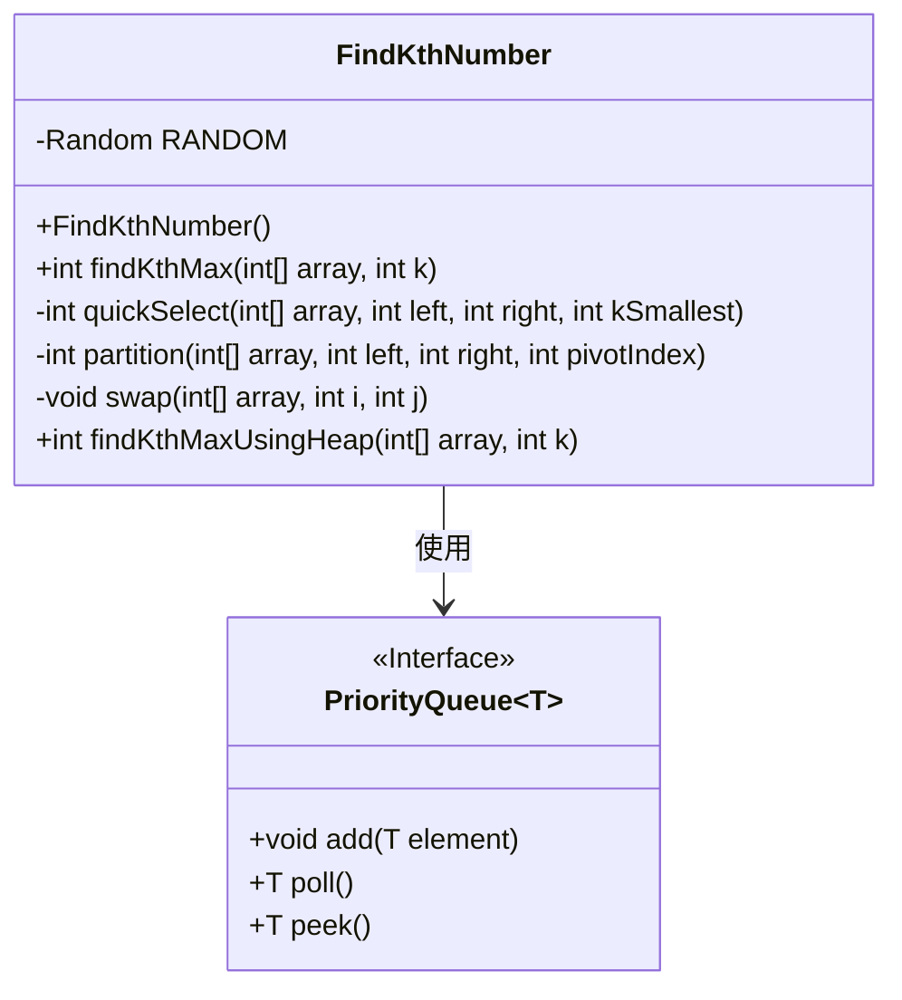
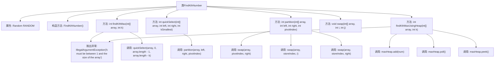

# 基础信息

|      |      |
|------|------|
| 名称 | FindKthNumber |
| 编码语言 | .java |
| 代码路径 | Java/src/main/java/com/thealgorithms/maths/FindKthNumber.java |
| 包名 | com.thealgorithms.maths |
| 依赖项 | ['java.util.Collections', 'java.util.PriorityQueue', 'java.util.Random'] |
| 概述说明 | FindKthNumber类提供快速选择和堆排序方法查找第k大元素。 |

# 说明

FindKthNumber类提供了两种方法来查找数组中第k大的元素：快速选择和堆排序。快速选择是一种基于分治策略的算法，通过选取一个基准元素将数组分为两部分，从而快速定位目标元素。堆排序则利用堆数据结构，通过构建最大堆或最小堆来高效地找到第k大元素。这两种方法各有优势，适用于不同场景，能够有效解决查找数组中第k大元素的问题。

# 类列表 Class Summary

| 名称   | 类型  | 说明 |
|-------|------|-------------|
| FindKthNumber | class | FindKthNumber类提供两种方法查找数组中第k大元素：快速选择和堆排序。 |

## 类 FindKthNumber

|      |      |
|------|------|
| 访问范围 | public final |
| 类型 | class |
| 名称 | FindKthNumber |
| 说明 | FindKthNumber类提供两种方法查找数组中第k大元素：快速选择和堆排序。 |

### UML类图

这段代码定义了一个 `FindKthNumber` 类，用于在数组中查找第 k 大的元素。类中提供了两种实现方式：一种是基于快速选择算法的 `findKthMax` 方法，另一种是基于最大堆的 `findKthMaxUsingHeap` 方法。`FindKthNumber` 类依赖于 `PriorityQueue` 接口来实现堆操作。快速选择算法通过递归地分区数组来找到第 k 大的元素，而堆方法则通过维护一个最大堆来逐步移除最大元素，直到找到第 k 大的元素。

### 内部方法调用关系图

这段代码定义了一个`FindKthNumber`类，包含两个主要方法`findKthMax`和`findKthMaxUsingHeap`，用于查找数组中第k大的元素。`findKthMax`使用快速选择算法，而`findKthMaxUsingHeap`使用最大堆实现。代码还包含辅助方法`quickSelect`、`partition`和`swap`，用于支持快速选择算法的实现。流程图展示了类结构、方法调用关系以及异常处理逻辑。

### 字段列表 Field List

| 名称  | 类型  | 说明 |
|-------|-------|------|
| RANDOM = new Random() | Random | 声明一个私有的静态随机数生成器实例。 |

### 方法列表 Method List

| 名称  | 类型  | 说明 |
|-------|-------|------|
| quickSelect | int | 快速选择算法递归查找数组中第k小元素。 |
| partition | int | 分区函数通过交换将数组元素按基准值排序。 |
| findKthMaxUsingHeap | int | 使用最大堆查找数组中第k大元素，确保k有效。 |
| findKthMax | int | 查找数组中第k大元素的Java方法，使用快速选择算法。 |
| swap | void | 私有方法swap用于交换数组中两个元素的位置。 |

