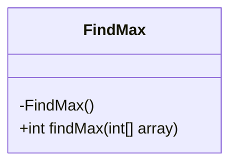
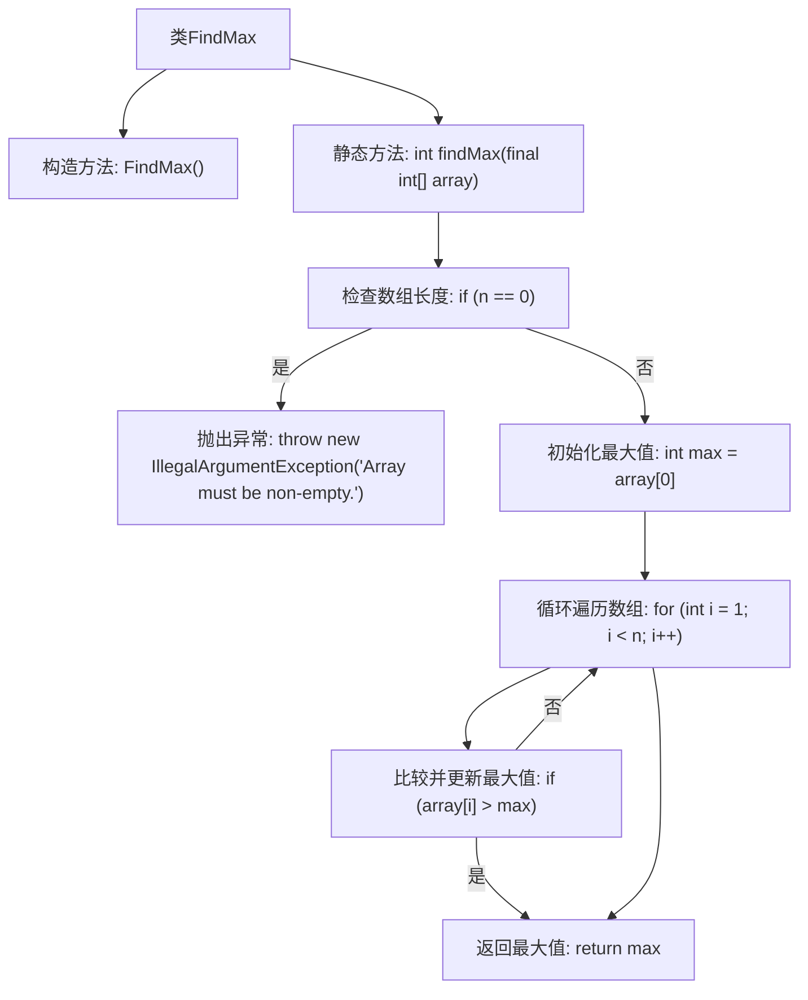

# 基础信息

|      |      |
|------|------|
| 名称 | FindMax |
| 编码语言 | .java |
| 代码路径 | Java/src/main/java/com/thealgorithms/maths/FindMax.java |
| 包名 | com.thealgorithms.maths |
| 依赖项 | [] |
| 概述说明 | 工具类查找数组最大值，空数组抛出异常。 |

# 说明

这是一个用于查找数组中最大值的工具类。该工具类的主要功能是接收一个数组作为输入，并返回该数组中的最大值。如果输入的数组为空，工具类会抛出一个异常，以确保在处理空数组时能够提供明确的错误提示。这种设计有助于提高代码的健壮性和可维护性，确保在使用该工具类时能够正确处理各种边界情况。

# 类列表 Class Summary

| 名称   | 类型  | 说明 |
|-------|------|-------------|
| FindMax | class | 查找数组最大值的工具类，空数组抛出异常。 |

## 类 FindMax

|      |      |
|------|------|
| 访问范围 | public final |
| 类型 | class |
| 名称 | FindMax |
| 说明 | 查找数组最大值的工具类，空数组抛出异常。 |

### UML类图

**描述：**  
`FindMax` 类是一个工具类，用于查找整数数组中的最大值。它包含一个私有构造函数，防止类被实例化。`findMax` 方法接收一个整数数组作为参数，并返回数组中的最大值。如果数组为空，方法会抛出 `IllegalArgumentException` 异常。该方法通过遍历数组来找到最大值，确保在处理边缘情况时能够正确响应。

### 内部方法调用关系图

这段代码定义了一个名为 `FindMax` 的类，其中包含一个私有构造方法和一个静态方法 `findMax`。`findMax` 方法用于查找输入数组中的最大值。首先，方法检查数组是否为空，如果为空则抛出 `IllegalArgumentException` 异常。如果数组不为空，方法初始化最大值为数组的第一个元素，然后通过循环遍历数组中的每个元素，比较并更新最大值。最后，方法返回找到的最大值。流程图展示了这一逻辑流程，从检查数组长度到最终返回最大值。

### 字段列表 Field List

| 名称  | 类型  | 说明 |
|-------|-------|------|

### 方法列表 Method List

| 名称  | 类型  | 说明 |
|-------|-------|------|
| findMax | int | 静态方法findMax查找非空整数数组中的最大值。 |

