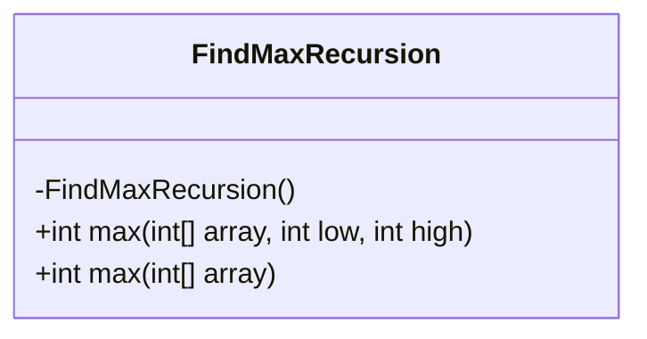
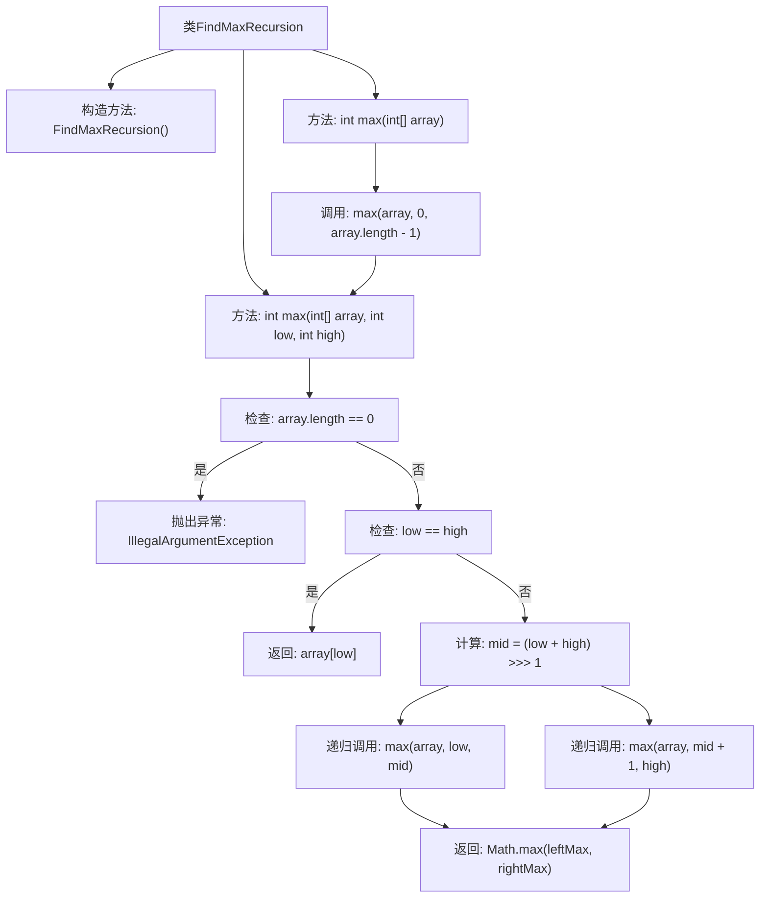

# 基础信息

|      |      |
|------|------|
| 名称 | FindMaxRecursion |
| 编码语言 | .java |
| 代码路径 | Java/src/main/java/com/thealgorithms/maths/FindMaxRecursion.java |
| 包名 | com.thealgorithms.maths |
| 依赖项 | [] |
| 概述说明 | 递归分治法求数组最大值，支持指定范围。 |

# 说明

递归分治法求数组最大值是一种高效的算法，通过将数组分成更小的子数组，分别求解每个子数组的最大值，再合并结果得到整个数组的最大值。该算法支持指定范围，允许用户在数组的特定区间内查找最大值，提高了灵活性和适用性。递归分治法通过不断缩小问题规模，最终将问题简化为基本情况，从而高效地解决问题。这种方法在处理大规模数据时表现出色，具有良好的时间复杂度和空间效率。

# 类列表 Class Summary

| 名称   | 类型  | 说明 |
|-------|------|-------------|
| FindMaxRecursion | class | 递归分治法求数组最大值，支持指定范围。 |

## 类 FindMaxRecursion

|      |      |
|------|------|
| 访问范围 | public final |
| 类型 | class |
| 名称 | FindMaxRecursion |
| 说明 | 递归分治法求数组最大值，支持指定范围。 |

### UML类图

**描述：**  
`FindMaxRecursion` 类是一个工具类，用于通过递归和分治算法查找数组中的最大值。该类包含两个静态方法：`max(int[] array, int low, int high)` 和 `max(int[] array)`。第一个方法通过递归将数组分为两部分，分别查找左半部分和右半部分的最大值，然后返回两者中的较大值。第二个方法是对第一个方法的封装，默认从数组的第一个元素到最后一个元素进行查找。该类设计为不可实例化，构造函数为私有。

### 内部方法调用关系图

这段代码定义了一个名为`FindMaxRecursion`的类，该类包含两个静态方法`max`，用于通过递归和分治算法找到数组中的最大值。第一个`max`方法接受数组、起始索引和结束索引作为参数，通过递归将数组分为两部分，分别找到左半部分和右半部分的最大值，然后返回两者中的较大值。第二个`max`方法则是对第一个方法的封装，直接传入数组并调用第一个方法进行计算。流程图展示了方法的调用关系和递归过程。

### 字段列表 Field List

| 名称  | 类型  | 说明 |
|-------|-------|------|

### 方法列表 Method List

| 名称  | 类型  | 说明 |
|-------|-------|------|
| max | int | 递归查找数组中指定范围内的最大值。 |
| max | int | 静态方法max返回数组的最大值，调用重载方法处理整个数组范围。 |

