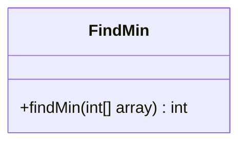
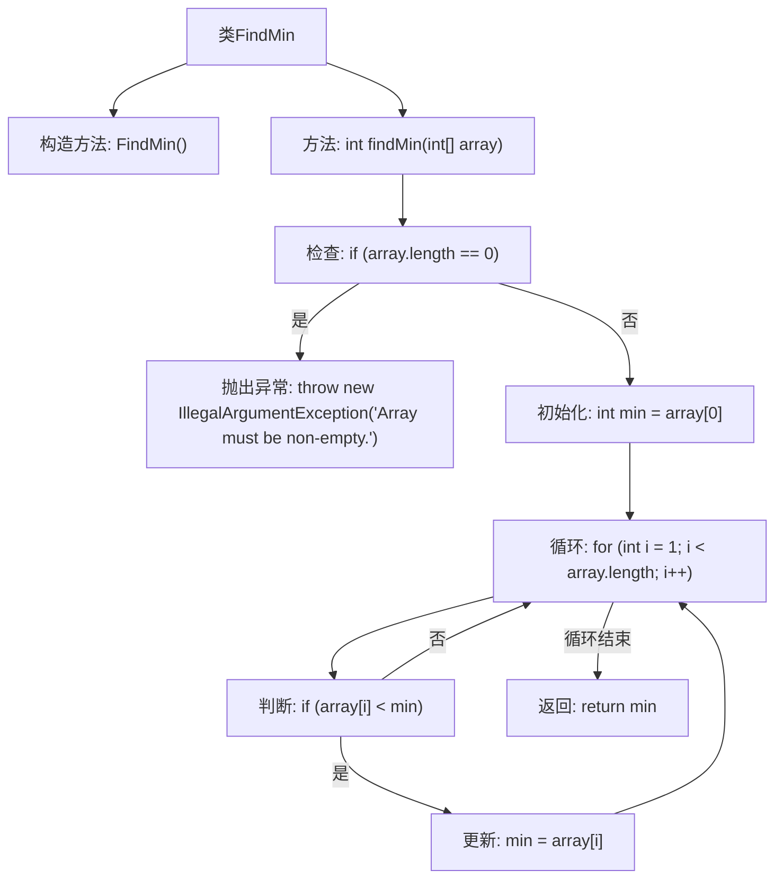

# 基础信息

|      |      |
|------|------|
| 名称 | FindMin |
| 编码语言 | .java |
| 代码路径 | Java/src/main/java/com/thealgorithms/maths/FindMin.java |
| 包名 | com.thealgorithms.maths |
| 依赖项 | [] |
| 概述说明 | FindMin类提供findMin方法，查找非空整数数组最小值，空数组抛出异常。 |

# 说明

FindMin类包含一个静态方法findMin，该方法用于在非空整数数组中查找最小值。如果传入的数组为空，该方法将抛出异常。这个方法的主要功能是确保在非空数组中能够准确找到最小值，并在数组为空时通过抛出异常来处理异常情况。

# 类列表 Class Summary

| 名称   | 类型  | 说明 |
|-------|------|-------------|
| FindMin | class | FindMin类提供静态方法findMin，用于查找非空整数数组中的最小值，若数组为空则抛出异常。 |

## 类 FindMin

|      |      |
|------|------|
| 访问范围 | public final |
| 类型 | class |
| 名称 | FindMin |
| 说明 | FindMin类提供静态方法findMin，用于查找非空整数数组中的最小值，若数组为空则抛出异常。 |

### UML类图

**描述：**  
`FindMin` 类是一个工具类，用于查找整数数组中的最小值。它包含一个静态方法 `findMin`，该方法接收一个整数数组作为参数，并返回数组中的最小值。如果输入数组为空，方法会抛出 `IllegalArgumentException` 异常。该方法通过遍历数组来找到最小值，确保代码的健壮性和正确性。

### 内部方法调用关系图

这段代码定义了一个名为 `FindMin` 的类，其中包含一个静态方法 `findMin`，用于查找输入数组中的最小值。方法首先检查数组是否为空，若为空则抛出 `IllegalArgumentException` 异常。否则，初始化最小值为数组的第一个元素，然后通过循环遍历数组，逐个比较并更新最小值，最后返回最小值。流程图展示了方法的执行流程，包括异常处理、初始化和循环更新最小值的步骤。

### 字段列表 Field List

| 名称  | 类型  | 说明 |
|-------|-------|------|

### 方法列表 Method List

| 名称  | 类型  | 说明 |
|-------|-------|------|
| findMin | int | 查找数组最小值的静态方法，空数组抛出异常。 |

