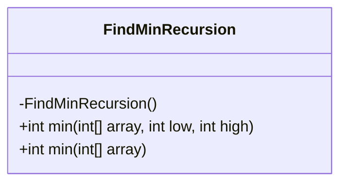
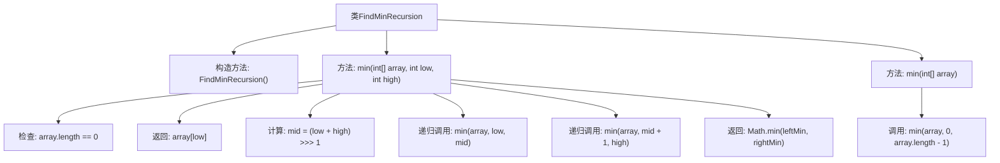

# 基础信息

|      |      |
|------|------|
| 名称 | FindMinRecursion |
| 编码语言 | .java |
| 代码路径 | Java/src/main/java/com/thealgorithms/maths/FindMinRecursion.java |
| 包名 | com.thealgorithms.maths |
| 依赖项 | [] |
| 概述说明 | 递归分治法实现数组最小值查找。 |

# 说明

递归分治法实现数组最小值查找是一种通过将数组不断分割为更小的子数组，逐步缩小查找范围，最终找到最小值的方法。该方法首先将数组分为两部分，分别递归查找每部分的最小值，然后比较这两个最小值，返回更小的那个作为整个数组的最小值。当数组长度为1时，直接返回该元素作为最小值。这种方法通过递归调用和分治策略，有效地减少查找范围，提高查找效率。

# 类列表 Class Summary

| 名称   | 类型  | 说明 |
|-------|------|-------------|
| FindMinRecursion | class | 递归分治法实现数组最小值查找。 |

## 类 FindMinRecursion

|      |      |
|------|------|
| 访问范围 | public final |
| 类型 | class |
| 名称 | FindMinRecursion |
| 说明 | 递归分治法实现数组最小值查找。 |

### UML类图

这段代码定义了一个名为 `FindMinRecursion` 的类，该类包含两个静态方法用于查找数组中的最小值。第一个方法 `min(int[] array, int low, int high)` 使用分治算法递归地查找数组中的最小值，第二个方法 `min(int[] array)` 是对第一个方法的封装，简化了调用方式。类图展示了 `FindMinRecursion` 类的结构，包括其私有构造函数和两个公有方法。

### 内部方法调用关系图

这段代码定义了一个`FindMinRecursion`类，其中包含两个方法：`min(int[] array, int low, int high)`和`min(int[] array)`。第一个方法使用分治算法递归地找到数组中的最小值，第二个方法是对第一个方法的封装，简化了调用过程。流程图展示了类的结构、方法的调用关系以及递归调用的流程。

### 字段列表 Field List

| 名称  | 类型  | 说明 |
|-------|-------|------|

### 方法列表 Method List

| 名称  | 类型  | 说明 |
|-------|-------|------|
| min | int | 该方法递归查找数组中指定范围的最小值。 |
| min | int | 静态方法返回数组最小值。 |

