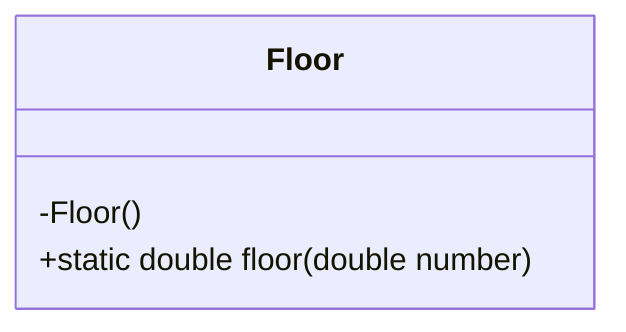
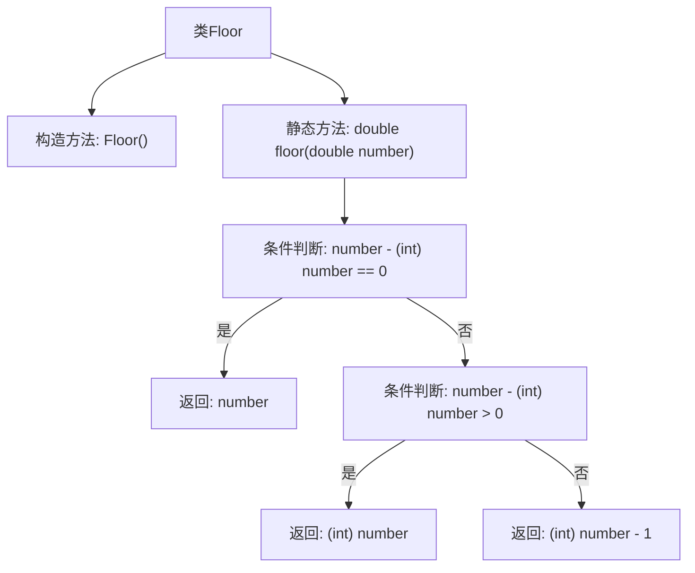

# 基础信息

|      |      |
|------|------|
| 名称 | Floor |
| 编码语言 | .java |
| 代码路径 | Java/src/main/java/com/thealgorithms/maths/Floor.java |
| 包名 | com.thealgorithms.maths |
| 依赖项 | [] |
| 概述说明 | Floor类方法返回最接近正无穷大的整数。 |

# 说明

Floor类提供了一个名为floor的方法，该方法返回一个整数，该整数是最接近正无穷大的整数。这意味着floor方法会将输入的数字向下取整，返回不大于该数字的最大整数。该方法在处理需要向下取整的数学运算时非常有用，确保结果符合预期的整数范围。

# 类列表 Class Summary

| 名称   | 类型  | 说明 |
|-------|------|-------------|
| Floor | class | Floor类提供floor方法，返回最接近正无穷大的整数。 |

## 类 Floor

|      |      |
|------|------|
| 访问范围 | public final |
| 类型 | class |
| 名称 | Floor |
| 说明 | Floor类提供floor方法，返回最接近正无穷大的整数。 |

### UML类图

这段代码定义了一个名为 `Floor` 的最终类，其中包含一个私有的构造函数和一个公有的静态方法 `floor`。`floor` 方法接收一个 `double` 类型的参数 `number`，并返回最接近该数且小于或等于它的整数。该方法通过检查 `number` 与它的整数部分之间的差值来确定返回的值。如果差值为零，则返回 `number` 本身；如果差值大于零，则返回 `number` 的整数部分；如果差值小于零，则返回 `number` 的整数部分减一。这个类的主要作用是实现类似于 `Math.floor` 的功能，用于向下取整。

### 内部方法调用关系图

这段代码定义了一个名为 `Floor` 的类，其中包含一个静态方法 `floor`，用于返回给定浮点数的最大整数（即向下取整）。方法首先检查输入数字是否为整数，如果是则直接返回该数字；否则根据数字的正负情况返回相应的整数部分或整数部分减一。流程图清晰地展示了方法的逻辑流程和条件判断。

### 字段列表 Field List

| 名称  | 类型  | 说明 |
|-------|-------|------|

### 方法列表 Method List

| 名称  | 类型  | 说明 |
|-------|-------|------|
| floor | double | 该方法返回不大于输入数字的最大整数。 |

