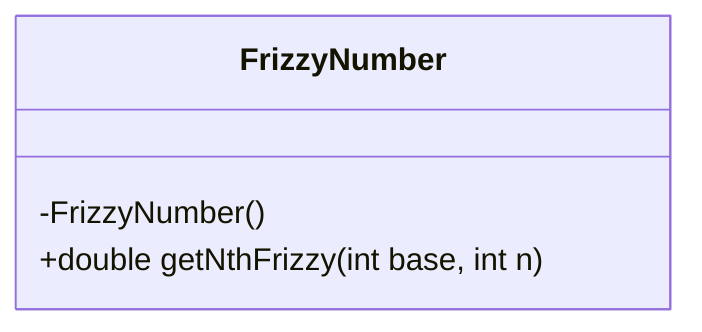
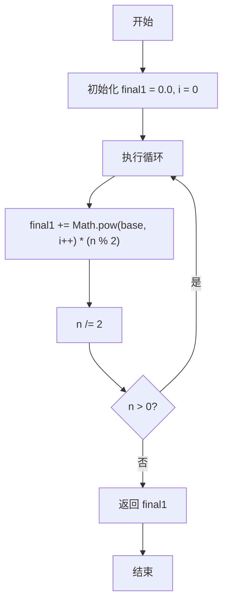
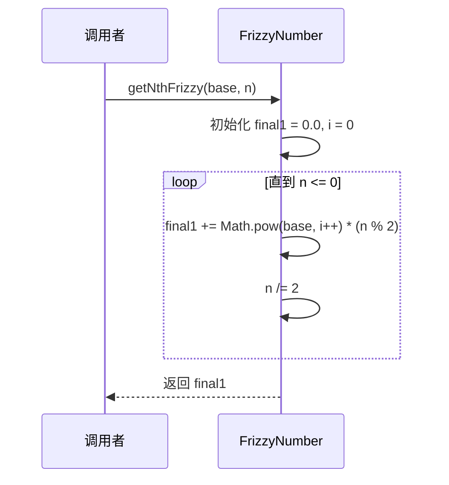
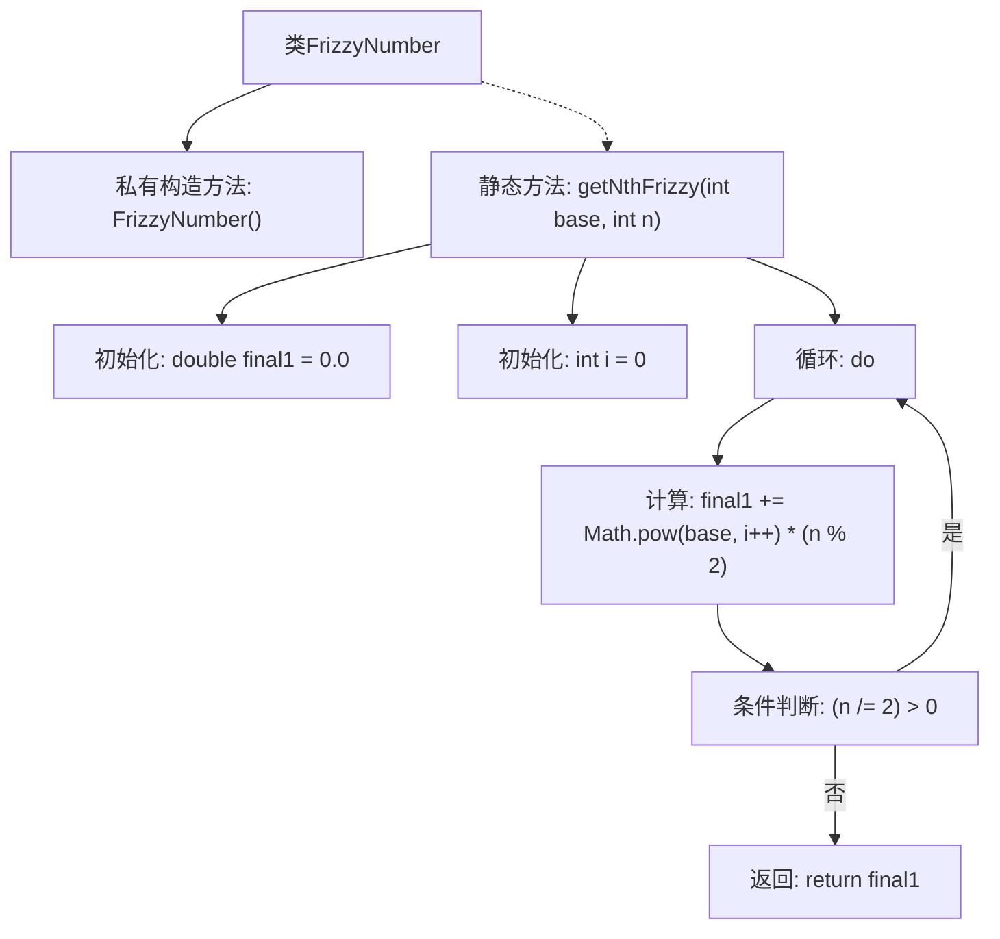

# 基础信息

|      |      |
|------|------|
| 名称 | FrizzyNumber |
| 编码语言 | .java |
| 代码路径 | Java/src/main/java/com/thealgorithms/maths/FrizzyNumber.java |
| 包名 | com.thealgorithms.maths |
| 依赖项 | [] |
| 概述说明 | FrizzyNumber类的getNthFrizzy方法计算基数的第n个幂和。 |

# 说明

FrizzyNumber类中的getNthFrizzy方法用于计算给定基数的第n个幂和。该方法接受基数和幂次作为输入，通过计算基数的第n次幂并求和，最终返回结果。该方法适用于需要快速计算幂和的应用场景，能够高效地处理大数运算，确保计算结果的准确性和可靠性。

# 类列表 Class Summary

| 名称   | 类型  | 说明 |
|-------|------|-------------|
| FrizzyNumber | class | FrizzyNumber类提供getNthFrizzy方法，计算给定基数的第n个幂和。 |

## 类 FrizzyNumber

|      |      |
|------|------|
| 访问范围 | public final |
| 类型 | class |
| 名称 | FrizzyNumber |
| 说明 | FrizzyNumber类提供getNthFrizzy方法，计算给定基数的第n个幂和。 |

### UML类图

**描述：**  
`FrizzyNumber` 类是一个工具类，用于计算给定基数的幂的和的第 n 个数。类中的 `getNthFrizzy` 方法通过循环和位运算逐步计算幂的和，直到 n 的值变为 0。该方法返回计算得到的最终值。类图展示了类的结构，流程图和时序图分别展示了方法的执行流程和调用顺序。

### 内部方法调用关系图

这段代码定义了一个名为 `FrizzyNumber` 的类，该类包含一个私有构造方法和一个静态方法 `getNthFrizzy`。`getNthFrizzy` 方法用于计算给定基数的第 n 个幂和。方法通过循环和位运算逐步计算幂和，最终返回结果。流程图展示了方法的执行步骤，包括初始化、循环计算和条件判断，直到满足条件后返回最终结果。

### 字段列表 Field List

| 名称  | 类型  | 说明 |
|-------|-------|------|

### 方法列表 Method List

| 名称  | 类型  | 说明 |
|-------|-------|------|
| getNthFrizzy | double | 该方法计算基于base和n的特定数学序列值。 |

