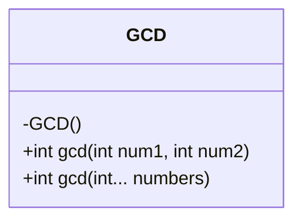
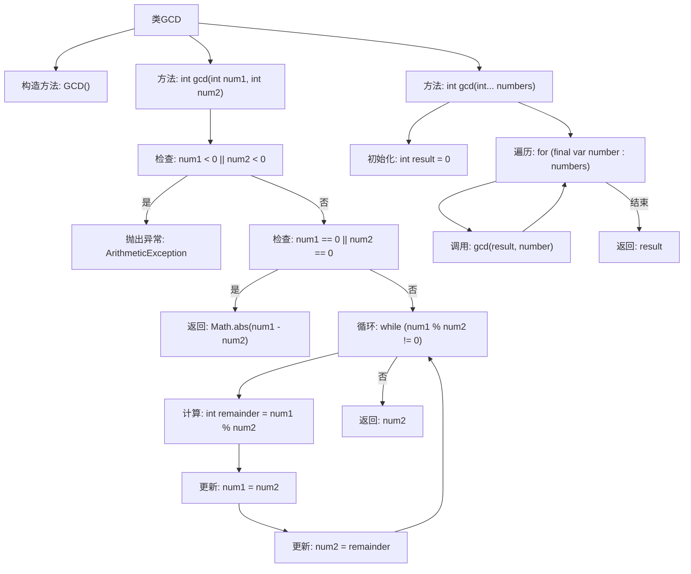

# 基础信息

|      |      |
|------|------|
| 名称 | GCD |
| 编码语言 | .java |
| 代码路径 | Java/src/main/java/com/thealgorithms/maths/GCD.java |
| 包名 | com.thealgorithms.maths |
| 依赖项 | [] |
| 概述说明 | GCD类提供计算最大公约数的方法。 |

# 说明

GCD类是一个专门用于计算最大公约数的工具类。它提供了计算两个数或数组中元素最大公约数的方法。通过该类，用户可以方便地求解两个整数或多个整数之间的最大公约数，适用于各种需要求最大公约数的场景。该类设计简洁，功能明确，便于集成到其他项目中，提高了代码的复用性和可维护性。

# 类列表 Class Summary

| 名称   | 类型  | 说明 |
|-------|------|-------------|
| GCD | class | GCD类提供计算两个数或数组最大公约数的方法。 |

## 类 GCD

|      |      |
|------|------|
| 访问范围 | public final |
| 类型 | class |
| 名称 | GCD |
| 说明 | GCD类提供计算两个数或数组最大公约数的方法。 |

### UML类图

这段代码定义了一个名为 `GCD` 的类，用于计算两个或多个整数的最大公约数（GCD）。类中包含两个静态方法：`gcd(int num1, int num2)` 用于计算两个整数的 GCD，`gcd(int... numbers)` 用于计算一个整数数组中所有元素的 GCD。类被标记为 `final`，表示它不能被继承，并且构造函数是私有的，防止外部实例化。方法 `gcd(int num1, int num2)` 使用欧几里得算法进行计算，并在输入为负数时抛出 `ArithmeticException`。方法 `gcd(int... numbers)` 通过遍历数组并调用 `gcd(int num1, int num2)` 来计算整个数组的 GCD。

### 内部方法调用关系图

这段代码定义了一个名为`GCD`的类，其中包含两个静态方法`gcd`。第一个方法计算两个整数的最大公约数（GCD），通过检查输入是否为负数或零，并使用欧几里得算法进行计算。第二个方法计算一个整数数组中所有元素的最大公约数，通过遍历数组并调用第一个方法逐步计算。流程图清晰地展示了方法的调用顺序和逻辑判断过程。

### 字段列表 Field List

| 名称  | 类型  | 说明 |
|-------|-------|------|

### 方法列表 Method List

| 名称  | 类型  | 说明 |
|-------|-------|------|
| gcd | int | 计算两个整数的最大公约数，处理负数和零值情况。 |
| gcd | int | 静态方法计算多个整数的最大公约数。 |

