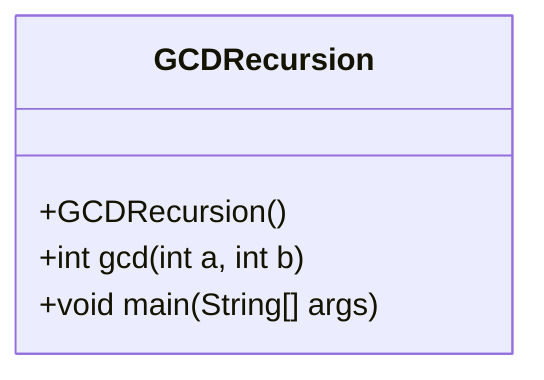
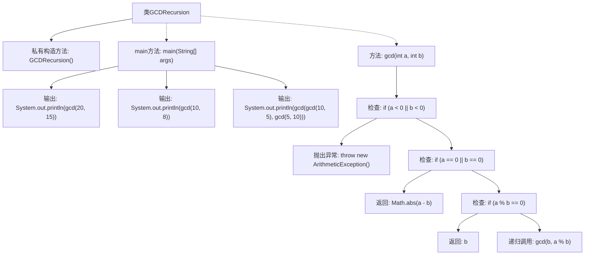

# 基础信息

|      |      |
|------|------|
| 名称 | GCDRecursion |
| 编码语言 | .java |
| 代码路径 | Java/src/main/java/com/thealgorithms/maths/GCDRecursion.java |
| 包名 | com.thealgorithms.maths |
| 依赖项 | [] |
| 概述说明 | Java递归计算最大公约数，支持多组输入并输出结果。 |

# 说明

该内容描述了一个使用Java语言实现的递归算法，用于计算最大公约数（GCD）。该算法支持多组输入数据，能够依次处理每组输入并输出相应的计算结果。递归方法通过不断调用自身来分解问题，直至找到最大公约数。该实现适用于需要处理多组数据的场景，确保每组的计算独立且准确。

# 类列表 Class Summary

| 名称   | 类型  | 说明 |
|-------|------|-------------|
| GCDRecursion | class | Java递归实现最大公约数计算，支持多组输入并输出结果。 |

## 类 GCDRecursion

|      |      |
|------|------|
| 访问范围 | public final |
| 类型 | class |
| 名称 | GCDRecursion |
| 说明 | Java递归实现最大公约数计算，支持多组输入并输出结果。 |

### UML类图

**描述：**  
`GCDRecursion` 类是一个用于计算两个整数的最大公约数（GCD）的工具类。它包含一个私有的构造函数，防止实例化。`gcd` 方法通过递归的方式计算两个非负整数的最大公约数，并在输入为负数时抛出 `ArithmeticException`。`main` 方法展示了如何使用 `gcd` 方法，并输出计算结果。该类是一个典型的工具类，专注于提供静态方法，不涉及对象实例化。

### 内部方法调用关系图

这段代码定义了一个名为`GCDRecursion`的类，用于计算两个整数的最大公约数（GCD）。类中包含一个私有的构造方法和一个静态的`gcd`方法。`gcd`方法通过递归调用自身来计算最大公约数，并在输入为负数时抛出异常。`main`方法中展示了如何使用`gcd`方法，并输出计算结果。流程图清晰地展示了类的结构、方法的调用关系以及递归逻辑的执行过程。

### 字段列表 Field List

| 名称  | 类型  | 说明 |
|-------|-------|------|

### 方法列表 Method List

| 名称  | 类型  | 说明 |
|-------|-------|------|
| main | void | Java代码计算并输出多个数的最大公约数。 |
| gcd | int | 计算两个整数的最大公约数，处理负数和零值，使用递归方法。 |

