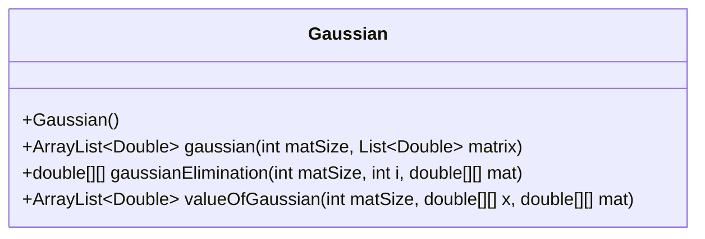
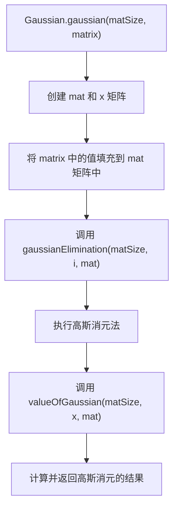
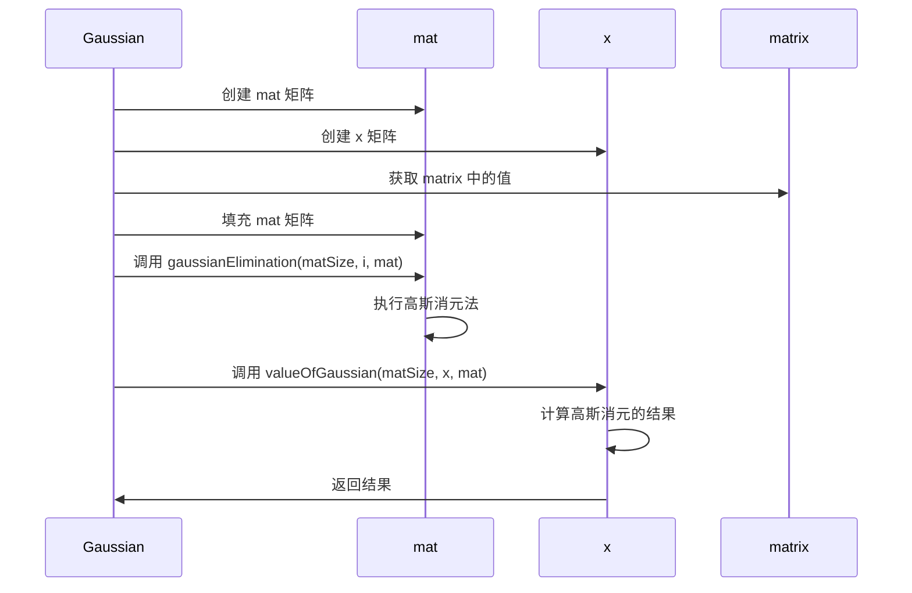
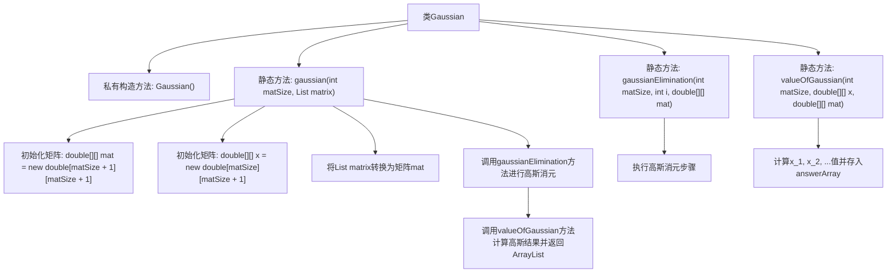

# 基础信息

|      |      |
|------|------|
| 名称 | Gaussian |
| 编码语言 | .java |
| 代码路径 | Java/src/main/java/com/thealgorithms/maths/Gaussian.java |
| 包名 | com.thealgorithms.maths |
| 依赖项 | ['java.util.ArrayList', 'java.util.List'] |
| 概述说明 | Gaussian类通过高斯消元法计算矩阵解并返回结果。 |

# 说明

Gaussian类实现了高斯消元法，用于求解矩阵的线性方程组。该方法通过逐步消元将矩阵转换为上三角矩阵，进而通过回代计算得到方程组的解。类的主要功能包括矩阵的输入、消元过程的执行以及最终解的返回。整个过程确保了计算的准确性和效率，适用于各种规模的矩阵求解问题。

# 类列表 Class Summary

| 名称   | 类型  | 说明 |
|-------|------|-------------|
| Gaussian | class | Gaussian类实现高斯消元法，计算矩阵解并返回结果。 |

## 类 Gaussian

|      |      |
|------|------|
| 访问范围 | public final |
| 类型 | class |
| 名称 | Gaussian |
| 说明 | Gaussian类实现高斯消元法，计算矩阵解并返回结果。 |

### UML类图

**描述**：  
`Gaussian` 类实现了高斯消元法，用于求解线性方程组。该类包含三个主要方法：`gaussian` 用于初始化矩阵并调用消元过程，`gaussianElimination` 执行高斯消元法的核心步骤，`valueOfGaussian` 计算并返回消元后的结果。通过流程图和时序图，可以清晰地看到矩阵的创建、填充、消元以及结果计算的过程。

### 内部方法调用关系图

这段代码实现了一个高斯消元法的计算过程。首先，将输入的List<Double>矩阵转换为二维数组，然后通过高斯消元法对矩阵进行处理，最后计算并返回结果。流程图展示了类Gaussian的结构及其内部方法的调用关系，详细描述了从矩阵初始化到最终结果计算的整个流程。

### 字段列表 Field List

| 名称  | 类型  | 说明 |
|-------|-------|------|

### 方法列表 Method List

| 名称  | 类型  | 说明 |
|-------|-------|------|
| gaussian | ArrayList<Double> | 静态方法实现高斯消元法，返回结果矩阵。 |
| gaussianElimination | double[][] | 高斯消元法实现，用于矩阵化简。 |
| valueOfGaussian | ArrayList<Double> | 静态方法计算高斯值，返回结果数组。 |

