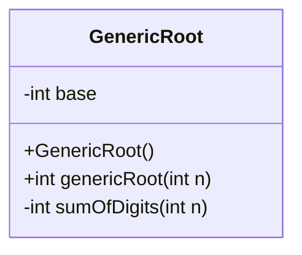
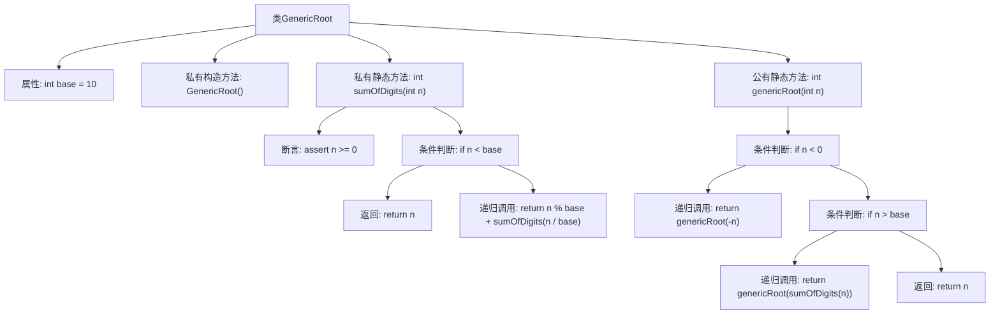

# 基础信息

|      |      |
|------|------|
| 名称 | GenericRoot |
| 编码语言 | .java |
| 代码路径 | Java/src/main/java/com/thealgorithms/maths/GenericRoot.java |
| 包名 | com.thealgorithms.maths |
| 依赖项 | [] |
| 概述说明 | GenericRoot类递归求和数字各位数，直到结果为单数。 |

# 说明

GenericRoot类用于计算数字的通用根，其核心方法是通过递归将数字的各位数相加，直到最终结果变为一个单数。这一过程确保了无论输入数字多大，最终都能得到一个简化的单一数字结果，从而便于进一步处理或分析。

# 类列表 Class Summary

| 名称   | 类型  | 说明 |
|-------|------|-------------|
| GenericRoot | class | GenericRoot类计算数字的通用根，通过递归求和数字的各位数，直到结果为单数。 |

## 类 GenericRoot

|      |      |
|------|------|
| 访问范围 | public final |
| 类型 | class |
| 名称 | GenericRoot |
| 说明 | GenericRoot类计算数字的通用根，通过递归求和数字的各位数，直到结果为单数。 |

### UML类图

**描述**：`GenericRoot` 类是一个工具类，用于计算一个整数的通用根。通用根是指通过不断将数字的各位相加，直到得到一个单一数字的过程。类中包含一个私有方法 `sumOfDigits` 用于计算数字的各位之和，以及一个公有方法 `genericRoot` 用于递归计算通用根。类中的 `base` 变量用于定义基数，默认为 10。

### 内部方法调用关系图

这段代码定义了一个名为 `GenericRoot` 的类，其中包含一个私有构造方法和两个静态方法。`sumOfDigits` 方法用于计算一个整数的各位数字之和，而 `genericRoot` 方法则通过递归调用 `sumOfDigits` 来计算一个数的通用根（即不断将数字的各位相加，直到得到一个单一的数字）。流程图展示了类中的方法调用关系和条件判断逻辑，清晰地描述了代码的执行流程。

### 字段列表 Field List

| 名称  | 类型  | 说明 |
|-------|-------|------|
| base = 10 | int | 定义一个私有静态整型变量base，初始值为10。 |

### 方法列表 Method List

| 名称  | 类型  | 说明 |
|-------|-------|------|
| sumOfDigits | int | 该方法递归计算非负整数n的各位数字之和。 |
| genericRoot | int | 计算整数的通用根，递归处理负数和大于基数的值。 |

