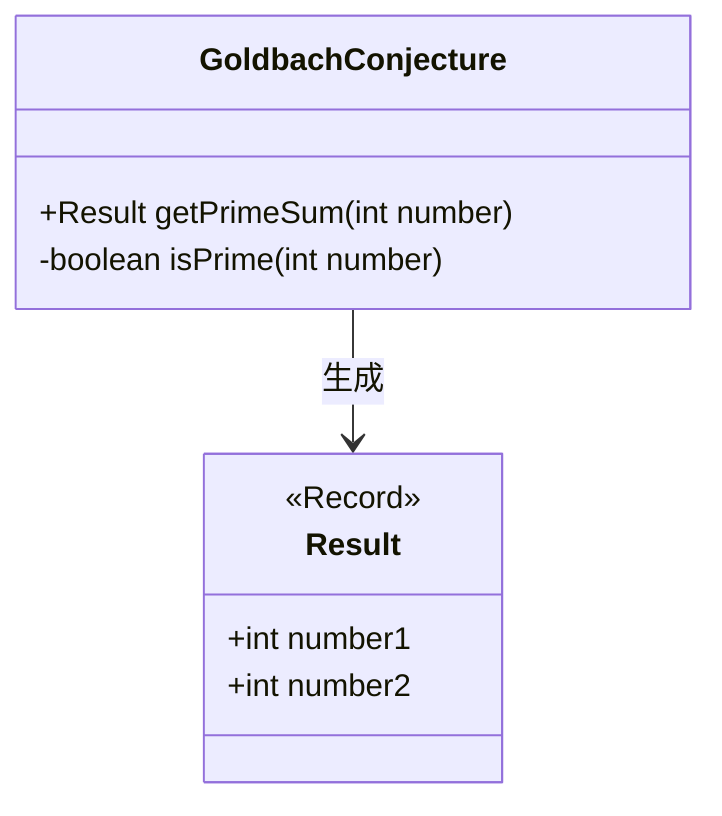
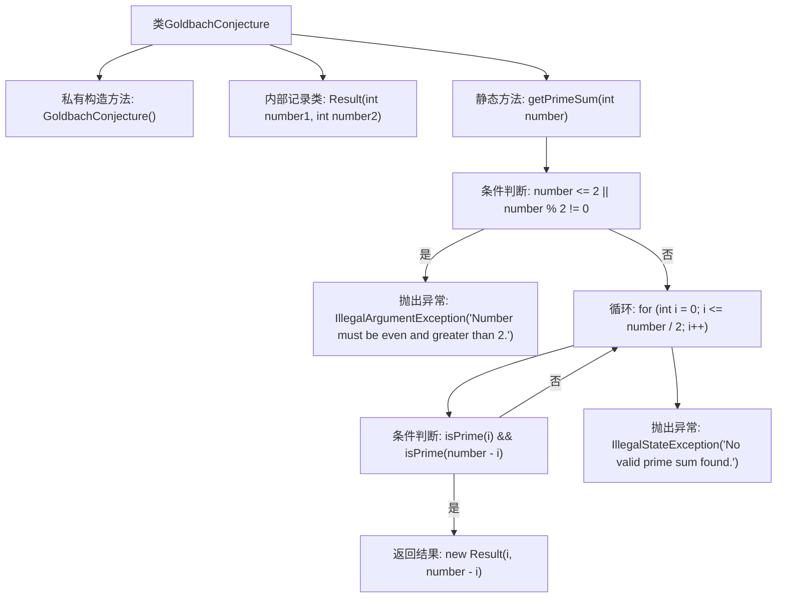

# 基础信息

|      |      |
|------|------|
| 名称 | GoldbachConjecture |
| 编码语言 | .java |
| 代码路径 | Java/src/main/java/com/thealgorithms/maths/GoldbachConjecture.java |
| 包名 | com.thealgorithms.maths |
| 依赖项 | ['com.thealgorithms.maths.Prime.PrimeCheck.isPrime'] |
| 概述说明 | GoldbachConjecture类用于查找两个质数之和等于指定偶数。 |

# 说明

GoldbachConjecture类的主要功能是寻找两个质数，使得它们的和等于给定的偶数。该类的核心目标是实现哥德巴赫猜想，即任何一个大于2的偶数都可以表示为两个质数的和。通过该类的实现，用户可以输入一个偶数，系统将返回满足条件的两个质数组合。

# 类列表 Class Summary

| 名称   | 类型  | 说明 |
|-------|------|-------------|
| GoldbachConjecture | class | GoldbachConjecture类用于寻找两个质数之和等于给定偶数的组合。 |

## 类 GoldbachConjecture

|      |      |
|------|------|
| 访问范围 | public final |
| 类型 | class |
| 名称 | GoldbachConjecture |
| 说明 | GoldbachConjecture类用于寻找两个质数之和等于给定偶数的组合。 |

### UML类图

这段代码定义了一个名为 `GoldbachConjecture` 的类，该类包含一个私有方法 `isPrime` 用于判断一个数是否为素数，以及一个公有方法 `getPrimeSum` 用于找到两个素数，使得它们的和等于给定的偶数。`Result` 是一个记录类，用于存储找到的两个素数。`GoldbachConjecture` 类依赖于 `Result` 类来返回结果。

### 内部方法调用关系图

这段代码实现了一个名为 `GoldbachConjecture` 的类，用于验证哥德巴赫猜想。该类包含一个私有构造方法和一个内部记录类 `Result`。`getPrimeSum` 方法接受一个偶数且大于2的整数，返回两个素数之和等于该整数的 `Result` 对象。如果输入不合法或未找到符合条件的素数对，将抛出相应的异常。

### 字段列表 Field List

| 名称  | 类型  | 说明 |
|-------|-------|------|

### 方法列表 Method List

| 名称  | 类型  | 说明 |
|-------|-------|------|
| getPrimeSum | Result | 获取偶数大于2的质数和的Java方法。 |

