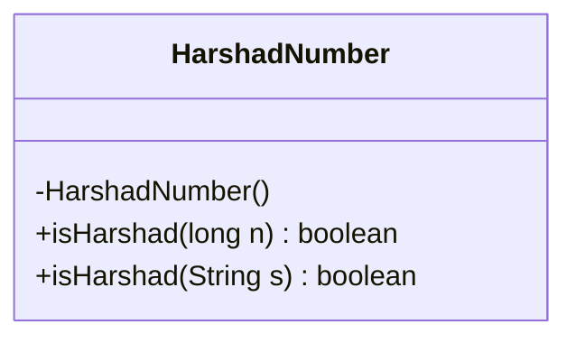
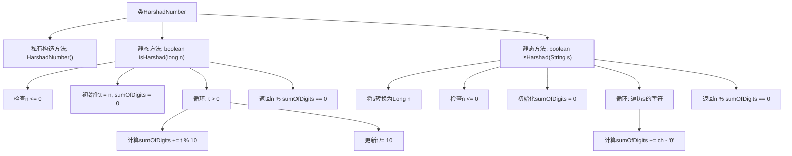

# 基础信息

|      |      |
|------|------|
| 名称 | HarshadNumber |
| 编码语言 | .java |
| 代码路径 | Java/src/main/java/com/thealgorithms/maths/HarshadNumber.java |
| 包名 | com.thealgorithms.maths |
| 依赖项 | [] |
| 概述说明 | HarshadNumber类用于判断数字是否为哈沙德数。 |

# 说明

HarshadNumber类包含一个用于判断数字是否为哈沙德数的方法。哈沙德数是指能够被其各位数字之和整除的数。该类通过实现这一功能，帮助用户快速确定给定数字是否符合哈沙德数的定义。

# 类列表 Class Summary

| 名称   | 类型  | 说明 |
|-------|------|-------------|
| HarshadNumber | class | HarshadNumber类提供检查数字是否为哈沙德数的方法。 |

## 类 HarshadNumber

|      |      |
|------|------|
| 访问范围 | public final |
| 类型 | class |
| 名称 | HarshadNumber |
| 说明 | HarshadNumber类提供检查数字是否为哈沙德数的方法。 |

### UML类图

这段代码定义了一个名为 `HarshadNumber` 的类，该类包含两个静态方法 `isHarshad`，用于检查一个数字是否是哈沙德数（Harshad Number）。哈沙德数是指能够被其各位数字之和整除的数。第一个方法接受一个 `long` 类型的参数，第二个方法接受一个 `String` 类型的参数。两个方法都通过计算数字的各位数字之和，然后判断原数是否能被该和整除来返回布尔值。类本身是 `final` 的，并且构造函数是私有的，防止实例化。

### 内部方法调用关系图

**描述：**  
这段代码定义了一个`HarshadNumber`类，包含两个静态方法`isHarshad`，分别用于检查一个数字是否是Harshad数。第一个方法接受`long`类型的参数，第二个方法接受`String`类型的参数。两个方法都通过计算数字的各位数字之和，然后判断原数是否能被该和整除来确定是否为Harshad数。流程图清晰地展示了方法的调用顺序和逻辑判断流程。

### 字段列表 Field List

| 名称  | 类型  | 说明 |
|-------|-------|------|

### 方法列表 Method List

| 名称  | 类型  | 说明 |
|-------|-------|------|
| isHarshad | boolean | 判断字符串表示的数字是否为哈沙德数。 |
| isHarshad | boolean | 判断一个正数是否为哈沙德数，即该数能被其各位数字之和整除。 |

