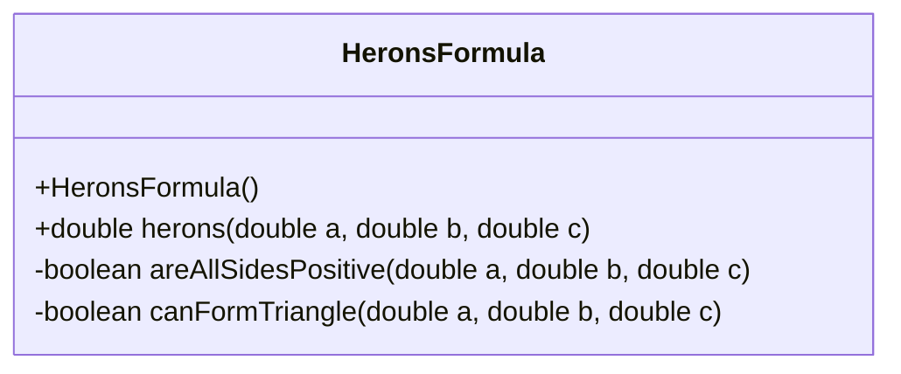
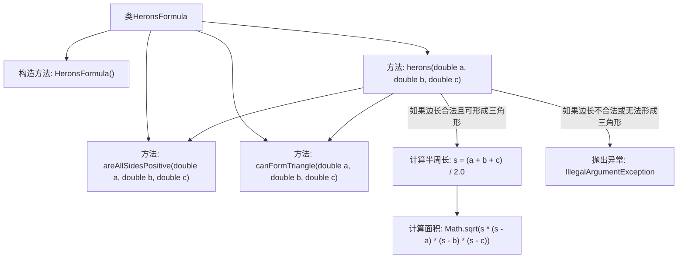

# 基础信息

|      |      |
|------|------|
| 名称 | HeronsFormula |
| 编码语言 | .java |
| 代码路径 | Java/src/main/java/com/thealgorithms/maths/HeronsFormula.java |
| 包名 | com.thealgorithms.maths |
| 依赖项 | [] |
| 概述说明 | HeronsFormula类验证边长并计算三角形面积。 |

# 说明

HeronsFormula类专门用于计算三角形的面积。它首先验证输入的边长是否为正数，并检查这些边长是否能构成一个有效的三角形。如果验证通过，该类会使用海伦公式来计算并返回三角形的面积。这一过程确保了计算的准确性和输入数据的合法性。

# 类列表 Class Summary

| 名称   | 类型  | 说明 |
|-------|------|-------------|
| HeronsFormula | class | HeronsFormula类用于计算三角形面积，验证边长是否为正且能构成三角形，使用海伦公式计算面积。 |

## 类 HeronsFormula

|      |      |
|------|------|
| 访问范围 | public final |
| 类型 | class |
| 名称 | HeronsFormula |
| 说明 | HeronsFormula类用于计算三角形面积，验证边长是否为正且能构成三角形，使用海伦公式计算面积。 |

### UML类图

**描述：**  
`HeronsFormula` 类是一个工具类，用于计算三角形的面积。它包含一个私有构造函数，防止类被实例化。类中提供了三个方法：`herons` 是公有方法，用于计算三角形的面积；`areAllSidesPositive` 和 `canFormTriangle` 是私有方法，分别用于验证三角形的边长是否为正数以及是否能构成三角形。如果边长不符合要求，`herons` 方法会抛出 `IllegalArgumentException` 异常。

### 内部方法调用关系图

这段代码定义了一个名为 `HeronsFormula` 的类，用于计算三角形的面积。类中包含三个私有方法：`areAllSidesPositive` 用于检查边长是否为正数，`canFormTriangle` 用于判断三边是否能形成三角形，`herons` 方法则根据海伦公式计算面积。如果边长不合法或无法形成三角形，`herons` 方法会抛出 `IllegalArgumentException` 异常。流程图展示了类的结构和方法之间的调用关系。

### 字段列表 Field List

| 名称  | 类型  | 说明 |
|-------|-------|------|

### 方法列表 Method List

| 名称  | 类型  | 说明 |
|-------|-------|------|
| areAllSidesPositive | boolean | 判断三角形三边是否均为正数。 |
| canFormTriangle | boolean | 判断三条边能否构成三角形。 |
| herons | double | 计算三角形面积的Heron公式实现，验证边长有效性后返回面积。 |

