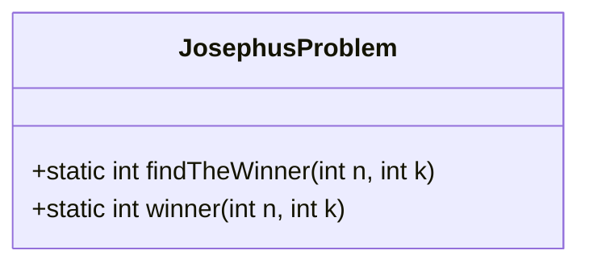
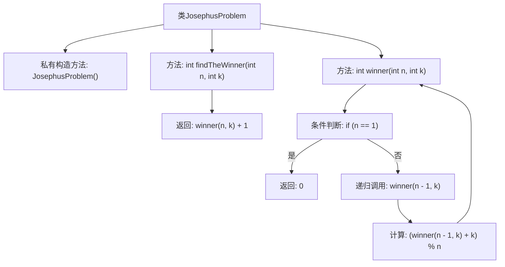

# 基础信息

|      |      |
|------|------|
| 名称 | JosephusProblem |
| 编码语言 | .java |
| 代码路径 | Java/src/main/java/com/thealgorithms/maths/JosephusProblem.java |
| 包名 | com.thealgorithms.maths |
| 依赖项 | [] |
| 概述说明 | 约瑟夫问题通过递归计算确定游戏胜者。 |

# 说明

约瑟夫问题是一个经典的数学问题，涉及在一个固定数量的参与者中，按照特定规则逐步淘汰，最终确定胜者。递归计算是一种解决该问题的方法，通过将问题分解为更小的子问题，逐步推导出最终结果。递归方法的核心思想是利用前一个子问题的解来计算当前问题的解，从而高效地确定游戏的最终胜者。这种方法不仅简洁，还能有效处理较大规模的参与者数量。

# 类列表 Class Summary

| 名称   | 类型  | 说明 |
|-------|------|-------------|
| JosephusProblem | class | 约瑟夫问题求解，递归计算游戏胜者。 |

## 类 JosephusProblem

|      |      |
|------|------|
| 访问范围 | public final |
| 类型 | class |
| 名称 | JosephusProblem |
| 说明 | 约瑟夫问题求解，递归计算游戏胜者。 |

### UML类图

**描述：**
`JosephusProblem` 类是一个工具类，用于解决约瑟夫问题。它包含两个静态方法：`findTheWinner` 和 `winner`。`findTheWinner` 方法接收两个参数 `n` 和 `k`，分别表示朋友的数量和步长，返回游戏的获胜者。`winner` 方法是一个递归方法，用于计算在 `n` 个人中以步长 `k` 进行淘汰后的获胜者索引。该类是一个最终类，不允许被继承，且构造函数为私有，防止实例化。

### 内部方法调用关系图

这段代码实现了一个解决约瑟夫问题的类。约瑟夫问题是一个经典的数学问题，描述了一群人围成一圈，每隔k-1个人淘汰第k个人，最后剩下的人即为胜利者。代码通过递归的方式计算胜利者的位置，`winner`方法用于递归求解，`findTheWinner`方法则对结果进行加1处理，使其符合实际编号。流程图展示了类的方法调用关系和递归过程。

### 字段列表 Field List

| 名称  | 类型  | 说明 |
|-------|-------|------|

### 方法列表 Method List

| 名称  | 类型  | 说明 |
|-------|-------|------|
| winner | int | 计算约瑟夫问题中最后幸存者的位置。 |
| findTheWinner | int | 该方法返回约瑟夫问题中第n个参与者的胜利者编号，基于步长k计算。 |

