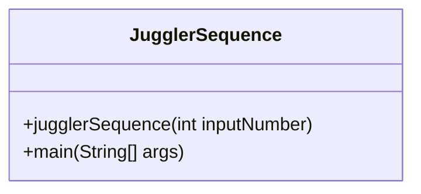
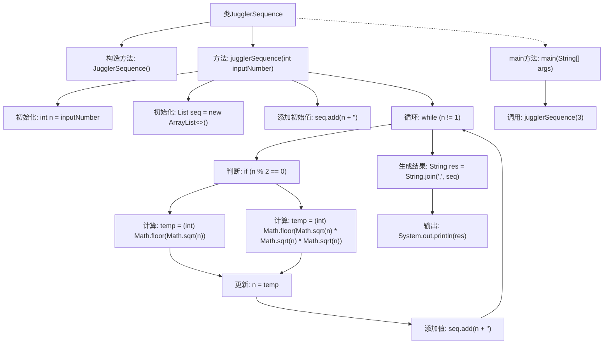

# 基础信息

|      |      |
|------|------|
| 名称 | JugglerSequence |
| 编码语言 | .java |
| 代码路径 | Java/src/main/java/com/thealgorithms/maths/JugglerSequence.java |
| 包名 | com.thealgorithms.maths |
| 依赖项 | ['java.util.ArrayList', 'java.util.List'] |
| 概述说明 | JugglerSequence类根据奇偶性生成并打印从指定数开始的序列。 |

# 说明

JugglerSequence类用于生成并打印从指定数开始的序列。该序列的生成规则基于当前数的奇偶性来计算下一个数。如果当前数是奇数，则下一个数通过特定计算得出；如果当前数是偶数，则下一个数通过另一种计算得出。该过程持续进行，直到序列结束。

# 类列表 Class Summary

| 名称   | 类型  | 说明 |
|-------|------|-------------|
| JugglerSequence | class | JugglerSequence类生成并打印从指定数开始的序列，序列规则根据奇偶性计算下一个数。 |

## 类 JugglerSequence

|      |      |
|------|------|
| 访问范围 | public final |
| 类型 | class |
| 名称 | JugglerSequence |
| 说明 | JugglerSequence类生成并打印从指定数开始的序列，序列规则根据奇偶性计算下一个数。 |

### UML类图

这段代码定义了一个名为 `JugglerSequence` 的类，该类包含两个静态方法：`jugglerSequence` 和 `main`。`jugglerSequence` 方法用于生成并打印 Juggler 序列，该序列从给定的整数开始，通过一系列数学运算逐步减少到 1。`main` 方法是程序的入口，调用 `jugglerSequence` 方法并传入初始值 3，最终输出序列 3,5,11,36,6,2,1。该类的设计简洁，仅包含公共方法，没有实例化需求，因此构造函数被私有化。

### 内部方法调用关系图

这段代码定义了一个名为 `JugglerSequence` 的类，其中包含一个静态方法 `jugglerSequence`，用于生成并打印从给定数字开始的Juggler序列。Juggler序列的规则是：如果当前项是偶数，则下一项为其平方根的整数部分；如果当前项是奇数，则下一项为其平方根的三次方的整数部分。代码通过循环不断计算序列的下一项，直到序列达到1为止。最终，序列被转换为字符串并打印出来。`main` 方法调用了 `jugglerSequence` 方法，传入初始值3，生成并打印相应的Juggler序列。

### 字段列表 Field List

| 名称  | 类型  | 说明 |
|-------|-------|------|

### 方法列表 Method List

| 名称  | 类型  | 说明 |
|-------|-------|------|
| jugglerSequence | void | 生成Juggler序列，偶数取平方根，奇数取立方根，直到n为1。 |
| main | void | Java程序调用jugglerSequence方法，输入3生成序列3,5,11,36,6,2,1。 |

