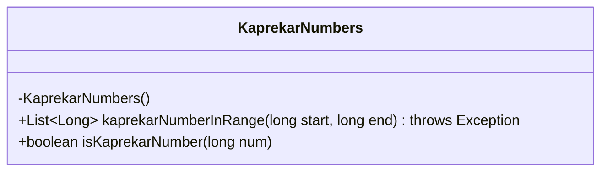
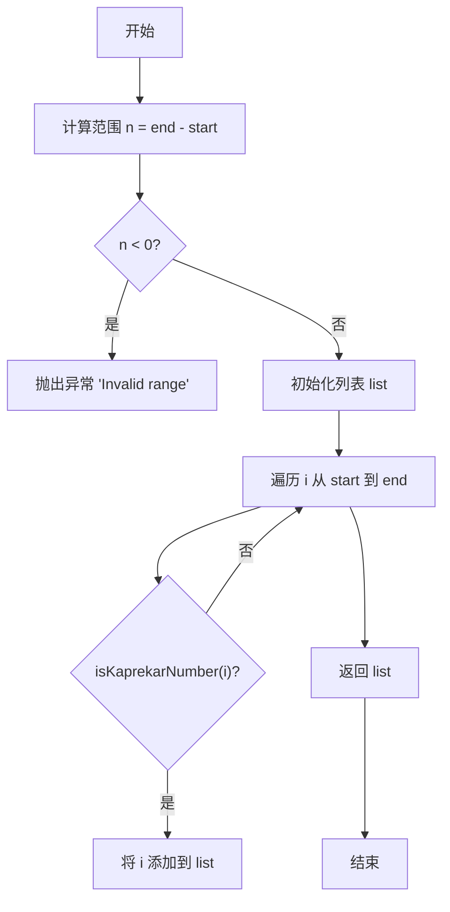
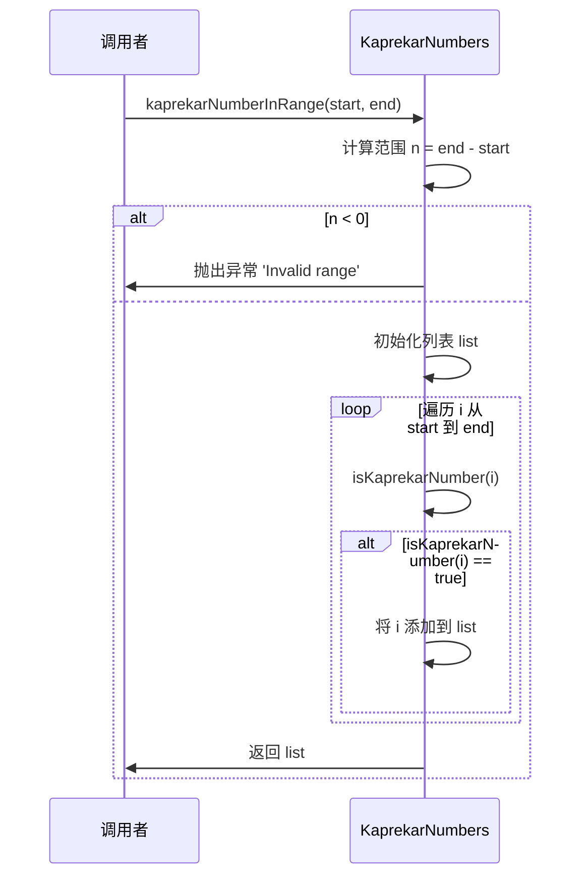
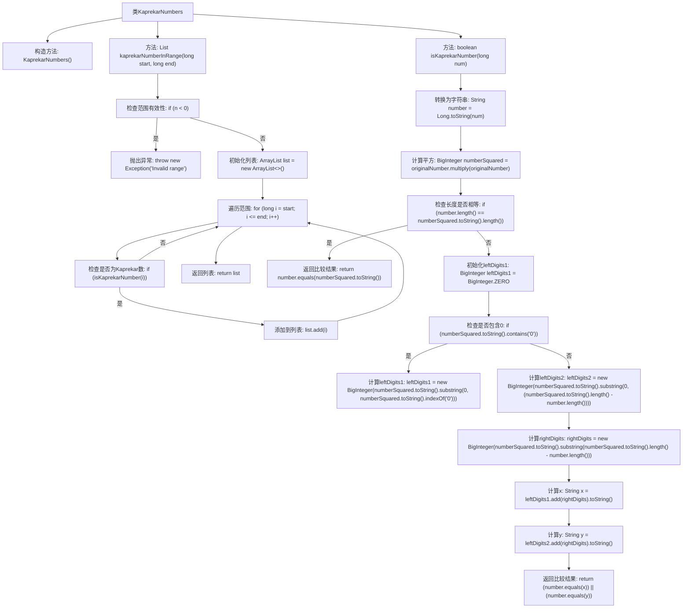

# 基础信息

|      |      |
|------|------|
| 名称 | KaprekarNumbers |
| 编码语言 | .java |
| 代码路径 | Java/src/main/java/com/thealgorithms/maths/KaprekarNumbers.java |
| 包名 | com.thealgorithms.maths |
| 依赖项 | ['java.math.BigInteger', 'java.util.ArrayList', 'java.util.List'] |
| 概述说明 | KaprekarNumbers类提供查找范围内Kaprekar数和判断某数是否为Kaprekar数的方法。 |

# 说明

KaprekarNumbers类包含两个主要方法：kaprekarNumberInRange和isKaprekarNumber。kaprekarNumberInRange方法用于在指定范围内查找所有Kaprekar数，而isKaprekarNumber方法则用于判断某个特定数字是否为Kaprekar数。这两个方法共同实现了对Kaprekar数的查找和验证功能。

# 类列表 Class Summary

| 名称   | 类型  | 说明 |
|-------|------|-------------|
| KaprekarNumbers | class | KaprekarNumbers类包含两个方法：kaprekarNumberInRange用于查找范围内的Kaprekar数，isKaprekarNumber用于判断某数是否为Kaprekar数。 |

## 类 KaprekarNumbers

|      |      |
|------|------|
| 访问范围 | public final |
| 类型 | class |
| 名称 | KaprekarNumbers |
| 说明 | KaprekarNumbers类包含两个方法：kaprekarNumberInRange用于查找范围内的Kaprekar数，isKaprekarNumber用于判断某数是否为Kaprekar数。 |

### UML类图

这段代码定义了一个名为 `KaprekarNumbers` 的类，该类包含两个静态方法：`kaprekarNumberInRange` 和 `isKaprekarNumber`。`kaprekarNumberInRange` 方法用于在给定范围内查找所有 Kaprekar 数，并返回一个列表。`isKaprekarNumber` 方法用于检查给定的数字是否为 Kaprekar 数。Kaprekar 数是指其平方可以分成两部分，其中右部分有与原始数字相同的位数，且这两部分的和等于原始数字。代码通过计算平方数并将其分割为两部分来验证是否为 Kaprekar 数。

### 内部方法调用关系图

**描述：**  
该代码实现了一个用于查找指定范围内Kaprekar数的类。`kaprekarNumberInRange`方法首先检查范围的有效性，然后遍历范围内的每个数，调用`isKaprekarNumber`方法判断是否为Kaprekar数，并将其添加到列表中返回。`isKaprekarNumber`方法通过将数字转换为字符串并计算其平方，然后根据特定规则判断是否为Kaprekar数。流程图清晰地展示了各个方法之间的调用关系和逻辑判断过程。

### 字段列表 Field List

| 名称  | 类型  | 说明 |
|-------|-------|------|

### 方法列表 Method List

| 名称  | 类型  | 说明 |
|-------|-------|------|
| isKaprekarNumber | boolean | 判断一个数是否为卡普雷卡数的方法。 |
| kaprekarNumberInRange | List<Long> | 该方法在指定范围内查找并返回所有卡普雷卡数。 |

